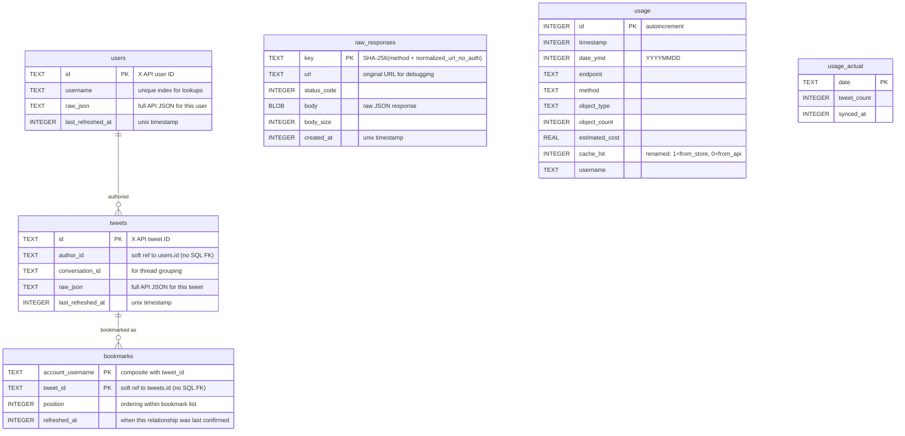

# Replace Request-Level Cache with Entity Store

## Enhancement Summary

**Deepened on:** 2026-02-18 (round 2)
**Research agents used:** architecture-strategist, security-sentinel, performance-oracle, code-simplicity-reviewer, pattern-recognition-specialist, data-integrity-guardian, learnings-researcher, best-practices-researcher, repo-research-analyst, framework-docs-researcher, git-history-analyzer

### Key Revisions from Research

1. **Simplified schema: only store lookup-relevant columns + raw_json** -- The simplicity reviewer found that ~20 normalized columns (like_count, retweet_count, etc.) are never queried by any command. Commands output raw JSON to stdout. Store only the columns needed for lookups (id, author_id, conversation_id, username) alongside `raw_json`. Estimated 185-270 LOC saved.
2. **Use `INSERT ... ON CONFLICT DO UPDATE` instead of `INSERT OR REPLACE`** -- `INSERT OR REPLACE` deletes and re-inserts the row, losing `first_seen_at` and changing rowids. `ON CONFLICT DO UPDATE` preserves untouched columns and is a single operation.
3. ~~**Consider `WITHOUT ROWID` for entity tables**~~ -- **REVERSED (round 2).** WITHOUT ROWID is counterproductive for tables storing large `raw_json` TEXT blobs. WITHOUT ROWID uses a B-tree (not B\*-tree) that stores row data in intermediate nodes, degrading fan-out. Per [SQLite docs](https://sqlite.org/withoutrowid.html): "WITHOUT ROWID tables work best when individual rows are not too large." Keep WITHOUT ROWID **only on `bookmarks`** (small rows, no BLOB/TEXT payload). Tweets and users use standard rowid tables.
4. **Comprehensive index strategy required** -- The plan was missing indexes entirely. Added `idx_tweets_conversation_id`, `idx_tweets_last_refreshed_at`, `idx_users_username`, composite bookmark index. Note: `idx_tweets_author_id` deferred (no current query path).
5. **Security hardening** -- Enforce 0o600 permissions on every open (not just creation). Expand anti-tamper check to include views. Set WAL sidecar permissions explicitly. Wrap usage migration in transaction with idempotency sentinel.
6. **`sha2` cannot be removed** -- Used by `auth.rs` for PKCE code challenge and still needed for `raw_responses` key computation.
7. **Removed YAGNI items** -- `pagination_state` table (no consumer), `get_user_by_id()` (no caller), hidden CLI aliases (just rename), split cost display format (defer), `first_seen_at` column (no consumer).
8. **X API response format** -- Multi-ID responses do NOT preserve order (match by id). `data` key is absent (not null) when all IDs deleted. `errors` can coexist with `data` in 200 responses. `includes.users` is deduplicated within a single response.
9. **Batch operations must use explicit transactions** -- 100-200x performance gain for multi-row upserts. Use `unchecked_transaction()` + `prepare_cached()` pattern.
10. **Use `(page_count - freelist_count) * page_size` for O(1) DB size checks** -- `page_count` alone includes free pages from deleted rows, causing pruning to re-trigger after deletions.
11. **CRITICAL: Remove hard foreign keys on API-sourced columns** -- X API does not guarantee `includes.users` contains every referenced `author_id`. Hard FK constraints cause entire batch INSERT failures when referenced entities are missing. Use soft references (no SQL FK, validate at application layer if needed).
12. **Bookmark streaming refactor is unnecessary** -- Entity upsert can happen per-page within the existing streaming loop (between response parse and item output). No buffering needed.
13. **Remove `authenticated_get()` from BirdClient** -- Premature abstraction coupling transport to auth. The 7-file auth dispatch duplication (~15 lines each) is acceptable; a free function is preferable if consolidation is desired later.
14. **Fix usage migration to exclude `id` column** -- `INSERT OR IGNORE INTO usage SELECT * FROM old_cache.usage` silently drops rows with conflicting AUTOINCREMENT IDs. Explicitly list columns excluding `id`.
15. **Simplify CacheOpts flag conflicts** -- Instead of erroring on `cache_only + refresh`, use silent precedence: `no_store` wins all; `cache_only` suppresses `refresh`.
16. **Drop `first_seen_at` column** -- No consumer exists. YAGNI. Can be added later if analytics use case emerges.
17. **Skip partition_ids() 999-chunking** -- X API maximum is 100 IDs per request. 100 < 999 `SQLITE_MAX_VARIABLE_NUMBER`. Chunking logic is dead code.
18. **Guard `PRAGMA optimize` with `0x10002` mask** -- For short-lived CLI connections, run `PRAGMA optimize(0x10002)` just before close.
19. **Add `debug_assert!` for unchecked_transaction safety** -- `debug_assert!(self.conn.is_autocommit())` before `unchecked_transaction()` catches accidental nesting in tests.

---

## Overview

Replace the current request-level TTL cache (`CachedClient` + `cache.db`) with an entity-level permanent data store (`bird.db`). The X API Pay-Per-Use billing charges per-resource on first fetch per UTC calendar day. The entity store aligns with this model: serve entities from local storage when they were last fetched in a prior UTC day (avoiding re-charges); always hit the API within the current UTC day (free re-fetch with fresh data). Multi-ID batch requests are split to only fetch missing or stale entities.

## Problem Statement

See brainstorm: `docs/brainstorms/2026-02-17-entity-store-cache-redesign-brainstorm.md` -- "Current problems" section. In summary: the cache caches the wrong thing (HTTP blobs), at the wrong granularity (whole responses), with the wrong key (includes auth type), using the wrong eviction strategy (short TTLs that discard paid data).

## Technical Approach

### Architecture

```
Commands (search, profile, bookmarks, thread, watchlist, raw)
    │
    ▼
BirdClient (replaces CachedClient)
    │
    ├── db: Option<BirdDb>             ← graceful degradation preserved
    ├── http: reqwest::Client
    └── cache_opts: CacheOpts              ← naming preserved
            │
            ▼
      BirdDb (replaces current BirdDb cache role)
            │
            ├── tweets table     ← keyed by tweet ID, lookup columns + raw_json
            ├── users table      ← keyed by user ID, lookup columns + raw_json
            ├── bookmarks table  ← junction: (account, tweet_id, position)
            ├── raw_responses    ← request-keyed for bird raw
            ├── usage table      ← preserved from current system
            └── usage_actual     ← preserved from current system
```

**Key design constraint**: `BirdClient` remains the sole interface for commands. Commands should require minimal changes -- the entity store is transparent to them.

### ERD: Entity Store Schema (Simplified)



**Schema changes from original plan:**
- Tweets table reduced from 14 columns to 4 (only lookup-relevant + raw_json); `first_seen_at` removed (YAGNI)
- Users table reduced from 16 columns to 4 (only lookup-relevant + raw_json); `first_seen_at` removed (YAGNI)
- Bookmarks table uses composite primary key `(account_username, tweet_id)`
- `pagination_state` table removed (YAGNI -- no consumer exists)
- `WITHOUT ROWID` on **bookmarks only** (small rows). Tweets and users use standard rowid tables (large `raw_json` TEXT payloads degrade WITHOUT ROWID B-tree fan-out)
- **No SQL foreign keys** on API-sourced columns (`author_id`, `tweet_id`). X API does not guarantee referential completeness in `includes`. Soft references only.
- `raw_responses` has a **7-day TTL** -- pruned alongside entity pruning. Sensitive API responses (DMs, private data) have limited exposure window.

### Index Strategy

```sql
-- tweets: PK covers id lookups. Additional indexes:
-- idx_tweets_author_id DEFERRED: no current query path uses author_id lookups.
-- Add when a command needs "all tweets by author" queries.
-- CREATE INDEX idx_tweets_author_id ON tweets(author_id);
CREATE INDEX idx_tweets_conversation_id ON tweets(conversation_id);
CREATE INDEX idx_tweets_last_refreshed_at ON tweets(last_refreshed_at);

-- users: PK covers id lookups. Additional indexes:
CREATE UNIQUE INDEX idx_users_username ON users(username);

-- bookmarks: composite PK covers account+tweet lookups. Additional:
CREATE INDEX idx_bookmarks_tweet_id ON bookmarks(tweet_id);

-- raw_responses: PK covers key lookups. Additional:
CREATE INDEX idx_raw_created_at ON raw_responses(created_at);
```

### Implementation Phases

#### Phase 1: DB Layer -- BirdDb

Build the new storage layer alongside the existing cache (no removal yet). This phase produces a tested `BirdDb` struct.

**Tasks:**

- [x] Create `src/db/` module directory with `mod.rs`, `db.rs`, `usage.rs`
- [x] Define DB model structs in `src/db/db.rs`:
  - `TweetRow` -- `{ id, author_id, conversation_id, raw_json, last_refreshed_at }`, derives `Debug, Clone`
  - `UserRow` -- `{ id, username, raw_json, last_refreshed_at }`, derives `Debug, Clone`
  - `BookmarkRow` -- `{ account_username, tweet_id, position, refreshed_at }`
  - `RawResponseRow` -- `{ key, url, status_code, body, body_size, created_at }`
  - Implement `TweetRow::from_api_json(&serde_json::Value) -> Self` and `UserRow::from_api_json(&serde_json::Value) -> Self` -- extract only lookup fields + store full JSON as `raw_json`
- [x] Implement `BirdDb` in `src/db/db.rs`:
  - `open(path, max_size_mb) -> Result<Self, rusqlite::Error>`:
    - **Set process umask(0o077) before opening DB** -- ensures all SQLite-created files (DB, WAL, SHM sidecars) are automatically restricted. Restore original umask after connection established.
    - Pre-create file with 0o600 permissions
    - **Enforce 0o600 on every open** (check and correct existing file permissions on DB, WAL, and SHM files)
    - Set PRAGMAs: WAL, synchronous=NORMAL, busy_timeout=5000, mmap_size=min(max_size_mb * 1048576, 67108864) (cap at 64MB to avoid excessive virtual address space), temp_store=MEMORY
    - **No `PRAGMA foreign_keys = ON`** -- removed because entity tables use soft references (no SQL FKs). This avoids batch failure when X API omits referenced entities from `includes`.
    - **Expand anti-tamper check** to reject views and virtual tables (not just triggers)
    - Run migrations via `rusqlite_migration::Migrations::new()` with its OWN migration list (not appended to existing cache.db migrations). bird.db is a fresh database with its own schema versioning.
    - **Set 0o600 on WAL/SHM sidecar files** after enabling WAL mode
  - Schema migration: `WITHOUT ROWID` on bookmarks only (tweets/users use standard rowid tables for large `raw_json`), all indexes defined above
  - `upsert_tweet(&self, tweet: &TweetRow) -> Result<(), rusqlite::Error>`:
    ```sql
    INSERT INTO tweets (id, author_id, conversation_id, raw_json, last_refreshed_at)
    VALUES (?1, ?2, ?3, ?4, ?5)
    ON CONFLICT(id) DO UPDATE SET
        author_id = excluded.author_id,
        conversation_id = excluded.conversation_id,
        raw_json = excluded.raw_json,
        last_refreshed_at = excluded.last_refreshed_at
    ```
  - `upsert_user(&self, user: &UserRow) -> Result<(), rusqlite::Error>` -- same ON CONFLICT pattern
  - `upsert_entities(&self, tweets: &[TweetRow], users: &[UserRow]) -> Result<(), rusqlite::Error>`:
    - `debug_assert!(self.conn.is_autocommit())` before transaction (catches accidental nesting in tests)
    - Wrap in `unchecked_transaction()` + `prepare_cached()` for batch performance
    - Upsert users first, then tweets (logical ordering; no FK enforcement)
  - `get_tweet(&self, id: &str) -> Result<Option<TweetRow>, rusqlite::Error>`
  - `get_user_by_username(&self, username: &str) -> Result<Option<UserRow>, rusqlite::Error>`
  - `is_stale(last_refreshed_at: i64, now: chrono::DateTime<chrono::Utc>) -> bool` -- pure function: `date_utc(last_refreshed_at) < now.date_naive()`. Takes `now` as parameter for deterministic testing of UTC midnight boundary edge cases.
  - `partition_ids(&self, ids: &[&str]) -> Result<(Vec<TweetRow>, Vec<String>), rusqlite::Error>`:
    - `SELECT id, last_refreshed_at, ... FROM tweets WHERE id IN (?,?,...)` query using `params_from_iter`
    - No chunking needed: X API max is 100 IDs per request, well under SQLite's 999 `SQLITE_MAX_VARIABLE_NUMBER` default
    - Partition results in Rust: stale/missing → ids_to_fetch, fresh → from_store
    - Returns `(from_store, ids_to_fetch)`
  - `upsert_raw_response(&self, key: &str, url: &str, status: u16, body: &[u8]) -> Result<(), rusqlite::Error>`
  - `get_raw_response(&self, key: &str) -> Result<Option<RawResponseRow>, rusqlite::Error>`
  - Bookmark operations:
    - `replace_bookmarks(account, bookmarks: &[BookmarkRow]) -> Result<(), rusqlite::Error>`:
      Wrap in transaction: DELETE all for account, INSERT new with `prepare_cached()`
    - `get_bookmarks(account) -> Result<Vec<BookmarkRow>, rusqlite::Error>`
  - Stats: `stats() -> Result<StoreStats, rusqlite::Error>` (entity counts by type, total live size via `(PRAGMA page_count - PRAGMA freelist_count) * PRAGMA page_size`)
  - `clear() -> Result<u64, rusqlite::Error>` -- clear all entity data + raw_responses (preserves usage tables)
  - Pruning: `prune_if_needed(max_bytes: u64) -> Result<(), rusqlite::Error>`:
    - Use `(PRAGMA page_count - PRAGMA freelist_count) * PRAGMA page_size` for O(1) live-data size check (avoids re-triggering after deletions)
    - Use `last_refreshed_at` as pruning proxy (not `last_accessed_at` -- avoids turning reads into writes)
    - Prune to 80% of limit (hysteresis prevents re-pruning immediately)
    - **Always prune raw_responses older than 7 days** (`DELETE FROM raw_responses WHERE created_at < ?` with unix_now - 7*86400) regardless of DB size
    - Prune entity tables (tweets, users) by `last_refreshed_at` only when over size limit
  - `Drop` impl: `PRAGMA optimize(0x10002); PRAGMA wal_checkpoint(PASSIVE);` (0x10002 mask ensures all tables analyzed for short-lived CLI connections)
- [x] Migrate usage methods to `src/db/usage.rs`:
  - Move `log_usage`, `query_usage_summary`, `query_daily_usage`, `query_top_endpoints`, `upsert_actual_usage`, `query_actual_usage` from `src/cache/usage.rs`
  - Same SQL, new `impl BirdDb` for entity-store DB instead of current cache `impl BirdDb`
  - Move `normalize_endpoint()` to `src/db/mod.rs` (still needed by usage logging)
- [x] **Usage data migration** (with transactional integrity):
  - On first `BirdDb::open()`, check if `~/.config/bird/cache.db` exists
  - **Validate source DB before ATTACH:**
    - Verify expected tables exist: `SELECT name FROM sqlite_master WHERE type='table'` must include `usage` and `usage_actual`
    - If validation fails, log warning and skip migration (do not block startup)
    - Note: skip `PRAGMA integrity_check` (too slow for large DBs) and file size checks (over-engineered per simplicity review)
  - Use `ATTACH DATABASE` pattern for bulk copy:
    ```sql
    ATTACH DATABASE '/path/to/cache.db' AS old_cache;
    -- Exclude id column to avoid AUTOINCREMENT collisions; let new DB generate fresh IDs
    INSERT OR IGNORE INTO usage (timestamp, date_ymd, endpoint, method, object_type, object_count, estimated_cost, cache_hit, username)
      SELECT timestamp, date_ymd, endpoint, method, object_type, object_count, estimated_cost, cache_hit, username FROM old_cache.usage;
    INSERT OR IGNORE INTO usage_actual SELECT * FROM old_cache.usage_actual;
    DETACH DATABASE old_cache;
    ```
  - Wrap in transaction for atomicity
  - Write migration sentinel (row in `migrations_meta` or pragma) so migration is idempotent
  - If migration fails, log warning and continue (do not block)
  - Do NOT delete `cache.db` automatically
- [x] Write unit tests:
  - `is_stale()` with various timestamp boundaries around UTC midnight
  - `partition_ids()` with mix of stale, fresh, and missing IDs (single IN query via `params_from_iter`)
  - `upsert_tweet()` + `get_tweet()` round-trip (verify re-upsert updates `last_refreshed_at` and `raw_json`)
  - `upsert_user()` + `get_user_by_username()` round-trip
  - `upsert_entities()` with missing author (no FK failure -- soft references)
  - `replace_bookmarks()` removes old bookmarks, preserves ordering
  - Concurrent access (two BirdDb instances on same file via WAL)
  - Graceful degradation when DB fails to open
  - File permissions enforced on existing files
  - Anti-tamper rejects views
  - Usage migration idempotency (including `id` column exclusion)
  - Pruning size calculation uses `(page_count - freelist_count) * page_size`

**Error Handling:**

- DB operations return `Result<T, rusqlite::Error>` (no wrapping)
- BirdClient methods return `Result<T, Box<dyn std::error::Error + Send + Sync>>` (existing codebase pattern)
- On DB failure, BirdClient logs a warning and falls back to direct HTTP (graceful degradation)

**Files:**

- `src/db/mod.rs` (new)
- `src/db/db.rs` (new)
- `src/db/usage.rs` (new)
- `src/main.rs` (modified -- add `mod db` in alphabetical position between `cost` and `doctor`; remove `mod cache`)

**Free function placement from `cache/mod.rs`:**

| Item | Destination | Rationale |
|------|-------------|-----------|
| `RequestContext`, `ApiResponse`, `CacheOpts` | `src/db/mod.rs` (re-exports) | Shared types used by commands |
| `normalize_endpoint()` | `src/db/mod.rs` | Still needed by usage logging |
| `unix_now()` | `src/db/mod.rs` | Shared timestamp helper |
| `compute_cache_key()` | `src/db/client.rs` | Only used by raw_responses key computation |
| `normalize_url()` | `src/db/client.rs` | Only used by cache key computation |
| `should_skip_cache()` | Removed | Replaced by `is_entity_endpoint()` classification |
| `default_ttl_for_endpoint()` | Removed | Replaced by UTC-day freshness (no per-endpoint TTLs) |
| `hex` inline module | `src/db/client.rs` | Only used by cache key hex encoding |
| `KNOWN_LITERALS` | Removed | Was for URL normalization of cache keys |

#### Phase 2: Transport Layer -- BirdClient

Replace `CachedClient` with `BirdClient` that wraps the entity store and handles UTC-day freshness, request splitting, entity decomposition, and response merging.

**Tasks:**

- [x] Create `BirdClient` in `src/db/client.rs` (separate file for 200-line rule):
  ```
  pub struct BirdClient {
      http: reqwest::Client,
      db: Option<BirdDb>,
      cache_opts: CacheOpts,
  }
  ```
- [x] Define `CacheOpts` (field names preserved from current codebase):
  ```
  pub struct CacheOpts {
      pub no_store: bool,      // --no-cache: disable entirely
      pub refresh: bool,       // --refresh: skip reads, still write
      pub cache_only: bool,    // --cache-only: no API calls
  }
  ```
  - Flag precedence (silent, no errors): `no_store` wins all (disables cache_only and refresh). `cache_only` suppresses `refresh`. No user-facing errors for conflicting flags.
- [x] Implement core methods matching current `CachedClient` API:
  - `new(http, store_path, cache_opts, max_size_mb) -> Self`
  - `get(&mut self, url, ctx, headers) -> Result<ApiResponse, Box<dyn Error + Send + Sync>>` -- entity-aware GET:
    1. If `no_store`: direct HTTP, no DB interaction
    2. If `cache_only`: check DB, return or error
    3. Extract entity IDs from URL params (if batch endpoint)
    4. `partition_ids()` to split stale vs fetch
    5. Build API URL with only fetch-set IDs
    6. HTTP GET for fetch-set
    7. **Parse response defensively**: check for `errors` key even in 200 responses. `data` may be absent (not null) when all IDs deleted.
    8. Decompose response: upsert users first (parents), then tweets (children), then raw response
    9. Merge DB entities + API entities by ID matching (NOT by array index -- API does not preserve order)
    10. Log usage (cost only for API-fetched entities)
    11. Return `ApiResponse` with merged data
  - `request(&mut self, method, url, ctx, headers, body) -> Result<ApiResponse>` -- mutations pass through (no entity store interaction for POST/PUT/DELETE)
  - `oauth1_request(&mut self, method, url, config, body) -> Result<ApiResponse>` -- same entity-aware logic for GET; mutations pass through
  - `http() -> &reqwest::Client`
  - `http_get(&self, url, headers) -> Result<ApiResponse>` -- bypass store (for auth, usage sync)
  - ~~`authenticated_get()`~~ -- **Removed (round 2).** Premature abstraction coupling transport to auth. The auth dispatch pattern (~15 lines per command) is acceptable duplication. If consolidation is desired later, use a free function rather than a struct method.
  - `db_stats()`, `db_clear()`, `db_path()`, `db()`, `db_disabled()`
  - `log_api_call()` -- preserved, calls through to `BirdDb`
- [x] Implement response decomposition:
  - `is_entity_endpoint(url: &str) -> Option<EntityType>` -- explicit classification to prevent misclassification:
    ```rust
    fn is_entity_endpoint(url: &str) -> Option<EntityType> {
        let path = url::Url::parse(url).ok()?.path().to_string();
        match path.as_str() {
            p if p.starts_with("/2/users/") && p.contains("/bookmarks") => Some(EntityType::Tweet),
            p if p.starts_with("/2/tweets") && !p.starts_with("/2/tweets/search/counts") => Some(EntityType::Tweet),
            p if p.starts_with("/2/users") && !p.starts_with("/2/usage") => Some(EntityType::User),
            _ => None, // usage, auth, search/counts -- no entity decomposition
        }
    }
    ```
    When `None`, request falls through to raw HTTP without entity decomposition.
  - `decompose_response(url, json) -> DecomposedEntities`:
    - Parse `data` (single object or array) → `Vec<TweetRow>` or `Vec<UserRow>` depending on endpoint
    - Parse `includes.users` → `Vec<UserRow>` (already deduplicated within single response by API)
    - **Do NOT parse `includes.tweets`** for v1 (no command needs referenced tweets from store)
    - Media, places, polls: stored within parent tweet's `raw_json` column (not decomposed)
    - Handle error-in-200 pattern: `data` + `errors` can coexist. Log errors, process available data.
    - Handle absent `data` key: treat as empty result set (not an error)
- [x] Implement multi-ID request splitting:
  - Parse `ids=` or `usernames=` query parameter
  - Call `db.partition_ids()`
  - If all stale → return from DB only (no API call)
  - If all fresh/missing → normal API call
  - If mixed → build reduced API URL, fetch, merge
  - Merge by ID matching (HashMap lookup), preserving original request ID ordering
  - Handle API returning fewer IDs than requested (deleted tweets): omit from merged result, do NOT serve stale DB version
  - Respect X API max 100 IDs per request: if >100 IDs need fetching, batch into multiple API calls
- [x] Implement cost estimation update:
  - Cost estimation runs on API response ONLY, before merge
  - `cost::estimate_cost()` receives only API-fetched data
  - For v1, keep existing display format. Replace "cache hit" with "from store":
    `[cost] $0.00 (from store)` or `[cost] ~$0.0100 (2 tweets, cache miss)`
  - For v1, keep `cache_hit: bool` on `ApiResponse`. When entire response is from DB, `cache_hit = true`. When any entities come from API, `cache_hit = false` and cost is computed from API response only. The `cache_hit` field is sufficient for v1 since cost estimation runs on the API response before merge.
- [x] Write unit tests:
  - Entity-aware GET: single entity, batch, mixed stale/fresh
  - Request splitting: all stale, all fresh, mixed, all missing
  - Response decomposition: tweet with expansions, user lookup, search results
  - Error-in-200: partial errors (some found + some not-found), all not-found (absent data key)
  - Mutations bypass: POST/PUT/DELETE never touch entity store
  - Flag precedence: `no_store` overrides all, `cache_only` suppresses `refresh` (silent precedence, no errors)
  - Graceful degradation: `db: None` falls back to direct HTTP
  - Multi-ID merge preserves original ordering

**Files:**

- `src/db/mod.rs` (modified -- re-exports, shared types)
- `src/db/client.rs` (new -- BirdClient)
- `src/cost.rs` (modified -- rename "cache hit" to "from store" in display string)

#### Phase 3: Command Migration

Migrate all commands from `CachedClient` to `BirdClient`. This is the "big bang" -- all commands switch at once. Search first (most complex), then the rest.

**Per-command migration table:**

| Command | Current | New Behavior | Entity Store Interaction |
|---------|---------|-------------|------------------------|
| **search** | `client.get()` with per-command fields | `client.get()` with canonical fields | Always fetches from API. Decomposes response: upserts all tweets + expanded users. |
| **profile** | `client.get()` for single user | Same | Entity lookup: UTC day check on user by username. `--cache-only` works via `get_user_by_username()`. |
| **bookmarks** | `client.get()` for /users/me + paginate | Same | Tweet entities from bookmarks are upserted. `replace_bookmarks()` with position ordering. |
| **thread** | `client.get()` for root tweet + search | Same | Root tweet: entity lookup. Search phase: always fetch. Both upsert entities. |
| **watchlist** | `client.get()` per-account search | Same | Each search always fetches. Upserts all entities. |
| **raw** | `client.get()`/`request()` passthrough | Entity-aware for GET, passthrough for mutations | GET: entity decomposition + raw response storage. Mutations: passthrough. |
| **usage** | `client.db()` for queries | `client.db()` same pattern | No change to usage queries. |
| **doctor** | `client.cache_stats()` | `client.db_stats()` | Updated stats (entity counts by type). |

**Tasks:**

- [x] **search.rs** (first -- validates the full pattern):
  - Replace `use crate::cache::{CachedClient, RequestContext, ApiResponse}` with `use crate::db::{BirdClient, RequestContext, ApiResponse}`
  - Remove local `TWEET_FIELDS`, `USER_FIELDS`, `EXPANSIONS` constants
  - Import canonical fields from `crate::fields`
  - Update URL construction to use canonical field sets
  - **Keep `seen_ids: HashSet<String>` for output deduplication across pages.** The entity store deduplicates storage (via upsert), but search output still needs cross-page dedup since the same tweet can appear in multiple search result pages. The store handles "don't store twice," `seen_ids` handles "don't print twice."
  - Run full test suite against search
- [x] **profile.rs**: same import swap, use canonical fields, entity lookup for user
- [x] **bookmarks.rs**: import swap, add canonical fields (currently missing), bookmark relationship storage. Entity upsert happens per-page within the existing streaming loop -- call `db.upsert_entities()` after parsing each page response but before outputting items. No streaming-to-buffer refactoring needed.
- [x] **thread.rs**: import swap, canonical fields, entity lookup for root tweet
- [x] **watchlist.rs**: import swap, canonical fields
- [x] **raw.rs**: import swap, raw response storage for GET
- [x] **usage.rs**: import swap (minimal -- just `client.db()`)
- [x] **doctor.rs**: update `cache_stats()` → `db_stats()`, update display to show entity counts by type
- [x] **main.rs**:
  - Replace `CachedClient::new()` with `BirdClient::new()`
  - Update `CacheOpts` field mappings for new BirdClient constructor
  - Add `--cache-only` CLI flag
  - Flag precedence is silent (no validation errors): `no_store` wins all, `cache_only` suppresses `refresh`
  - Keep `bird cache stats` and `bird cache clear` subcommands (naming preserved for backwards compatibility; internal implementation changes to use BirdDb)
  - Update DB path from `cache.db` to `bird.db`
  - Remove `--cache-ttl` flag (no longer relevant)
  - **Preserve `BIRD_NO_CACHE` env var** -- existing users and scripts depend on this. Map to CacheOpts.no_cache internally.
  - Login auto-clear: keep behavior
- [x] **config.rs**: Update `cache_path` to point to `bird.db` instead of `cache.db` (field name unchanged). All `cache_*` config field names preserved for backwards compatibility.

**Files (modified):**

- `src/search.rs`
- `src/profile.rs`
- `src/bookmarks.rs`
- `src/thread.rs`
- `src/watchlist.rs`
- `src/raw.rs`
- `src/usage.rs`
- `src/doctor.rs`
- `src/main.rs`
- `src/config.rs`

#### Phase 4: Cleanup

Remove the old cache module entirely.

**Tasks:**

- [x] Delete `src/cache/mod.rs`, `src/cache/db.rs`, `src/cache/usage.rs`
- [x] Remove `mod cache;` from `src/main.rs`
- [x] Remove any remaining `use crate::cache::` imports
- [x] **Keep `sha2` dependency** in `Cargo.toml` -- still used by `auth.rs` (PKCE) and `raw_responses` key computation
- [x] Update `docs/solutions/performance-issues/sqlite-cache-layer-api-cost-reduction.md` with migration notice pointing to new entity store
- [x] Run `cargo clippy`, `cargo fmt`, `cargo test`
- [x] Integration test: full workflow (search → profile → bookmarks → thread → usage)

**Files (deleted):**

- `src/cache/mod.rs`
- `src/cache/db.rs`
- `src/cache/usage.rs`

## Alternative Approaches Considered

1. **Gradual migration (layer on top of CachedClient)** -- Rejected. Adds a translation layer between two systems. More code, more bugs, slower delivery. The brainstorm chose big bang for a reason: the old system's fundamentals are wrong.

2. **Keep request-level cache alongside entity store** -- Rejected. Two storage systems with overlapping responsibility violate SRP. The entity store subsumes the cache's purpose.

3. **Use `sqlx` instead of `rusqlite`** -- Rejected. The codebase already uses `rusqlite` with bundled SQLite, async is unnecessary for a CLI tool with single-threaded tokio, and `rusqlite` is simpler for this use case.

4. **Fully normalized columns (20+ columns per entity)** -- Rejected after deepening. No command queries normalized columns -- all output passes through raw JSON. Store only lookup-relevant columns (id, author_id, conversation_id, username) alongside `raw_json`. Add normalized columns when a command actually needs to query them.

5. **`last_accessed_at` column for LRU pruning** -- Rejected. Tracking access on every read transforms the store from read-optimized to write-heavy. Use `last_refreshed_at` as pruning proxy instead.

## Acceptance Criteria

### Functional Requirements

- [ ] `bird search "rust"` always hits API, stores returned tweet + user entities in `bird.db`
- [ ] `bird profile @username` serves from DB if `last_refreshed_at` is in a prior UTC day; fetches from API if same day or missing
- [ ] `bird raw GET /2/tweets?ids=1,2,3` splits IDs: stale from DB, fresh/missing from API, merges by ID matching in original order
- [ ] `bird bookmarks` stores bookmark relationships with ordering; tweet entities shared across accounts
- [ ] `bird thread 123` uses entity lookup for root tweet, search for conversation
- [ ] `--cache-only` serves from local store for entity lookups; errors for search
- [ ] `--refresh` skips store reads, still writes entities
- [ ] `--no-cache` bypasses store entirely (no reads, no writes)
- [ ] `bird cache stats` reports entity counts by type, total live size (via `(page_count - freelist_count) * page_size`)
- [ ] `bird cache clear` clears entity data + raw_responses but preserves usage history
- [ ] Usage history migrated from `cache.db` on first run (idempotent)
- [ ] `bird usage` continues to work with migrated + new usage data
- [ ] Cost display shows "from store" for DB-served entities
- [ ] Error-in-200 responses handled correctly (partial data + errors, absent data key)

### Non-Functional Requirements

- [ ] `bird.db` created and maintained with 0o600 permissions (enforced on every open)
- [ ] WAL/SHM sidecar files explicitly set to 0o600
- [ ] WAL mode for concurrent reads
- [ ] Anti-tamper check rejects triggers AND views
- [ ] Graceful degradation: store failures fall back to API-only mode with warning
- [ ] `busy_timeout` of 5000ms for write contention
- [ ] No SQL foreign keys on API-sourced columns (soft references only)
- [ ] `PRAGMA optimize(0x10002)` on connection close
- [ ] `WITHOUT ROWID` on bookmarks table only (tweets/users use standard rowid for large `raw_json`)
- [ ] Pruning via `last_refreshed_at` proxy when over configurable max (default 1 GB)
- [ ] `cargo clippy` clean, `cargo fmt` clean

### Quality Gates

- [ ] All existing 123 tests pass (117 unit + 6 integration)
- [ ] New unit tests for: `is_stale()`, `partition_ids()` (single IN query via `params_from_iter`), entity upsert round-trip, upsert with missing author (no FK failure), response decomposition (including error-in-200), request splitting, flag precedence, bookmark ordering, usage migration idempotency (id exclusion), file permission enforcement, pruning size calculation
- [ ] New integration tests for: search → entity stored → profile lookup from store; multi-ID split; `--cache-only` mode

## Dependencies & Prerequisites

- **Plan 1 Phase 3 complete**: `src/fields.rs` defined with canonical field sets. Plan 1 Phases 1-2 (type generation) are NOT required -- Plan 2 uses `serde_json::Value` for entity storage, not typed structs.
- **Existing test suite green**: All 123 tests passing before starting

## Risk Analysis & Mitigation

| Risk | Likelihood | Impact | Mitigation |
|------|-----------|--------|------------|
| Big bang breaks all commands simultaneously | Medium | High | Search-first validation. Comprehensive unit tests for store layer before command migration. |
| **Usage data migration fails or corrupts** | Low | High | ATTACH DATABASE in transaction with idempotency sentinel. Validate row counts. Log on failure, continue. |
| Entity decomposition misses edge cases | Medium | Medium | Test against error-in-200 pattern. Handle absent `data` key. Match by ID not index. |
| UTC day boundary off-by-one | Low | High | Explicit test cases around midnight UTC. Use `chrono::Utc::now().date_naive()`. |
| **File permissions not enforced on existing DB** | Medium | Medium | Check and correct 0o600 on every open (not just creation). Set sidecar permissions after WAL enable. |
| Concurrent write contention increases | Low | Low | WAL mode + 5s busy_timeout handles this. CLI processes are short-lived. |
| `--cache-only` reveals missing entities | Low | Low | Clear error message: "Entity not in local store. Run without --cache-only to fetch." |
| **INSERT OR REPLACE loses data on re-upsert** | High (if used) | Medium | Use INSERT ON CONFLICT DO UPDATE instead. Only update mutable columns. |
| **FK constraint fails on missing includes** | High | High | Removed all SQL FKs on API-sourced columns. X API does not guarantee referential completeness. Soft references only. |
| **Pruning re-triggers after deletions** | Medium | Low | Use `(page_count - freelist_count) * page_size` for live data size, not total file size. |
| **Usage migration ID collision** | Medium | Medium | Exclude `id` column from INSERT; let AUTOINCREMENT generate fresh IDs. |
| Anti-tamper check insufficient for expanded schema | Medium | Low | Expand to reject views and virtual tables alongside triggers. |

## Documentation Plan

- [ ] Update `docs/solutions/performance-issues/sqlite-cache-layer-api-cost-reduction.md` with migration notice
- [ ] Create `docs/solutions/architecture-patterns/entity-store-design.md` after implementation (via `/compound`)
- [ ] Update any README or help text referencing `--cache-ttl` or `bird cache` commands

## References & Research

### Internal References

- Brainstorm: `docs/brainstorms/2026-02-17-entity-store-cache-redesign-brainstorm.md`
- Current cache architecture: `src/cache/mod.rs`, `src/cache/db.rs`, `src/cache/usage.rs`
- Cost estimation: `src/cost.rs`
- CLI definitions: `src/main.rs:102-147`
- Config: `src/config.rs:177` (cache_path)
- Username validation: `src/profile.rs:82-97`
- Cache layer solution doc: `docs/solutions/performance-issues/sqlite-cache-layer-api-cost-reduction.md`
- Module split solution doc: `docs/solutions/architecture-patterns/code-review-round2-quality-improvements.md`

### External References

- X API Pay-Per-Use pricing: https://docs.x.com/x-api/getting-started/pricing
- X API error-in-200 analysis: https://apihandyman.io/what-can-we-learn-from-tweets-lookup-error-responses-of-twitter-v2-api/
- X API expansions docs: https://docs.x.com/x-api/fundamentals/expansions
- SQLite UPSERT (ON CONFLICT): https://sqlite.org/lang_upsert.html
- SQLite WITHOUT ROWID: https://sqlite.org/withoutrowid.html
- SQLite WITHOUT ROWID analysis (large rows): https://benjamincongdon.me/blog/2025/12/05/TIL-SQLites-WITHOUT-ROWID/
- SQLite performance tuning: https://phiresky.github.io/blog/2020/sqlite-performance-tuning/
- rusqlite Transaction API: https://docs.rs/rusqlite/latest/rusqlite/struct.Transaction.html
- rusqlite params_from_iter: https://docs.rs/rusqlite/latest/rusqlite/fn.params_from_iter.html
- typify: https://github.com/oxidecomputer/typify
- rusqlite_migration: https://docs.rs/rusqlite_migration

### Research Insights Applied

| Source | Finding | Applied To |
|--------|---------|-----------|
| Performance oracle | Missing index strategy is highest-impact gap | Added complete index set to Phase 1 |
| Performance oracle | partition_ids must use single IN clause | Specified in BirdDb API |
| Performance oracle | Batch upserts need explicit transactions | Added upsert_entities() with transaction pattern |
| Performance oracle | Use PRAGMA page_count for O(1) size check | Specified in pruning and stats |
| Simplicity reviewer | ~20 normalized columns never queried | Reduced to lookup columns + raw_json |
| Simplicity reviewer | pagination_state is YAGNI | Removed from schema |
| Security sentinel | Permissions not enforced on existing files | Enforce 0o600 on every open |
| Security sentinel | WAL sidecar permissions depend on umask | Explicit permission setting after WAL enable |
| Security sentinel | Usage migration needs transactional integrity | ATTACH DATABASE in transaction with sentinel |
| Pattern recognition | sha2 cannot be removed (auth.rs PKCE) | Corrected in Phase 4 |
| Pattern recognition | config.rs cache_path default needs updating | Added to Phase 3 (field names preserved) |
| Pattern recognition | normalize_endpoint() must be carried over | Moved to src/db/mod.rs |
| X API researcher | Multi-ID response order NOT guaranteed | Match by id, not array index |
| X API researcher | data key absent (not null) when all IDs deleted | Handle in decompose_response |
| X API researcher | errors can coexist with data in 200 | Log errors, process available data |
| rusqlite researcher | INSERT ON CONFLICT preserves untouched columns | Replaced INSERT OR REPLACE |
| rusqlite researcher | unchecked_transaction + prepare_cached pattern | Specified for batch operations |
| **Round 2 findings** | | |
| Performance oracle (r2) | WITHOUT ROWID degrades with large TEXT blobs (raw_json) | Removed WITHOUT ROWID from tweets/users; kept on bookmarks only |
| Performance oracle (r2) | PRAGMA page_count includes free pages from deletions | Fixed to `(page_count - freelist_count) * page_size` |
| Performance oracle (r2) | PRAGMA optimize needs 0x10002 mask for short-lived connections | Updated Drop impl |
| Data integrity guardian | X API does not guarantee includes.users completeness | Removed all SQL FKs on API-sourced columns (soft references) |
| Data integrity guardian | Bookmark replacement not atomic with entity upserts | Accepted: best-effort (fail-open) |
| Data integrity guardian | Usage migration INSERT OR IGNORE drops rows with conflicting IDs | Exclude `id` column, let AUTOINCREMENT generate fresh IDs |
| Simplicity reviewer (r2) | authenticated_get() is premature abstraction | Removed from BirdClient; auth dispatch stays per-command |
| Simplicity reviewer (r2) | Bookmark streaming refactor is unnecessary | Entity upsert per-page within existing loop |
| Simplicity reviewer (r2) | first_seen_at column has no consumer | Dropped from schema (YAGNI) |
| Simplicity reviewer (r2) | partition_ids() 999-chunking is dead code | Removed (API max 100 < SQLite limit 999) |
| Simplicity reviewer (r2) | CacheOpts flag conflict validation is over-specified | Changed to silent precedence |
| Best practices researcher | debug_assert! for unchecked_transaction safety | Added before batch upsert transactions |
| Learnings researcher | const MIGRATIONS doesn't work in Rust; use fn | Verified: using `Migrations::new()` |
| Learnings researcher | Parse JSON once at transport layer | Decompose response from parsed Value, not re-parsed |
| Framework docs researcher | rusqlite params_from_iter for dynamic IN clauses | Specified for partition_ids() |
| Framework docs researcher | chrono `now` feature required for Utc::now() | chrono already has `now` via default features |

### Resolved SpecFlow Gaps

| Gap | Resolution |
|-----|-----------|
| #1 Username-to-ID | `users.username` column with unique index; `get_user_by_username()` method |
| #2 Entity type from URL | Determine from URL path pattern in `decompose_response()` |
| #4 UTC day boundary | `date_utc(last_refreshed_at) < date_utc(now)` using `chrono::NaiveDate` |
| #6 Batch entity type | Infer from URL path (`/tweets/` vs `/users/`) |
| #7 >100 IDs batch | Chunk API requests into batches of 100 |
| #8 API returns subset | Omit deleted IDs from merged result; do not serve stale DB version |
| #9 Cost estimation order | Estimate from API response before merge |
| #10 Cost display | Reuse existing format: "from store" replaces "cache hit" |
| #11 Mutations invalidate? | No. Mutations bypass store. Use `--refresh` for fresh data. |
| #14 Bookmark ordering | `position` column in bookmarks table |
| #15 Bookmark deletions | Full replacement per fetch (`replace_bookmarks()`) |
| #20 sqlx::FromRow | Not used. DB models are hand-written flat structs with manual SQL. |
| #22 Usage data migration | ATTACH DATABASE in transaction with idempotency sentinel |
| #23 CLI surface | Keep `bird cache` naming for backwards compatibility; internals use BirdDb |
| #26 Deleted entities | Omit from merged result when API confirms deletion (absent from `data`) |
| #29 --cache-only | New flag in CacheOpts with precedence rules |
| #30 Auth in cache key | Dropped from entity keys. Entity data is auth-agnostic. |

### Deferred SpecFlow Gaps (acceptable defaults documented)

| Gap | Default | Revisit When |
|-----|---------|-------------|
| #3 Media/place/poll entities | Stored within tweet's raw_json column | When dedicated media commands exist |
| #5 Midnight boundary race | Accept slight inaccuracy (seconds) | Never (non-issue) |
| #10 Extra entity types | Tweets + users only initially | When API adds new entity types |
| #12 Raw + entity atomicity | Best-effort (not transactional) | If data consistency issues arise |
| #17 Pagination resume | Deferred entirely (YAGNI) | When --resume flag is needed |
| #18 Cursor invalidation | Deferred (no cursor storage) | When pagination resume is formalized |
| #25 Corrupted DB behavior | Graceful degradation (same as current cache) | If users report issues |
| #27 Upsert after display | Display before upsert (fail-open) | If --cache-only reliability issues arise |
| #28 Concurrent writes | WAL + 5s busy_timeout (same as current) | If contention increases |
