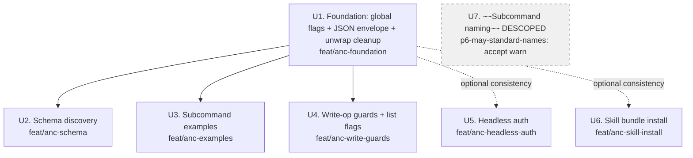

# feat: Push bird to 100% on anc (agent-native-cli) scoring

## Summary

Drive `bird` from anc score **68%** (35 pass / 23 warn / 6 fail / 5 skip out of 69 audits) to **100%**, executed as 7
independent feature-branch PRs against `dev`. One foundational PR unblocks six parallel workstreams that each map
cleanly to a coherent slice of the agentnative spec (P1–P8). Every workstream cites the specific anc audit IDs it
resolves, so the verification step is just `anc audit --output json` after merge.

## Problem Frame

`bird` is a Rust CLI for the X/Twitter API designed for human + agent use. The agent-native principle compliance is
graded by `anc` (the canonical checker), which probes three layers: behavioral (spawn the binary and inspect output),
source (ast-grep over Rust), and project (manifest/completions/bundle presence). The current 68% has 6 MUST-tier
failures and 23 warnings — material gaps that block agent automation (no runtime-discoverable schema, plain-text errors
under `--output json`, no destructive-op guards, no subcommand examples, no `bird skill install`).

Scope here is *anc remediation only* — no unrelated feature work, refactors, or DX polish lands in these PRs.

## Requirements (Traceability)

Every requirement is an anc audit ID. The implementation units (U1–U7) each list which IDs they resolve. The plan is
complete when `anc audit` reports score ≥ 99% with zero MUST-tier `fail` and warnings limited to legitimate `skip` rows
(vacuous conditional applicability).

**MUST-tier (currently failing — these must reach `pass`):**

- `p2-must-schema-print` — runtime-discoverable output schema
- `p2-must-json-errors` — JSON error envelope under `--output json`
- `p3-must-subcommand-examples` — every subcommand carries example(s) in `--help`
- `p5-must-force-yes` — destructive subcommands require `--force` or `--yes`
- `p8-must-bundle-install` — skill-bundle install path advertised in `--help`
- `code-unwrap` — no `.unwrap()` in production code paths

**MUST-tier (currently warn — must reach `pass`):**

- `p1-must-no-browser` — auth supports headless / manual-paste flow
- `p2-must-output-flag` — JSON output validation under safe probes
- `p4-must-try-parse` — `Cli::try_parse()`, no `.parse().unwrap()` in handlers
- `p5-must-dry-run` — write commands support `--dry-run`
- `p6-must-timeout-network` — global `--timeout` flag binds to reqwest client

**SHOULD-tier (warn → pass):**

- `p2-should-json-aliases` — `--json` / `--jsonl` short aliases
- `p2-should-consistent-envelope` — success/error envelopes share non-payload keys
- `p2-should-schema-file` — `schema/*.schema.json` at repo root
- `p3-should-paired-examples` — text + `--output json` example within 5 lines
- `p4-should-json-error-output` — errors parse as JSON under `--output json` (subsumed by p2-must-json-errors)
- `p4-should-structured-enum` — dedicated error module
- `p6-should-consistent-naming` — watchlist children are uniformly verb-shaped
- `p7-should-verbose` — `-v` / `--verbose`, repeatable
- `p7-should-limit` — list-style commands carry `--limit` / `--max-results`
- `p7-should-timeout` — long-running commands honor `--timeout` (subsumed by p6-must-timeout-network)

**MAY-tier (warn → pass; cheap):**

- `p2-may-raw-flag` — `--raw` for pipe-safe text
- `p2-may-more-formats` — at least one extra `--output` value (jsonl or csv)
- `p3-may-examples-subcommand` — `--examples` flag prints curated block
- `p6-may-color-flag` — `--color auto|always|never`
- `p6-may-standard-names` — ≥70% subcommands match anc's verb allow-list
- `p7-may-cursor-pagination` — `--cursor` / `--page` on list commands
- `p1-may-rich-tui` — TTY affordance (lowest priority; defer to follow-up if cost > value)

**Code-quality (null-tier):**

- `p7-naked-println` — naked `println!` in production code routed through output module
- `p6-dependencies` — confirm `anyhow`/`thiserror` present (already on if BirdError exists)

**Currently `skip` (must stay skip or improve to pass):**

- `p1-must-no-interactive` — passing via alternative gate; keep
- `p6-must-no-pager` — bird invokes no pager; keep
- `p6-should-stdin-input` — vacuous skip (no parse/validate subcommands); keep
- `p1-must-env-var` — currently flagged "no clap `#[arg(...)]` attributes found"; investigate (likely a layer-detection
  artifact; verify clap derive is recognized after U1's struct restructure)
- `p2-should-consistent-envelope` — currently skipped because no success-mode JSON to compare against; resolves
  automatically once U1 emits success JSON

## Scope Boundaries

**In scope:**

- All anc audit remediation listed above
- New `bird schema` subcommand and `schema/*.schema.json` files
- New `bird skill install` subcommand (mirrors `anc skill install`)
- Refactor of `Cli` struct to support `global = true` flag attributes
- Migration to `Cli::try_parse()` with JSON-aware error formatter
- Per-subcommand `after_help` examples (text + `--output json` paired)
- `--force` / `--yes` / `--dry-run` on every destructive or mutating command
- `--no-browser` / `--headless` on `bird login` (xurl manual-paste callback)
- Production-code `.unwrap()` replacement; tests untouched

**Out of scope (anti-creep):**

- Adding new bird features unrelated to anc
- Rewriting subcommand semantics (e.g., changing what `search` does)
- Performance work
- Documentation rewrites beyond what each PR's subcommand `after_help` needs
- iOS/Android/native wrapper work
- Test framework migrations

### Deferred to Follow-Up Work

- `p1-may-rich-tui` (spinner/progress bars via `indicatif` if cost > value)
- `p2-may-more-formats` (CSV/TSV beyond ndjson — only ship if free)
- Rust error-type refactor to `thiserror` if `BirdError` already serves the audit (only do the refactor if it's required
  to make `p4-should-structured-enum` pass)

### Deliberately Accepted Warns (Out of Scope)

- `p6-may-standard-names` — the social subcommands (`tweet`, `like`, `follow`, `dm`, `post`, `reply`, `repost`, `block`,
  `mute`, and their `un*` counterparts) are X/Twitter API canonical terminology. Aliasing to
  `create-tweet`/`delete-like` /etc. would bloat `--help`, fragment documentation, and damage agent discoverability of
  names they already know — for what is, by design, a MAY-tier audit (Warn never Fail). Bonus: anc's audit reads
  `--help` output, so hidden aliases wouldn't satisfy it; visible aliases would do the discoverability damage outright.
  Accept the Warn.

## Key Technical Decisions

**KTD-1: JSON error envelope shape.** Adopt anc's exact envelope: `{"error": "<kebab-case-id>", "kind":
"usage|auth|config|general", "message": "<human-readable>", "exit_code": <int>}`. `error` is a stable
machine-identifier; `kind` enumerates by exit code (usage→2, auth→77, config→78, general→1). Rationale: the audit only
requires the triple (error/kind/message) but anc itself ships this four-key form; adopting it verbatim minimizes review
surface and matches the reference passing CLI. (See `/tmp/anc-spec-dossier.md` § p2-must-json-errors.)

**KTD-2: Success envelope shape.** Wrap all success JSON as `{"data": <payload>, "meta": {...}}`. `data` is in anc's
payload-key allowlist (won't drift-flag against the error envelope per `p2-should-consistent-envelope`); `meta` carries
`next_cursor`, `truncated`, etc. For streaming subcommands (`bookmarks list`), `--output jsonl` writes one object per
line without the wrapper. (See `/tmp/anc-spec-dossier.md` § p2-should-consistent-envelope.)

**KTD-3: Schema authority.** `schema/<command>.schema.json` files at repo root are the build-time source.
`src/schema_print.rs` embeds them via `include_str!`. The `bird schema` subcommand emits the embedded bytes; a CI test
asserts `bird schema <name>` matches `schema/<name>.schema.json` byte-for-byte. Rationale: avoids drift between file and
runtime emission; single source of truth. (See `/tmp/anc-spec-dossier.md` § p2-should-schema-file.)

**KTD-4: Global flag refactor.** Promote `--output`, `--quiet`, `--verbose`, `--timeout`, `--color`, `--raw`,
`--no-interactive`, `--json`, `--jsonl`, `--examples` to clap `global = true` on the root `Cli` struct. Drop deprecated
`--plain` and `--no-color` (re-expose as `--color never` aliases). Rationale: anc's `p6-must-global-flags` requires it;
one struct edit unblocks 6+ audits.

**KTD-5: `--force` and `--yes` as mutually equivalent aliases.** Both forms accepted via clap `alias = "yes"` (or `alias
= "force"`) — the spec accepts either. Rationale: agent ergonomics; some agents emit `--yes` (gh, apt), some emit
`--force` (rm, kubectl). Pick one canonical name internally; both spellings advertised.

**KTD-6: `--dry-run` contract.** When set, the command MUST: (a) validate all inputs, (b) print to stdout the would-be
effect (HTTP method + URL + body redacted to safe fields), (c) exit 0 with no network call. Under `--output json`, emit
`{"dry_run": true, "would": {...}}`. Tests assert no HTTP mock is touched.

**KTD-7: Production-vs-test unwrap policy.** Per the spec dossier, `code-unwrap` flags ALL `.unwrap()` regardless of
`#[cfg(test)]`. But the audit's pragmatic standard is *no production unwraps*. Strategy: convert every `.unwrap()`
outside `#[cfg(test)]` blocks. Tests stay untouched. If the audit still flags test-code unwraps after production
cleanup, evaluate using `.expect("test invariant: ...")` for the test rows or filing an upstream anc issue.

**KTD-8: `--no-browser` for OAuth.** Twitter OAuth 2.0 PKCE has no Device Authorization Grant. `--no-browser` flow:
print authorization URL + state, instruct user to open in any browser/device, paste callback URL or code back to stdin.
Use xurl's existing manual-paste support if it exists; otherwise wrap stdin prompts in bird (and gate them behind
`--no-interactive=false`).

**KTD-9: Subcommand naming — accept the MAY-tier warn.** The social subcommands (`tweet`, `like`, `follow`, `dm`,
`post`, `reply`, `repost`, `unrepost`, `block`, `unblock`, `mute`, `unmute`) are canonical X/Twitter API terms. Aliasing
to `create-tweet`/`delete-like` etc. would bloat `--help`, fragment documentation, and damage agent discoverability of
names they already know — for what is, by design, a MAY-tier audit (Warn never Fail). Accept the Warn. (Bonus: anc reads
`--help`, so hidden aliases would not satisfy it; visible aliases would do the discoverability damage outright.)
`p6-should-consistent-naming` is a separate audit and stays in scope (watchlist children remain uniformly verb-shaped).

**KTD-10: Skill bundle install.** Copy anc's `src/skill_install.rs` pattern: `bird skill install [--host
claude-code|cursor|...] [--dry-run]`. The bundle source is `AGENTS.md` plus optionally a `skill/` directory at repo
root; destination is `~/.claude/skills/bird/` (per host). Default host = `claude-code` (per project memory: this user
installs into Claude Code).

## High-Level Technical Design

### Workstream dependency graph



U1 is the only hard blocker. U5/U6 are independent and can ship in any order, but landing after U1 yields cleaner
`--output json` errors throughout. **U7 is descoped** (see Scope Boundaries → Deliberately Accepted Warns).

### JSON envelope shape (KTD-1, KTD-2)

```text
Success:  {"data": <T>, "meta": {"next_cursor"?, "truncated"?, "dry_run"?}}
Error:    {"error": "<kebab-id>", "kind": "usage|auth|config|general",
           "message": "<human>", "exit_code": <int>}
JSONL:    one <T> per line; no wrapper; meta sent on a separate final line
          as {"meta": {...}} (terminator pattern)
```

### Schema flow (KTD-3)

```text
schema/bookmarks.schema.json          ← build-time source (git-tracked)
    │
    ▼ (include_str! at build time)
src/schema_print.rs::BOOKMARKS_SCHEMA  ← embedded bytes
    │
    ▼ (`bird schema bookmarks` or --schema)
stdout: <verbatim JSON>

tests/schema_parity.rs:
    assert_eq!(read("schema/bookmarks.schema.json"), BOOKMARKS_SCHEMA)
```

## Output Structure

New files/dirs (relative to repo root):

```text
schema/                              # KTD-3: build-time source
  bookmarks.schema.json
  search.schema.json
  thread.schema.json
  profile.schema.json
  watchlist.schema.json
  usage.schema.json
  doctor.schema.json
  raw-get.schema.json                # for `bird get` outputs
  error-envelope.schema.json         # KTD-1
  success-envelope.schema.json       # KTD-2
src/
  schema_print.rs                    # new — embeds schemas, dispatches `bird schema`
  skill_install.rs                   # new — mirrors anc's pattern
  error.rs                           # new (if needed for p4-should-structured-enum)
  examples.rs                        # new — curated `--examples` block source
tests/
  schema_parity.rs                   # new — byte-equality between file and embedded
  json_envelope.rs                   # new — round-trip envelope shape assertions
```

Modified files: `src/main.rs`, `src/cli.rs`, `src/output.rs`, `src/login.rs` (or wherever `Command::Login` lives), every
existing subcommand `*.rs` file (after_help additions).

## Implementation Units

### U1. Foundation: global flags, JSON error envelope, production unwrap cleanup

**Goal:** Refactor `Cli` to host global flags, route every error through a JSON-aware envelope formatter, and eliminate
`.unwrap()` from production code paths. This is the load-bearing PR — six other PRs build on its `Cli` shape and
envelope contract.

**Branch:** `feat/anc-foundation` → PR to `dev`

**Requirements covered:** `p2-must-json-errors`, `p2-must-output-flag`, `p2-should-json-aliases`,
`p2-should-consistent-envelope`, `p2-may-raw-flag`, `p4-must-try-parse`, `p4-should-json-error-output`,
`p4-should-structured-enum` (conditional), `p6-may-color-flag`, `p6-must-timeout-network`, `p7-should-verbose`,
`p7-should-timeout`, `p7-naked-println`, `code-unwrap`

**Dependencies:** none

**Files:**

- `src/cli.rs` — restructure `Cli` struct: promote `--output`, `--quiet`, `--timeout`, `--verbose`, `--color`, `--raw`,
  `--no-interactive`, `--json`, `--jsonl` to `global = true`; keep `--plain` / `--no-color` as aliases mapping to
  `--color never`
- `src/main.rs` — switch `Cli::parse()` → `Cli::try_parse()`; wrap clap `Err` through new JSON-aware error formatter;
  remove `.parse().unwrap()` at the tracing-filter line (currently main.rs:556)
- `src/output.rs` — add success/error envelope writers (KTD-1, KTD-2); add `--raw` text mode stripping
- `src/error.rs` — new module if needed: `BirdError` becomes `enum BirdError { Usage, Auth, Config, General }` with
  `kind()`, `error_id()`, `exit_code()` methods used by the formatter
- `src/transport.rs` — thread `--timeout` from `Cli` into `reqwest::ClientBuilder::timeout`
- Production source files with naked `println!`/`print!` or `.unwrap()` (per spec dossier audit list): `src/profile.rs`,
  `src/search.rs`, `src/watchlist.rs`, `src/thread.rs`, `src/transport.rs`, `src/bookmarks.rs`, `src/raw.rs`,
  `src/doctor.rs` (lines 250, 381), `src/usage.rs` (specific production lines, NOT test blocks), `src/db/client.rs`
  (production paths at 131, 315, 326, 339, 507, 781), `src/db/db.rs` (production line 814 —
  `Connection::open_in_memory().unwrap()` inside `#[cfg(test)]` is allowed; verify gating)

**Approach:**

- Clap derive supports `global = true` on `#[arg(...)]`. Apply to the listed flags on `Cli`.
- The JSON envelope formatter sits in `output.rs`. Every `eprintln!` of an error in `main.rs::run()` routes through
  `output::print_error(&err, &cfg)`, which switches on `cfg.format`.
- `try_parse` returns `Err(clap::Error)` — capture argv first (look for `--output json`, `--json`, `--jsonl` before clap
  consumes argv) to decide whether to emit text or JSON for the clap error itself.
- For unwraps in tests (`#[cfg(test)] mod tests { ... }` blocks): leave as-is. Only fix production-reachable unwraps.
  The dossier confirms anc allows `.expect("...")` for cases the developer considered.
- `--raw` only applies to text mode; under JSON, ignored.
- For `--verbose` (`u8` count via `ArgAction::Count`), wire to `tracing_subscriber` level: 0 = info, 1 = debug, 2+ =
  trace. Mutually-exclusive-last-wins with `--quiet`.

**Patterns to follow:**

- Existing `OutputConfig` resolution in `main.rs:573-579` (TTY → JSON when piped) — extend to honor `--json` / `--jsonl`
  short forms by collapsing them into `OutputFormat::Json` / `::Jsonl` before resolution.
- Existing `BirdError::print_json` (main.rs:75-91) — already routes structured fields but emits wrong field names;
  switch to KTD-1 shape.

**Technical design (directional):**

```text
// src/output.rs (pseudo-code, NOT implementation spec)
pub fn print_error(err: &BirdError, cfg: &OutputConfig) {
    match cfg.format {
        OutputFormat::Json | OutputFormat::Jsonl => {
            let env = ErrorEnvelope {
                error: err.error_id(),       // kebab-case stable ID
                kind: err.kind(),            // "usage" | "auth" | "config" | "general"
                message: err.to_string(),
                exit_code: err.exit_code(),
            };
            eprintln!("{}", serde_json::to_string(&env).unwrap_or_default());
        }
        OutputFormat::Text => { /* existing colored eprint */ }
    }
}
```

**Execution note:** Test-first for the envelope writers. Write `tests/json_envelope.rs` with explicit invalid
invocations (bad flag, missing arg, auth failure mock) and assert `serde_json::from_str::<Envelope>(stderr)` succeeds
with expected shape. Then make the implementation pass.

**Test scenarios:**

- Happy path: `bird --output json me` (mock) emits `{"data": {...}, "meta": {...}}` to stdout
- Bad clap flag: `bird --output json --bogus` emits
  `{"error":"unknown-argument","kind":"usage","message":"...","exit_code":2}` to stderr; exit code 2
- Auth error: mock-401 path emits `{"kind":"auth","exit_code":77,...}` to stderr; exit 77
- Config error: missing config file emits `{"kind":"config","exit_code":78,...}` to stderr; exit 78
- General error: network failure emits `{"kind":"general","exit_code":1,...}`
- `--json` alias: `bird --json me` behaves identically to `bird --output json me`
- `--jsonl` alias: `bird --jsonl bookmarks list` streams ndjson, terminator `{"meta":{...}}` line
- `--raw` text mode: `bird --raw bookmarks list` strips prose decoration; outputs `<id>\t<text>` per line
- `--raw` under JSON: flag is ignored, JSON envelope emitted normally
- `--color always`/`--color never`/`--color auto`: ANSI codes present/absent/TTY-dependent
- `--timeout 5` + slow mock: error is `general` with timeout message; reqwest client timeout = 5s (verify via mock
  measuring elapsed)
- `--verbose -v`: tracing-debug log emitted to stderr; happy path stdout unchanged
- `--verbose -vv`: tracing-trace logs emitted
- `--quiet`: no diagnostic output (existing behavior; assert preserved)
- Test code in `#[cfg(test)] mod tests { ... }` blocks still uses `.unwrap()` (existing tests pass)
- `anc audit` post-merge: `code-unwrap`, `p4-must-try-parse`, `p7-naked-println` move from `fail`/`warn` to `pass`;
  `p2-must-json-errors`, `p2-must-output-flag` move from `fail`/`warn` to `pass`

**Verification:**

- `cargo fmt --all` + `cargo clippy --all-targets --all-features -- -D warnings` + `cargo test` all green
- `anc audit --output json | jq '.summary'` shows pass count up by ≥12 vs baseline
- `target/debug/bird --output json --bogus 2>&1 | jq -e '.error and .kind and .message'` succeeds

---

### U2. Schema discovery: `bird schema` subcommand + `schema/*.schema.json`

**Goal:** Make every output shape runtime-discoverable. Add a `bird schema` subcommand that prints the JSON Schema for
any output type, plus build-time schema files at repo root that downstream consumers (CI, type generators) can pin
against.

**Branch:** `feat/anc-schema` → PR to `dev`

**Requirements covered:** `p2-must-schema-print`, `p2-should-schema-file`

**Dependencies:** `U1` (schema subcommand inherits global flags and envelope from foundation)

**Files:**

- `schema/` (new directory at repo root):
- `error-envelope.schema.json`
- `success-envelope.schema.json`
- `bookmarks.schema.json`
- `search.schema.json`
- `thread.schema.json`
- `profile.schema.json`
- `watchlist.schema.json`
- `usage.schema.json`
- `doctor.schema.json`
- `raw-get.schema.json`
- `src/schema_print.rs` — new module: `include_str!` each schema file; dispatch `bird schema [<name>] [--list]`
- `src/cli.rs` — add `Command::Schema { name: Option<String>, list: bool }`
- `src/main.rs` — add dispatch arm
- `tests/schema_parity.rs` — new: assert each embedded bytes match disk bytes exactly

**Approach:**

- `bird schema` (no arg): print success-envelope schema (the universal shape)
- `bird schema --list`: list available schema names, one per line (text) or JSON array (JSON mode)
- `bird schema <name>`: print that schema's bytes to stdout
- Each schema is a valid JSON Schema 2020-12 document with `$schema`, `$id`, `title`, `type: "object"`, `properties`.
  `$id` follows pattern `https://bird.dev/schema/<name>-v1.json` (stable URL even if not hosted — agents pin against
  it).
- The actual schemas describe the Twitter API response shape after bird's transformation, NOT the raw X API JSON (those
  are different things; bird normalizes).

**Patterns to follow:**

- anc's own `src/schema_print.rs` (per spec dossier) — copy structure verbatim
- Existing `src/doctor.rs` already serializes `DoctorReport` via serde — its struct can be the source for
  `doctor.schema.json` (use `schemars` crate at build time, or hand-write to start)

**Test scenarios:**

- `bird schema --list` text mode: prints names one per line, alphabetized
- `bird schema --list --json` (or `--output json`): emits `{"data": ["bookmarks", "doctor", ...], "meta": {}}`
- `bird schema bookmarks` prints valid JSON Schema (assert parseable + has `$schema`, `$id`, `title`, `properties`)
- `bird schema unknown-name` exits 2 with `{"error":"unknown-schema","kind":"usage",...}` under JSON
- Parity test: for each schema file, embedded bytes equal disk bytes
- `anc audit` post-merge: `p2-must-schema-print` and `p2-should-schema-file` move to `pass`

**Verification:**

- `bird schema | jq -e '.["$schema"] and .properties'` exits 0
- `ls schema/*.schema.json | wc -l` ≥ 10
- `cargo test --test schema_parity` green

---

### U3. Subcommand examples: per-subcommand `after_help` + `--examples` flag

**Goal:** Every subcommand carries at least one example invocation in `--help`. Top-level `bird --examples` (or `bird
--help` `Examples:` block) emits a curated reference list. Examples come in pairs: text + `--output json`.

**Branch:** `feat/anc-examples` → PR to `dev`

**Requirements covered:** `p3-must-subcommand-examples`, `p3-should-paired-examples`, `p3-may-examples-subcommand`

**Dependencies:** `U1` (examples that show `--output json` need it working first; if landing before U1 the JSON examples
are aspirational)

**Files:**

- `src/cli.rs` — `#[command(after_help = include_str!("../examples/<sub>.txt"))]` on every variant; add global
  `--examples` flag handling
- `examples/` (new directory at repo root):
- `top-level.txt`, `bookmarks-list.txt`, `search.txt`, `thread.txt`, `profile.txt`, `watchlist-add.txt`,
  `watchlist-remove.txt`, `watchlist-list.txt`, `watchlist-check.txt`, `usage.txt`, `me.txt`, `get.txt`, `post.txt`,
  `put.txt`, `delete.txt`, `tweet.txt`, `reply.txt`, `like.txt`, `unlike.txt`, `repost.txt`, `unrepost.txt`,
  `follow.txt`, `unfollow.txt`, `dm.txt`, `block.txt`, `unblock.txt`, `mute.txt`, `unmute.txt`, `login.txt`,
  `doctor.txt`, `cache.txt`, `completions.txt`, `schema.txt`, `skill.txt`
- `src/examples.rs` — new: dispatch `--examples` flag (or `examples` subcommand if simpler) to print curated reference

**Approach:**

- Each `examples/<sub>.txt` follows the format:

  ```text
  Examples:
    bird bookmarks list                    # human-readable
    bird bookmarks list --output json      # machine-readable (paired)
    bird bookmarks list --limit 50         # with limit
    BIRD_OUTPUT=json bird bookmarks list   # env-driven
  ```

- The `--examples` global flag (KTD-4) when set prints the top-level `examples/top-level.txt` and exits 0. Under
  `--output json`, emit `{"data": ["bird ...", ...], "meta": {}}`.
- Examples use realistic argument values (no `<foo>` placeholders) per spec dossier.

**Patterns to follow:**

- anc's `src/cli.rs` (per dossier: 2-5 paired examples per subcommand)
- Clap's `after_help` accepts owned `String` or `&'static str` — `include_str!` gives the latter

**Test scenarios:**

- For each subcommand: `bird <sub> --help` contains an example line (line starting with `bird` or `$` or a fenced code
  block); regex-assert in tests
- `bird --help` contains a top-level `Examples:` section with ≥1 paired example (text + `--output json`)
- `bird --examples` exits 0 and prints curated block
- `bird --examples --output json` emits `{"data": [...], "meta": {}}`
- `anc audit` post-merge: `p3-must-subcommand-examples`, `p3-should-paired-examples`, `p3-may-examples-subcommand` all
  `pass`

**Verification:**

- `for sub in $(bird --help | awk '/^ [a-z]/ {print $1}'); do bird $sub --help | grep -q 'bird ' || echo "$sub MISSING";
  done` produces no MISSING lines
- `bird --help | grep -A 1 'Examples:' | grep -q -- '--output json'` succeeds

---

### U4. Write-op hardening: `--force` / `--yes` / `--dry-run` + list flags

**Goal:** Every mutating subcommand requires explicit confirmation (`--force` or `--yes`) when stdin is not a TTY (or
always, configurable), and supports `--dry-run` to preview without side effects. List-style subcommands gain `--limit`
and `--cursor` for bounded, traversable results.

**Branch:** `feat/anc-write-guards` → PR to `dev`

**Requirements covered:** `p5-must-force-yes`, `p5-must-dry-run`, `p7-should-limit`, `p7-may-cursor-pagination`

**Dependencies:** `U1` (dry-run output uses success envelope; force-yes errors use error envelope)

**Files:**

- `src/cli.rs` — add `--force`/`--yes` and `--dry-run` flags to write commands (Tweet, Reply, Like, Unlike, Repost,
  Unrepost, Follow, Unfollow, Dm, Block, Unblock, Mute, Unmute, Post, Put, Delete, Cache::Clear, Watchlist::Remove); add
  `--limit`/`--cursor` to list commands (Bookmarks, Search, Thread, Watchlist::List, Watchlist::Check)
- `src/main.rs` — dispatch arms enforce `--force` (or TTY prompt) before mutation; `--dry-run` short-circuits before
  HTTP call
- `src/transport.rs` — accept `dry_run: bool` parameter; when true, print intended request and return without calling
  xurl
- `src/raw.rs`, `src/bookmarks.rs`, `src/search.rs`, `src/thread.rs`, `src/watchlist.rs` — accept limit/cursor params,
  propagate to API calls

**Approach:**

- Confirmation flow (per KTD-5): When write command runs without `--force`/`--yes`:
- If stdin is TTY and `--no-interactive` is unset: prompt "Proceed? [y/N]" (text mode) or refuse with
  `{"error":"requires-confirmation","kind":"usage","exit_code":2}` (JSON mode)
- Otherwise: refuse with the same usage error
- Dry-run output (per KTD-6):
- Text: `Would <verb>: <method> <url>\nBody: <safe-redacted-fields>\n(--dry-run; no request sent)`
- JSON: `{"data": {"dry_run": true, "would": {"method": "POST", "url": "...", "body": {...}}}, "meta": {}}`
- Limit: per-subcommand `--limit` with a documented ceiling (100 default, max 1000); under JSON, response includes
  `"meta": {"truncated": true}` when clamped
- Cursor: `--cursor <token>` passes through to upstream API's `pagination_token`; response includes `"meta":
  {"next_cursor": "..."}`

**Patterns to follow:**

- Existing `Cache::Clear` (if present) — confirm or extend
- Existing pagination in `bookmarks.rs` (max_results=100 default) — promote to `--limit`

**Test scenarios:**

- `bird tweet --text 'hi'` (no --force, no TTY): exits 2 with `{"error":"requires-confirmation",...}`
- `bird tweet --text 'hi' --force` (no TTY): proceeds (mock asserts POST issued)
- `bird tweet --text 'hi' --yes` (no TTY): proceeds identically to --force
- `bird tweet --text 'hi' --dry-run`: prints
  `{"data":{"dry_run":true,"would":{"method":"POST","url":"/2/tweets",...}},"meta":{}}`; HTTP mock asserts zero calls
- `bird delete /2/tweets/123 --dry-run --output json`: emits dry-run envelope; no DELETE issued
- `bird bookmarks list --limit 50`: response contains ≤50 items; `meta.truncated` true if upstream returned more
- `bird bookmarks list --limit 50 --cursor abc`: HTTP mock asserts `pagination_token=abc` in querystring
- `bird search --limit 1000 --query foo`: max items 1000
- `bird search --limit 1500 --query foo`: clamped to ceiling (1000) with `meta.truncated: true`
- `bird watchlist remove alice` (no --force, TTY): prompts; `n` aborts (exit 1), `y` proceeds
- `bird watchlist remove alice --force`: proceeds without prompt
- `anc audit` post-merge: `p5-must-force-yes`, `p5-must-dry-run`, `p7-should-limit`, `p7-may-cursor-pagination` all
  `pass`

**Verification:**

- All write subcommand `--help` shows `--force`, `--yes`, and `--dry-run`
- `for cmd in tweet reply like dm block delete; do bird $cmd --help | grep -q -- '--dry-run' || echo "$cmd MISSING";
  done` empty

---

### U5. Headless auth: `--no-browser` / `--headless` for `bird login`

**Goal:** `bird login` works without a browser, supporting agent-driven authentication flows.

**Branch:** `feat/anc-headless-auth` → PR to `dev`

**Requirements covered:** `p1-must-no-browser`

**Dependencies:** none (independent; benefits from U1's envelope but not blocked)

**Files:**

- `src/cli.rs` — add `--no-browser` (aliased `--headless`) flag to `Command::Login`
- `src/login.rs` or `src/main.rs` (wherever Login is dispatched) — branch on flag; when set, print authorization URL +
  state and wait on stdin for callback URL or auth code
- `src/transport.rs` — if xurl invocation needs a flag to suppress its own browser-spawn, pass it through

**Approach (per KTD-8):**

- Twitter OAuth 2.0 PKCE has no Device Authorization Grant; we use manual-paste callback flow
- Under `--no-browser`:
- Build authorization URL (existing xurl code does this)
- Print: `Open this URL in any browser:\n<url>\n\nAfter authorizing, paste the full callback URL here:`
- Read stdin line; extract `code` and `state` querystring params; validate state matches; exchange code for token via
  xurl
- Under JSON mode (`--no-browser --output json`): emit `{"data": {"auth_url": "...", "state": "..."}, "meta":
  {"awaiting": "callback_url_on_stdin"}}` to stdout; read stdin; emit `{"data": {"status": "authenticated", "username":
  "..."}, "meta": {}}` on success

**Patterns to follow:**

- xurl's existing OAuth2 PKCE flow (subprocess invocation patterns in `src/transport.rs`)

**Test scenarios:**

- `bird login --no-browser`: prints URL + state, waits on stdin; piping the callback URL succeeds; token saved to
  standard location
- `bird login --headless` (alias): identical behavior
- `bird login --no-browser --output json`: emits structured prompt; stdin callback completes; emits success envelope
- Invalid callback (state mismatch): emits `{"error":"state-mismatch","kind":"auth","exit_code":77}`
- `anc audit` post-merge: `p1-must-no-browser` moves to `pass`

**Verification:**

- `bird login --help` shows `--no-browser` and `--headless`
- `echo "https://callback?code=...&state=..." | bird login --no-browser` smoke test against mock OAuth server

---

### U6. Skill bundle install: `bird skill install`

**Goal:** Make the bird skill bundle agent-installable. Mirrors `anc skill install`.

**Branch:** `feat/anc-skill-install` → PR to `dev`

**Requirements covered:** `p8-must-bundle-install`

**Dependencies:** none

**Files:**

- `src/cli.rs` — add `Command::Skill { action: SkillAction }` where `SkillAction = Install { host, dry_run, all }`
- `src/skill_install.rs` — new module (lift anc's pattern); copies bundle from a known source (AGENTS.md + optional
  `skill/` dir or in-repo bundle path) into `~/.claude/skills/bird/` (or per-host destination)
- `src/main.rs` — dispatch arm

**Approach (per KTD-10):**

- `bird skill install` (no host): default `--host claude-code`
- `--host claude-code|cursor|all`: select destination
- `--all`: install to every supported host
- `--dry-run`: print would-be operations (mkdir + write paths), exit 0, no fs writes
- Bundle source: lift anc's pattern of embedding the bundle via `include_str!` of a `bundle/SKILL.md` file at build
  time, OR copy from a `skill/` directory in the repo

**Patterns to follow:**

- anc's `src/skill_install.rs` (per spec dossier — copy structure)
- Existing `src/completions.rs` (clap-complete subcommand) for clap structuring

**Test scenarios:**

- `bird skill install --dry-run`: prints intended fs ops; no writes (assert with tempdir HOME)
- `bird skill install --host claude-code --dry-run`: dry-run output mentions `~/.claude/skills/bird/`
- `bird skill install --all --dry-run`: dry-run mentions every supported host's path
- `bird skill install` (no flags, with tempdir HOME): bundle present at expected path; existing bundle (if any) backed
  up
- `bird --help | grep -q 'skill install'`: passes
- `anc audit` post-merge: `p8-must-bundle-install` moves to `pass`

**Verification:**

- `bird skill --help` documents `install`
- `HOME=$(mktemp -d) bird skill install` creates files; second run is idempotent

---

### U7. Subcommand naming alignment

**Goal:** Reach the 70% standard-verb threshold via clap aliases (no breaking renames). Make watchlist's child commands
uniformly verb-shaped.

**Branch:** `feat/anc-naming` → PR to `dev`

**Requirements covered:** `p6-may-standard-names`, `p6-should-consistent-naming`

**Dependencies:** none

**Files:**

- `src/cli.rs` — add clap `alias = "..."` (or `visible_aliases`) attributes to non-standard subcommands so a standard
  verb is reachable; tidy Watchlist children if any are non-verb

**Approach (per KTD-9):**

- For each non-standard top-level subcommand, add an alias mapping to the closest standard verb. Per spec dossier, anc's
  allow-list includes `add`, `create`, `delete`, `get`, `list`, `ls`, `remove`, `rm`, `set`, `update`, `show`, `search`,
  `view`, `apply`, `fetch`, `init`, `login`, `logout`, `status`, `watch`, `info`, `auth`, `config`, `doctor`, `skill`.
- Specific aliases to add:
- `me` → `--alias = "show-me"` (or accept warn; me is a Twitter-domain noun)
- `bookmarks` → alias `list-bookmarks`
- `profile` → alias `get-profile` or `show-profile`
- `thread` → alias `get-thread` or `show-thread`
- `tweet` → alias `create-tweet`
- `reply` → alias `create-reply`
- `like` → alias `create-like`
- `repost` → alias `create-repost`
- `dm` → alias `create-dm`
- `unlike` → alias `delete-like`
- `unrepost` → alias `delete-repost`
- `unfollow` → alias `delete-follow`
- `unblock` → alias `delete-block`
- `unmute` → alias `delete-mute`
- `follow` → alias `create-follow`
- `block` → alias `create-block`
- `mute` → alias `create-mute`
- Watchlist children: confirm `add`, `remove`, `list`, `check` are all verbs (they are per project memory) — likely
  already passing the consistent-naming gate; verify and adjust if `check` is the outlier (rename internal action to
  `status` if needed without breaking; or add alias)
- Standard verb count after aliases: enumerate to confirm ≥70%

**Test scenarios:**

- `bird create-tweet --text 'hi' --dry-run`: behaves identically to `bird tweet --text 'hi' --dry-run`
- `bird list-bookmarks`: behaves identically to `bird bookmarks list` (note hierarchy)
- `anc audit` post-merge: `p6-may-standard-names` warn moves to `pass` (or at minimum threshold satisfied)
- `p6-should-consistent-naming`: warn moves to `pass`

**Verification:**

- Run anc audit; confirm `p6-may-standard-names` ratio ≥ 70%
- `bird --help` lists no renamed subcommands; existing names still appear

---

## Risks & Mitigations

**R1: Test-code unwraps still flag `code-unwrap`.** Spec dossier notes anc's audit greps all `.unwrap()`. If post-U1 the
audit still flags test-block unwraps, we're stuck.

- *Mitigation:* Read anc's `code-unwrap` source (per dossier at `/home/brett/dev/agentnative-cli/src/audits/source/...`)
  before U1 lands. If it respects `#[cfg(test)]` boundaries, no action needed. If not: convert test unwraps to
  `.expect("test: ...")` (the audit accepts `expect`) en masse — purely mechanical; can be a follow-up commit on U1.

**R2: `bird login` xurl dependency for `--no-browser`.** If xurl itself doesn't support a no-browser mode, bird has to
drive the OAuth flow directly.

- *Mitigation:* Investigate xurl's flags first; if no support, build the manual-paste flow in bird itself using the same
  auth URL + state pattern. U5 already plans for this.

**R3: Schema authoring is tedious.** 10+ schema files at JSON Schema 2020-12 spec, by hand, is slow.

- *Mitigation:* Use `schemars` crate at build time where the response struct exists (e.g., `DoctorReport`). Hand-write
  where structs don't exist or are too large to derive from. Audit only checks parseable JSON Schema; minimum viable
  schemas are fine.

**R4: `--force` confirmation breaks existing user scripts.** Users today run `bird delete /2/tweets/123` and it works;
adding required confirmation breaks pipelines.

- *Mitigation:* Per KTD-5, prompt only in TTY mode. Non-TTY (CI/agent) with no flag: refuse with usage error. This is
  the spec-required behavior. Communicate the change in CHANGELOG (generated from PR descriptions per project memory).

**R5: Foundation PR (U1) is a large diff.** Touches `Cli`, every error path, several production source files for unwrap
cleanup. High review surface.

- *Mitigation:* Land via PR with a thorough description listing the audit IDs covered. Reviewer can spot-check by
  running `anc audit --output json` against the branch and confirming the named IDs move to `pass`. Optionally split
  into U1a (global flags + envelope) + U1b (unwrap cleanup) if review feedback requests.

**R6: `p1-must-env-var` skip says "no clap `#[arg(...)]` attributes found".** This may indicate anc's source-layer
scanner doesn't recognize bird's clap derive style.

- *Mitigation:* During U1, deliberately add `env = "BIRD_XXX"` to multiple args; re-run anc audit. If still skipped,
  file an issue against anc upstream — this is a checker bug, not a bird bug. Either the audit passes after U1 changes
  are visible, or it stays a skip (and skips count as `n_a`, which is the same as a pass for badge eligibility).

**R7: Aliases for `p6-may-standard-names` may confuse users.** `bird create-tweet` and `bird tweet` both working could
split documentation.

- *Mitigation:* Use clap's `alias` (hidden) not `visible_aliases`. Existing names stay primary in `--help`; aliases
  satisfy the audit's grep without polluting help output.

## Sources & Research

- Baseline anc audit: `/tmp/anc-baseline.json` (this session, 2026-06-02; 35 pass / 23 warn / 6 fail / 5 skip / 69 total
  / score 68%)
- Spec dossier: `/tmp/anc-spec-dossier.md` (this session; ~3000 words covering 27 audit IDs + 7 cross-cutting decisions)
- agentnative spec markdown: `/home/brett/dev/agentnative-spec/principles/p{1..8}-*.md`
- anc source: `/home/brett/dev/agentnative-cli/src/audits/{behavioral,project,source}/`
- Reference passing CLI: `anc` itself (35 pass / 8 skip / 0 warn / 0 fail = 100%)
- Triage table: produced by Explore subagent earlier in this session (mapped each non-passing audit to `src/` files)
- Architecture map: produced by Explore subagent earlier in this session (clap-derive in `src/cli.rs`; `BirdError` enum
- exit codes 78/77/1 in `src/main.rs`; `OutputFormat` + `OutputConfig` in `src/output.rs`; `DoctorReport` JSON pattern
  in `src/doctor.rs`; AGENTS.md bundle present)
- Prior learning (referenced via `qmd query`):
  `docs/solutions/test-failures/stale-release-binary-dogfood-fail-2026-05-07.md` — flags the failure mode
  "p2-must-schema-print returns Fail despite anc --help showing the schema subcommand"; when running `anc audit`, ensure
  the freshest `target/debug/bird` is what anc is probing

## PR Landing Order

1. **U1 (foundation)** — must land first; unblocks U2/U3/U4
2. **U2 + U3 + U4 in parallel** — all depend on U1, no inter-dependencies among themselves
3. **U5 + U6 in parallel** — independent of foundation but benefit from landing after for consistency
4. **U7 descoped** — `p6-may-standard-names` Warn accepted; X/Twitter API canonical terms preserved

## Acceptance

The plan is complete when:

- Zero `fail` rows
- Zero `warn` rows on MUST and SHOULD tier
- One acceptable `warn` on `p6-may-standard-names` (MAY tier; deliberately accepted — see Scope Boundaries →
  Deliberately Accepted Warns)
- All other warns either resolved to `pass` or downgraded to `skip` via conditional applicability
- Effective score: every audit anc grades on substance reaches `pass`; the only remaining `warn` is a documented domain
  decision

Verification:

```text
$ anc audit --output json | jaq '.summary | {pass, warn, fail}'
{ "pass": 67, "warn": 1, "fail": 0 }
$ anc audit --output json | jaq '[.results[] | select(.status == "warn") | .id]'
[ "p6-may-standard-names" ]
```

Or, if some `skip` rows are irreducible (e.g., `p6-must-no-pager` skips because bird invokes no pager, which is
correct), the equivalent ≥99% with every `must` and `should` row at `pass`.
