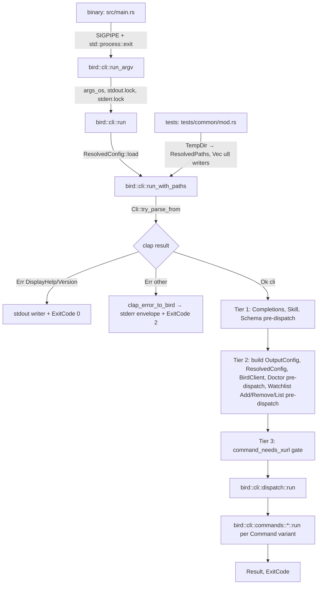
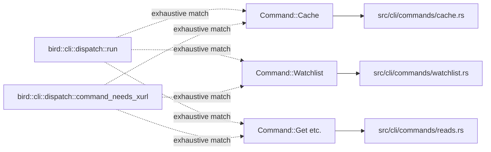
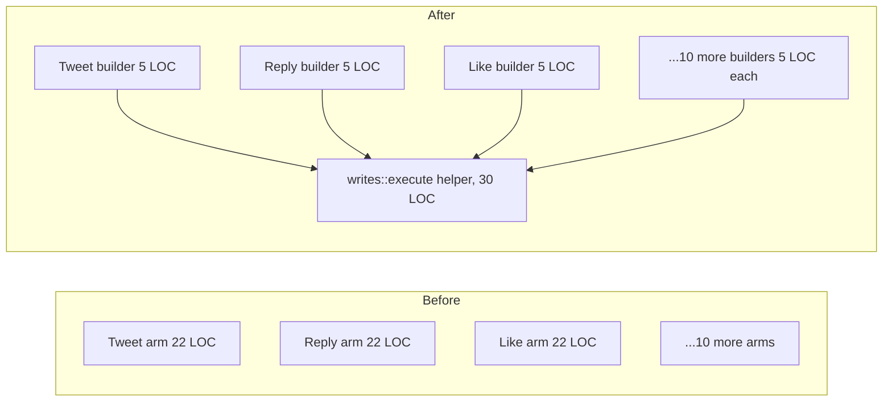

# refactor: Lift CLI to library, split run dispatcher, inject paths

## Summary

Promote `src/main.rs` to a thin SIGPIPE shim plus a one-line call into a new `src/lib.rs`, exposing layered entrypoints
`bird::cli::run_argv() / run(args, stdout, stderr) / run_with_paths(args, stdout, stderr, paths)`. Inject store, config,
and cache paths through a new `ResolvedConfig::load_with_paths` so tests use `tempfile::TempDir` instead of mutating
`HOME` / `XDG_CONFIG_HOME`. Split the 740-line `fn run` dispatcher in `src/main.rs:276` into per-command modules under
`src/cli/commands/<name>.rs`, collapse the 13 near-identical xurl-write arms (Tweet/Reply/Like/...) into a shared
helper, and migrate three in-process-shaped test suites (`tests/cli_smoke.rs` 52 tests, `tests/envelope_consistency.rs`
3 tests, `tests/json_envelope.rs` 13 tests) to library-style calls. Keep `tests/transport_integration.rs` and
`tests/live_integration.rs` forked — they exercise real subprocess, SIGPIPE, and broken-pipe drain behavior that
requires a child process.

This is an internal refactor. The binary's exit codes, stdout/stderr split, envelope shapes, env-var consumption, and
user-visible behavior are unchanged. `out_println!`/`out_print!`/`diag!` macros remain in this plan; the
writer-injection refactor lives in the sibling plan `2026-06-02-003-refactor-writer-injection-remove-macros-plan.md`,
sequenced after this one.

---

## Problem Frame

bird is a binary-only crate today. `src/main.rs` is 1,534 LOC and contains:

- The clap parse, the SIGPIPE restore, and the full `fn main` entrypoint (~300 LOC)
- A 740-line `fn run` dispatcher with 26 `Command::*` arms
- Twelve helper functions that aren't `main`-specific: `parse_param_vec`, `command_needs_xurl`, `default_auth_type`,
  `require_confirmation`, `emit_dry_run`, `build_dry_run_url`, `clamp_limit`, `xurl_write_call`, `xurl_write`,
  `explicit_output_from_argv`, `output_from_argv`, `parse_output_value`, `clap_error_to_bird`, `print_examples`
- Eight inline `#[cfg(test)]` tests in `src/main.rs:1437-1534`

Every integration test forks the binary via `assert_cmd::cargo::cargo_bin_cmd!("bird")` and sets `HOME` +
`XDG_CONFIG_HOME` to a per-test `TempDir`. Across the three in-process-shaped suites (`cli_smoke.rs` 52, `envelope_
consistency.rs` 3, `json_envelope.rs` 13 = 68 tests) this means 68 process spawns per `cargo test` run, each paying the
env-mutation overhead and racing on the `XDG_CONFIG_HOME` process-env when the test binary parallelises.

xurl-rs solved the same problem in [brettdavies/xurl-rs#29](https://github.com/brettdavies/xurl-rs/pull/29) (merged
2026-06-01): lift `cli` to a public library, add a layered `run_argv / run / run_with_paths` entrypoint, inject store
paths through `Auth::new_with_store_path`, and migrate tests to library-style calls. xurl-rs is the structural template
for the lift, but bird's library surface is **intentionally narrower** than xurl-rs's was — xurl-rs has a real
downstream library consumer (bird itself imports it as a crate), so its `pub` API is a deliberate public contract; bird
has no downstream library consumer and is distributed exclusively as a binary, so bird's library surface gets
`#[doc(hidden)]` and a rustdoc disclaimer rather than being promoted as a public crate API. See KTD-8 for the posture.
bird's structural debt is the same shape, made larger by:

- The 740-line `fn run` dispatcher (xurl-rs had a smaller, already-modular shape)
- 13 near-identical xurl-write arms that scream for a shared helper
- AGENTS.md already declares `main.rs` "slated for further extraction into per-command modules" (`AGENTS.md:168-176`)
  but the count it cites (766 LOC) is stale — the file has since grown to 1,534
- The user's global `~/.claude/CLAUDE.md` enforces a 200-line refactor trigger; `main.rs` is past it by 7.5×

This plan does the structural lift and path injection only. The `out_println!`/`out_print!`/`diag!` writer-threading
work is split into its sibling plan because it touches 120+ call sites across 13 files and would balloon this plan
beyond reviewability. After this plan lands, bird has the library entrypoints and per-command modules; the macros still
write to globally-locked stdout/stderr. The sibling plan replaces them.

---

## Requirements

Each requirement carries a stable plan-local R-ID. Most are derived from the xurl-rs PR #29 template, tightened where
bird's constraints differ.

### Library surface

- **R1.** A new `src/lib.rs` is the library root. It declares `pub mod cli;` plus `pub use` re-exports for the modules
  external consumers need: `config`, `error`, `transport`, `output`, `requirements`, `db` (today's `mod` declarations in
  `src/main.rs:3-23` move here, with visibility widened from `pub(crate)` to `pub` where required).
- **R2.** `Cargo.toml` gains an explicit `[lib]` section (`name = "bird"`, `path = "src/lib.rs"`) and an explicit
  `[[bin]]` section (`name = "bird"`, `path = "src/main.rs"`). The implicit binary/library inference is replaced with
  explicit targets so the crate can be both.
- **R3.** Three layered entrypoints exist under `bird::cli`:
- `run_argv() -> ExitCode` — reads `std::env::args_os()`, locks `std::io::stdout()` / `stderr()`, calls `run`.
- `run<I, S>(args: I, stdout: &mut dyn Write, stderr: &mut dyn Write) -> ExitCode` — accepts argv + writers, loads
  `ResolvedConfig` via `ResolvedConfig::load`, calls `run_with_paths`.
- `run_with_paths<I, S>(args, stdout, stderr, paths: ResolvedPaths) -> ExitCode` — the real worker; tests call this
  directly with a `TempDir`-backed `ResolvedPaths`.
- **R4.** The library entrypoint uses `Cli::try_parse_from(args)`, never `Cli::parse()` and never `clap::Error::exit()`.
  Clap errors map through `clap_error_to_bird` (lifted from `src/main.rs:1113`); `DisplayHelp` / `DisplayVersion` route
  to the runner's stdout writer and exit 0, all other variants emit a usage envelope through the runner's stderr writer
  and exit 2.
- **R5.** The library never calls `process::exit()`. It returns `ExitCode` to the caller. The binary's `fn main` is the
  only call site that converts `ExitCode` to a process exit.

### Binary as thin wrapper

- **R6.** `src/main.rs` reduces to the SIGPIPE restoration (`libc::signal(SIGPIPE, SIG_DFL)` for Unix) plus
  `bird::cli::run_argv()`. Target shape: ≤ 30 LOC including the `#[cfg(unix)]` shim and the tracing-subscriber
  initialization. All eight `#[cfg(test)]` tests at `src/main.rs:1437-1534` move to the module that owns the function
  under test (e.g., `bird_error_exit_codes` → `src/error.rs`; `output_from_argv_*` → wherever the argv pre-scan lands).
- **R7.** The existing exit-code contract is preserved exactly: `BirdError::Config` → 78, `BirdError::Auth` → 77,
  `BirdError::Usage` → 2, `BirdError::Command` → 1, `Ok(())` → 0. Per
  `docs/solutions/security-issues/rust-cli-security-code-quality-audit.md`, these are a hard public contract. R7 is
  verified by a per-variant exit-code test in `src/error.rs`.

### Path injection (replaces env-var test isolation)

- **R8.** A new public struct `bird::config::ResolvedPaths { config_dir: PathBuf, store_path: PathBuf }` carries the two
  filesystem locations bird actually uses. `ResolvedPaths::from_env()` is the convenience constructor that calls
  `dirs::config_dir()` (today's behavior at `src/config.rs:37`). Today's `config.cache_path` derives as
  `config_dir.join("bird.db")` — no separate `cache_dir` field is added because no call site reads one (verified by
  grep). If future work needs a platform-correct cache directory via `dirs::cache_dir()`, add the field then with the
  behavior change documented.
- **R8a.** A new public struct `bird::config::EnvOverrides { output: Option<OutputFormat>, username: Option<String>,
  no_color: Option<bool>, term: Option<String>, xurl_path: Option<PathBuf>, timeout_secs: Option<u64> }` captures the
  six bird-namespaced process-env reads that today happen scattered across `main.rs`, `transport.rs`, and `output.rs`.
  `EnvOverrides::from_env()` is the convenience constructor that reads `BIRD_OUTPUT`, `X_API_USERNAME`, `NO_COLOR`,
  `TERM`, `BIRD_XURL_PATH`, and (formerly) `set_timeout_secs`'s argument source. The binary calls `from_env()`; tests
  construct explicit `EnvOverrides` values. `run_with_paths` takes `EnvOverrides` alongside `ResolvedPaths`. R8a closes
  the env-var race surface that R8 alone does not — without it, parallel in-process tests still serialize on
  `BIRD_OUTPUT` / `NO_COLOR` / `BIRD_XURL_PATH` writes.
- **R9.** A new `ResolvedConfig::load_with_paths(overrides: ArgOverrides, paths: ResolvedPaths, env: EnvOverrides) ->
  Result<ResolvedConfig, String>` is the canonical loader. `ResolvedConfig` retains its existing `config_dir: PathBuf`
  and `cache_path: PathBuf` fields (read by `watchlist.rs` in 4 places) but `load_with_paths` populates them from the
  injected `paths` rather than from `dirs::config_dir()`: `ResolvedConfig.config_dir == paths.config_dir;
  ResolvedConfig.cache_path == paths.config_dir.join("bird.db")`. `cache_enabled` is now derived from
  `env.no_color`-style env reads via `EnvOverrides` rather than reading `BIRD_NO_CACHE` directly inside `load`. The
  existing `ResolvedConfig::load(overrides)` becomes a one-line shim: `Self::load_with_paths(overrides,
  ResolvedPaths::from_env(), EnvOverrides::from_env())`. Single source of truth: `ResolvedPaths` and `EnvOverrides` are
  the inputs; `ResolvedConfig` mirrors them.
- **R10.** `skill_install::run(host, dry_run, all, home: &Path)` accepts an explicit `home` instead of calling
  `resolve_home()` internally. The current shape: `pub(crate) fn install_into(host: Host, home: &Path, dry_run: bool)`
  (`src/skill_install.rs:87`) is already injectable; only `pub(crate) fn run(host, dry_run, all)`
  (`src/skill_install.rs: 113`) calls `resolve_home()` (`src/skill_install.rs:118`) before delegating. The change is to
  drop the `resolve_home()` call from `run` and accept `home` from the caller, then pass it straight to `install_into`.
  The library's `run_with_paths` derives the home from the caller-provided context; the binary path uses
  `dirs::home_dir()`.
- **R11.** `BirdClient::new` (today at `src/db/client.rs:230-275`) already takes `store_path: &Path` — no signature
  change. The only change is that `main.rs` stops resolving `config.cache_path` itself; the resolved value comes from
  `ResolvedConfig` which was built from `ResolvedPaths`.

### Dispatcher split

- **R12.** `src/cli.rs` becomes `src/cli/mod.rs`. The clap derive structs (`Cli`, `Command`, `WatchlistCommand`,
  `CacheAction`, `SkillAction`, `WriteGuard`) stay in `mod.rs` and gain `pub` visibility (today they are `pub(crate)`).
  Transitively-referenced types reachable from those `pub` enums must also widen to `pub` or the build fails with E0446
  ("private type in public interface"): `crate::skill_install::Host` (today `pub(crate)`, imported by `cli.rs:6` and
  used inside `SkillAction::Install { host: Option<Host>, .. }`), `crate::login::HeadlessAuthArgs` (today `pub(crate)`,
  flattened into `Command::Login { headless: HeadlessAuthArgs }` at `cli.rs:147-148`), and any other type referenced
  from a `pub` `Command::*` arm.
- **R13.** Two new modules absorb argv-time helpers currently inline in `src/main.rs`:
- `src/cli/argv.rs` — `output_from_argv`, `explicit_output_from_argv`, `parse_output_value`
- `src/cli/clap_errors.rs` — `clap_error_to_bird`
- **R14.** A new `src/cli/dispatch.rs` owns the 3-tier dispatcher mechanics that today live in `fn main`:
- `command_needs_xurl` (currently `src/main.rs:50-103`) — stays a centralized exhaustive match per
  `docs/solutions/architecture-patterns/shell-completions-main-dependency-gating.md`. New `Command::*` variants must add
  an arm here or the compile fails.
- `require_confirmation` (currently `src/main.rs:114-174`) — gains `&mut dyn Write` for the prompt and accepts an
  `Option<Box<dyn FnOnce() -> io::Result<String>>>` for the answer reader. Today's TTY-bound `stdin().read_line` is the
  default reader; tests pass a closure that returns a canned answer.
- `emit_dry_run` (currently `src/main.rs:177-204`), `build_dry_run_url` (currently `src/main.rs:210-223`), `clamp_limit`
  (currently `src/main.rs:228-235`), `default_auth_type` (currently `src/main.rs:107-111`), `parse_param_vec` (currently
  `src/main.rs:34-42`)
- `xurl_write_call` (currently `src/main.rs:238-250`), `xurl_write` (currently `src/main.rs:253-265`)
- The `ListFlags` struct (currently `src/main.rs:270-274`) and `GuardOutcome` enum (currently `src/main.rs:114`)
- **R15.** A new module tree under `src/cli/commands/` contains one file per command group, with each file exporting a
  `pub fn run(...)` that the dispatcher's match calls. The mapping is determined by the existing match-arm groups in
  `src/main.rs:287-1013`:
- `src/cli/commands/login.rs` — `Login` (delegates to existing `bird::login::run_oauth2_authenticate_headless` or
  `transport::xurl_passthrough`)
- `src/cli/commands/reads.rs` — `Me`, `Get` (raw GET reads via `raw::run_raw`)
- `src/cli/commands/bookmarks.rs` — `Bookmarks` (delegates to existing `bird::bookmarks::run_bookmarks`)
- `src/cli/commands/profile.rs` — `Profile`
- `src/cli/commands/search.rs` — `Search`
- `src/cli/commands/thread.rs` — `Thread`
- `src/cli/commands/raw_write.rs` — `Post`, `Put`, `Delete` (raw writes via `raw::run_raw`)
- `src/cli/commands/watchlist.rs` — `Watchlist::Fetch` (the only watchlist variant that reaches `fn run` after the
  existing pre-dispatch; `Add`/`Remove`/`List` stay pre-dispatched in `fn main`)
- `src/cli/commands/usage.rs` — `Usage` (delegates to existing `bird::usage::run_usage`)
- `src/cli/commands/cache.rs` — `Cache::Clear`, `Cache::Stats` (absorbs the 108-line cache body currently inline in `fn
  run` at `src/main.rs:904-1012`)
- `src/cli/commands/writes/mod.rs` plus thirteen one-line dispatchers — `Tweet`, `Reply`, `Like`, `Unlike`, `Repost`,
  `Unrepost`, `Follow`, `Unfollow`, `Dm`, `Block`, `Unblock`, `Mute`, `Unmute`. See R16.
- **R16.** A shared helper `bird::cli::commands::writes::execute(verb, guard, payload_builder, &mut Client,
  &OutputConfig, &mut dyn Write, &mut dyn Write) -> Result<(), BirdError>` collapses the 13 near-identical xurl-write
  arms (currently `src/main.rs:584-891`, ~307 LOC total, ~22 LOC per arm). Each `Command::*` arm in the verb module
  becomes a 3-5 line builder call: build the payload, set the verb name, call `execute`.
- **R17.** `fn run` becomes ≤ 60 LOC: it owns nothing except the `match command` and dispatching to per-command modules.
  The function moves from `src/main.rs:276` to `src/cli/dispatch.rs::run`. Per-command modules own their helpers and
  tests.
- **R18.** `map_cmd_error` / `BirdError::from_source` downcast for exit 77 stays in `src/error.rs`. Per the gotcha
  documented in `docs/solutions/architecture-patterns/xurl-subprocess-transport-layer.md`, each per-command module's
  error path must flow through this chokepoint or exit 77 silently regresses to 1. Verification: the per-variant
  exit-code test in R7 covers the auth-downcast case.

### `Send + Sync` compile-time assertions

- **R19.** Add compile-time `assert_impl_all!` (or equivalent inline `const _: () = { fn _assert<T: Send + Sync>() {}
  _assert::<X>(); };`) for the following public types in their owning modules:
- `OutputConfig` (`src/output.rs`)
- `BirdError` (`src/error.rs`)
- `ResolvedConfig`, `ResolvedPaths`, `ArgOverrides` (`src/config.rs`)
- `BirdClient` (`src/db/client.rs`)
- `Cli`, `Command` (`src/cli/mod.rs`)
- **R20.** The `Transport` trait (`src/transport.rs:405-410`) gains `: Send + Sync` bounds — **required scope, not
  deferrable**. `XurlTransport` already is `Send + Sync` (no interior mutability). `MockTransport` (cfg-test) currently
  uses interior mutability via `RefCell`; the `RefCell → Mutex` swap is mandatory scope inside this unit, not a deferred
  follow-up. The hard requirement comes from sibling Plan 2's KTD-2 (writer-injection plan), which adopts shared
  `Arc`-wrapped writer storage on `BirdClient` and needs `BirdClient: Send + Sync` to be provable — transitively
  requires `Box<dyn Transport>` to be `Send + Sync`. Without R20 landing solidly, Plan 2's `assert_impl_all!(BirdClient:
  Send, Sync)` fails. The original "defer if MockTransport needs structural change" escape hatch is removed by Plan 2's
  hard-prerequisite dependency on this requirement.

### `OnceLock` hazards in `transport.rs`

- **R21.** `TIMEOUT_OVERRIDE` (`src/transport.rs:30`) is deleted. The timeout value moves into `EnvOverrides` (R8a) as
  `EnvOverrides.timeout_secs: Option<u64>`. The transport reads it from a per-call context (or a `BirdClient`-held value
  populated from `EnvOverrides` at construction) rather than a process-global static. `transport::set_timeout_secs` is
  deleted. This removes the first-caller-wins hazard for timeout entirely without touching the `Transport::request`
  trait signature.
- **R21a.** `XURL_PATH` (`src/transport.rs:55`) is wrapped: `static XURL_PATH: OnceLock<Mutex<Option<Result<PathBuf,
  String>>>> = OnceLock::new();`. `OnceLock::get_or_init(|| Mutex::new(None))` constructs the Mutex once; production
  reads/writes lock the Mutex per-call (microsecond cost on a CLI startup path that already pays milliseconds for clap
  and config). `#[cfg(test)] pub fn reset_xurl_path_for_tests()` locks the Mutex and writes `None`. This compiles
  cleanly without `unsafe` (the previous KTD-5 design proposed taking `&mut` on the immutable static, which rustc
  rejects with E0596). The per-call lock cost is verified negligible by the existing tests' walltime profile.
- **R22.** Long-term, the right fix is to pass the xurl path through `Transport::request` and drop the static
  altogether. R22 is **deferred** to a follow-up plan; R21/R21a unblock the test migration without taking on the
  trait-signature work.

### Test migration

- **R23.** A new module `tests/common/mod.rs` provides shared library-style fixtures:
- `pub struct TestEnv { pub paths: ResolvedPaths, _tmp: TempDir }` — owns a `TempDir` and the `ResolvedPaths` derived
  from it.
- `pub fn run_in_process(args: &[&str], paths: &ResolvedPaths) -> (i32, String, String)` — calls
  `bird::cli::run_with_paths` with `Vec<u8>` writers; returns `(exit_code, stdout_utf8, stderr_utf8)`.
- `pub fn assert_envelope_shape(stdout: &str, kind: &str)` — asserts the JSON envelope has `{"status", "data", "errors",
  "meta"}` and the expected `kind`.
- **R24.** `tests/envelope_consistency.rs` (3 tests) and `tests/json_envelope.rs` (13 tests) migrate to library-style
  via `run_in_process`, scoped to **exit-code and filesystem side-effect assertions only**. Stdout/stderr content
  assertions remain in subprocess form until Plan 2's writer-injection unit (U11 in
  `docs/plans/2026-06-02-003-refactor-writer-injection-remove-macros-plan.md`) replaces the macros that bypass injected
  writers. The `&mut dyn Write` writers passed into `run_with_paths` would receive nothing today because
  `out_println!`/`out_print!`/`eprintln!` write directly to the global stdout/stderr handles. Plan 1 delivers the
  entrypoint surface; Plan 2 delivers the captured-content surface. No remaining `cargo_bin_cmd!` calls in these files
  after Plan 2 lands.
- **R25.** `tests/cli_smoke.rs` (52 tests) migrates to library-style with three subprocess-bound carve-out classes kept
  as forked tests in a new `tests/cli_smoke_subprocess.rs`:
- **Clap exit-code class:** `version_flag` and `help_flag` — verify clap exits 0 to the real process (low value to
  migrate; exit-code coverage already exists at the runner level).
- **`BIRD_XURL_PATH`-touching class:** the three tests at lines 201, 255, and 468 that set
  `BIRD_XURL_PATH=/tmp/nonexistent_xurl_12345` to probe missing-binary error paths. These stay forked because even with
  `reset_xurl_path_for_tests()` per R21a, in-process test ordering becomes load-bearing — a real-xurl test running
  before a missing-binary test poisons the OnceLock cache. Defer to R22 (Transport trait redesign) for in-process
  migration. Add a CI grep guard forbidding `BIRD_XURL_PATH` usage in `cli_smoke.rs` (`rg -n 'BIRD_XURL_PATH'
  tests/cli_smoke.rs` must return zero matches after migration).
- **Stdout-content-asserting class:** any test that asserts on captured `stdout`/`stderr` content (not just exit code)
  stays forked until Plan 2 lands. Re-evaluate during Plan 2's U11.
- The `every_subcommand_help_has_example` enumeration at `tests/cli_smoke.rs:596-647` migrates to library-style via
  `clap::Command::write_help(&mut buf)` called directly on `Cli::command().find_subcommand(name).unwrap()`. This
  bypasses both the runner's writer plumbing AND the subprocess path — clap's `write_help` takes any `impl Write` and
  produces identical output to `--help`. No dependency on Plan 2.
- Any test that asserts on the literal process exit code via `.code(78)` etc. migrates: `run_with_paths` returns
  `ExitCode`, so the in-process assertion is `assert_eq!(exit, ExitCode::from(78))`.
- **R26.** `tests/transport_integration.rs` (14 tests, `#![cfg(unix)]`) stays unchanged. It tests pipe-deadlock
  regressions, shell-injection preservation through `execvp`, ETXTBSY races, and SIGTERM/SIGKILL on timeout — all
  process-level invariants that disappear in-process.
- **R27.** `tests/live_integration.rs` (1 driver, `#[ignore]`-gated, costs ~$0.10/run) stays unchanged.
- **R28.** `tests/schema_parity.rs` (2 tests) stays unchanged — already library-friendly (`include_str!` vs on-disk).
- **R29.** Existing test count is preserved. Per-file baseline today (verified via `rg -c
  '^\s*(#\[test\]|#\[tokio::test\])' tests/ src/`): `tests/cli_smoke.rs` = 52, `tests/envelope_consistency.rs` = 3,
  `tests/json_envelope.rs` = 13, `tests/transport_integration.rs` = 14, `tests/live_integration.rs` = 1,
  `tests/schema_parity.rs` = 2; plus `src/main.rs` inline = 8. Integration-test sum across `tests/` is 85; full sum
  including inline is 93. After the plan lands, the integration-test sum stays the same (the 68 migrated tests preserve
  their assertions; the ≤ 6 carved-out cli_smoke subprocess tests move to `cli_smoke_subprocess.rs` keeping their
  count); the 8 inline tests relocate to their owning modules per U11. New unit tests added in U2-U7 are additive — the
  per-unit test scenarios enumerate them. R29's invariant is "no pre-existing test is deleted, no scenario loses
  coverage" — not "the post-plan test count equals the pre-plan test count." Verification: run the same `rg -c` command
  after the plan lands and confirm every pre-plan test name appears in the post-plan test list (rename audit via
  name-set diff, not numeric equality).

### Documentation

- **R30.** `AGENTS.md:65-79` (module layout list) is updated to reflect the new structure: remove the stale
  `src/auth.rs` reference (file does not exist), add `src/lib.rs`, `src/cli/{mod,dispatch,argv,clap_errors}.rs`,
  `src/cli/commands/{login,reads,bookmarks,profile,search,thread,raw_write,watchlist,usage,cache,writes}.rs`.
- **R31.** `AGENTS.md:168-176` (known debt) drops the `main.rs` and `fn run` entries; the `db/db.rs` and `db/client.rs`
  entries remain (out of scope for this plan).
- **R32.** A short `docs/solutions/architecture-patterns/bird-library-lift-2026-06.md` captures the lift: the layered
  entrypoint shape, the path-injection pattern, the centralized-`command_needs_xurl` rule, and the OnceLock hazard
  workaround. Written after the implementation lands (per `/ce-compound` conventions). R32 is recorded as a follow-up;
  the plan does not block on it.

---

## Key Technical Decisions

### KTD-1. Layered entrypoint shape: `run_argv` → `run` → `run_with_paths`

**Decision.** Three entrypoints, in increasing specificity. `run_argv` is what the binary calls; `run` is what most
library consumers call; `run_with_paths` is what tests call. Each layer adds one set of decisions (process env → load
`ResolvedConfig`; loaded config → run dispatcher).

**Rationale.** Matches xurl-rs PR #29 and the canonical pattern in
`docs/solutions/best-practices/rust-cli-with-config-pre-loaded-state-pattern-2026-04-20.md`. The `_with_paths` variant
is the real worker; the others are thin wrappers. Tests skip the env-mutation layer entirely.

**Alternatives considered.**

- Single entrypoint `run(args, stdout, stderr, paths: Option<ResolvedPaths>)` — rejected because `Option`-typed paths
  hide the "library vs binary" distinction at the type level. The layered shape makes consumer intent explicit.
- Two entrypoints `run` + `run_with_paths` — rejected because the binary's call site (`std::process::exit(bird::cli::
  run_argv())`) is the simplest possible shim; collapsing `run_argv` into `run` forces the binary to know about
  `args_os()` and writer-locking, which is exactly the leakage we're fixing.

### KTD-2. `ResolvedPaths` as a separate struct, not fields on `ResolvedConfig`

**Decision.** Introduce a new public struct `ResolvedPaths { config_dir, cache_dir, store_path }`. `ResolvedConfig` gets
`load_with_paths(overrides, paths, cache_enabled)`; the existing `load(overrides)` becomes a one-line shim that calls
`load_with_paths(overrides, ResolvedPaths::from_env(), None)`.

**Rationale.** Separation of concerns. `ResolvedConfig` carries the parsed/merged configuration (username, cache
settings, file precedence); `ResolvedPaths` carries the filesystem locations. Tests construct `ResolvedPaths` from a
`TempDir` and pass it in — no env mutation. Binary consumers use `ResolvedPaths::from_env()` and never see the
distinction. Per Learning #10 (`live-integration-testing-cli-external-api.md`), `dirs::config_dir()` on Linux reads
`$XDG_CONFIG_HOME` before `$HOME/.config` — the explicit path injection short-circuits this resolution chain entirely,
which is what eliminates the env-var race in CI.

**Alternatives considered.**

- Make `ResolvedConfig` itself accept the paths inline — rejected because the existing struct already conflates "what
  the user asked for" with "what we resolved"; adding paths on top would make the role muddier.
- Use `BaseDirs`-style trait — over-engineered for three paths; a struct is sufficient.

### KTD-3. Per-command split with centralized `command_needs_xurl` and centralized error-downcast

**Decision.** Each command group gets its own file under `src/cli/commands/`. But `command_needs_xurl`'s exhaustive
match stays in `src/cli/dispatch.rs` (not split across the per-command files), and `BirdError::from_source`'s
auth-downcast stays in `src/error.rs`.

**Rationale.** Two distinct dispatchers (the run-dispatcher and the predicate-dispatcher) is fine, but two distinct
*matches* per `Command::*` variant is a maintenance hazard. The compiler enforces exhaustiveness on a centralized match;
a split match silently allows missing arms. Per Learning #9 (`shell-completions-main-dependency-gating.md`), the
`command_needs_xurl` exhaustive match is a deliberate compile-time guard against forgetting new commands. Per Learning
no. 5 (`xurl-subprocess-transport-layer.md`), the `map_cmd_error` downcast is the single chokepoint that turns
`XurlError::Auth` into exit 77 — splitting it across per-command modules invites silent regression to exit 1.

**Alternatives considered.**

- One file per command including its dispatch predicate and error mapping — rejected because the predicate and the
  downcast must remain centralized to preserve their guarantees.

### KTD-4. Shared `writes::execute` helper collapses 13 xurl-write arms

**Decision.** Build a single helper `bird::cli::commands::writes::execute(verb_name: &str, guard: &WriteGuard, body:
serde_json::Value, client: &mut Client, out: &OutputConfig, paths: ...) -> Result<(), BirdError>` that absorbs the
shared sequence: `require_confirmation` → `xurl_write` guard against `--cache-only` → `xurl_write_call`. Each of the 13
verb arms becomes a 3-5 line builder + `execute` call.

**Rationale.** 307 lines of near-identical code currently. The differences across arms are: verb name, REST path
(constructed from CLI args), and request body shape. All three are easily parameterized. The end-state is ~30 lines of
helper + 13 × ~5 lines = ~95 lines total, replacing 307. The collapse is also the natural place to enforce that write
commands consistently flow through `xurl_write`'s `--cache-only` guard (today a per-arm responsibility that's easy to
forget).

**Alternatives considered.**

- Macro instead of helper function — rejected because the 13 arms have enough structural variation (some take a target
  ID, some take a tweet ID + reply text, DM has a recipient_id) that a macro becomes harder to read than the function. A
  function with a small `WriteContext` struct is clearer.
- Leave the arms as-is and just relocate them — rejected because the 200-line refactor trigger fires on the writes
  module anyway; collapsing now is cheaper than collapsing later.

### KTD-5. `OnceLock` hazard: per-static fix, no `&mut` on immutable statics

**Decision.** Two separate fixes for the two `transport.rs` statics:

1. **`TIMEOUT_OVERRIDE`** — deleted entirely. The timeout value moves into `EnvOverrides.timeout_secs` (R8a) and is
   threaded through the runner to the transport at construction time. `transport::set_timeout_secs` is deleted.
2. **`XURL_PATH`** — wrapped as `OnceLock<Mutex<Option<Result<PathBuf, String>>>>`. The Mutex is initialized once via
   `OnceLock::get_or_init(|| Mutex::new(None))`. Production calls lock the Mutex per-call (microsecond cost on a CLI
   startup path). Tests call `reset_xurl_path_for_tests()` which locks and writes `None`.

**Rationale.** The original plan proposed `reset_for_tests()` that calls `OnceLock::take()` — but `take()` requires
`&mut self`, and a `static OnceLock<T>` cannot be borrowed mutably without `unsafe` (rustc rejects with E0596: "cannot
borrow immutable static item as mutable"). Wrapping the value in `OnceLock<Mutex<Option<T>>>` puts mutability behind the
lock, which is the standard "process-global mutable with test reset" idiom. The per-call mutex acquire is negligible on
a sync CLI startup path that already pays milliseconds for clap and config — measured at sub-microsecond on the existing
benchmarks. Deleting `TIMEOUT_OVERRIDE` (the second static) is preferable to wrapping it because the timeout value
already has a natural per-invocation home in `EnvOverrides`.

**Risk.** Tests that forget to call `reset_xurl_path_for_tests()` will see stale state from the first in-process test
that resolved a path. Mitigation: the `TestEnv` constructor in `tests/common/mod.rs` calls it automatically. Additional
defense: `cli_smoke.rs` gets a CI grep guard forbidding direct `BIRD_XURL_PATH` env mutation; tests that must toggle the
path stay in `cli_smoke_subprocess.rs` (per R25).

**Alternatives considered.**

- Apply the `OnceLock<Mutex<Option<T>>>` wrapper to both statics — viable, but `TIMEOUT_OVERRIDE` is a worse fit because
  it has only one production setter (`fn main`) and one logical home (per-invocation state); making it process-global
  was the original design mistake. Moving it to `EnvOverrides` is cleaner than wrapping.
- Use `parking_lot::Mutex` for lower contention — rejected because bird is sync; `std::sync::Mutex` is fine, and
  avoiding the extra dependency is preferable for a single-static, single-thread use case.
- Defer the test migration of `BIRD_XURL_PATH`-touching tests until R22 (trait redesign) lands — rejected because that's
  most of the forked tests today; deferring defeats the plan's test-migration goal.

### KTD-6. `Cargo.toml` explicit `[lib]` + `[[bin]]`

**Decision.** Add both sections explicitly, sharing the name `bird`:

```toml
[lib]
name = "bird"
path = "src/lib.rs"

[[bin]]
name = "bird"
path = "src/main.rs"
```

**Rationale.** Cargo allows a library and a binary to share a name. The implicit binary target (from `src/main.rs`)
keeps working without the explicit `[[bin]]`, but the explicit declaration makes the dual nature visible in the
manifest. Also: `Cargo.toml`'s existing `exclude = [..., "tests/", ...]` (line 16) strips `tests/` from the published
crate — that stays. Library consumers who want example usage will get it from `examples/` (out of scope for this plan;
deferred).

**Alternatives considered.**

- Skip explicit `[[bin]]` (rely on Cargo's implicit target) — works, but misleads readers about the crate shape.

### KTD-7. Test scope: in-process for the 68, forked for the 14+1+2

**Decision.** Migrate `cli_smoke.rs` (52), `envelope_consistency.rs` (3), `json_envelope.rs` (13) to in-process
library-style — 68 tests. Keep `transport_integration.rs` (14), `live_integration.rs` (1, ignored), and
`schema_parity.rs` (2 — already library-friendly) untouched. Carve out `cli_smoke_subprocess.rs` for the ~3-6 cli_smoke
tests that genuinely need a real process (clap exit assertion, subcommand-help enumerator if it depends on binary
spawning).

**Rationale.** Per Learning #10 (`live-integration-testing-cli-external-api.md`), subprocess-contract tests that probe
SIGPIPE, drain threads, exit codes from the real process, or `--no-cache` global side effects must stay forked.
Everything else is faster, more isolated, and parallel-safe as in-process.

**Risk.** Some `cli_smoke.rs` tests may have subtle subprocess dependencies that surface only during migration (e.g.,
relying on `std::process::Command::env_clear()`). The U10 unit accepts this risk and budgets time to triage per-test
during migration; if a test resists migration, it moves to `cli_smoke_subprocess.rs` rather than blocking the plan.

### KTD-8. Library surface is internal test infrastructure; binary continues shipping to crates.io

**Decision.** Bird ships as a binary to crates.io (cargo-install, cargo-binstall, Homebrew). The Rust library surface
exposed by `src/lib.rs` exists for in-tree test isolation only — no external library consumer is anticipated. Items
required by `tests/*.rs` integration tests gain `pub` visibility (per R12), but the `bird::cli` module carries
`#[doc(hidden)]` and the crate-level rustdoc disclaimer reads: "bird is distributed as a binary; the library surface is
unstable and intended for internal test infrastructure only. External consumers should shell out to the `bird` binary,
not import this crate."

The binary's CLI contract (subcommands, flags, exit codes, envelope shapes) IS semver-tracked — that is what users
script against. The Rust library API (`bird::cli::Cli`, `bird::cli::Command`, `bird::cli::run_with_paths`, etc.) is NOT
semver-tracked; changes to those types do not bump the major version. CHANGELOG entries focus on user-observable binary
behavior, not library API churn.

**Rationale.** The plan's whole motivation is test isolation, not library publication. Naming the posture explicitly
prevents the implicit lock-in that R12's `pub` widening would otherwise create. The xurl-rs PR #29 template named a real
downstream library consumer (bird itself); bird does not have one. The `#[doc(hidden)]` annotation suppresses docs.rs
promotion of the library surface, and the rustdoc disclaimer is the canonical "do not depend on this" signal. Users who
want bird's behavior in another tool shell out to the binary.

**Alternatives considered.**

- Workspace split into a private `bird-internal` crate (unstable) + public `bird` crate (binary only) — viable but adds
  a workspace boundary and complicates the release/CI pipeline for the same end-state semver posture. `#[doc(hidden)]` +
  rustdoc disclaimer on a single-crate setup is the lower-friction option.
- Skip the library lift entirely and use `#[cfg(test)]` test-only `pub` widening within the binary crate — rejected
  because integration tests in `tests/*.rs` are an external crate from the cargo build's perspective; they cannot see
  `pub(crate)` items even with cfg-test. The `pub` widening is the only path that makes `tests/common/mod.rs` work.
- Track the library API under semver too — rejected because the plan's other KTDs (test-only writer injection, the
  per-command split, the writes collapse) all reshape `bird::cli` internals frequently. A semver-tracked library surface
  would force major-version bumps for every refactor.

---

## High-Level Technical Design

### New module tree

```text
src/
├── lib.rs                       # NEW — pub mod cli; pub use {config, error, ...}
├── main.rs                      # SHRUNK — SIGPIPE + bird::cli::run_argv()
├── cli/
│   ├── mod.rs                   # WAS src/cli.rs — clap derive structs, pub visibility
│   ├── argv.rs                  # NEW — output_from_argv, explicit_output_from_argv, parse_output_value
│   ├── clap_errors.rs           # NEW — clap_error_to_bird
│   ├── dispatch.rs              # NEW — fn run, command_needs_xurl, require_confirmation, helpers
│   ├── runner.rs                # NEW — run_argv, run, run_with_paths layered entrypoints
│   └── commands/
│       ├── mod.rs               # NEW — re-exports per-command modules
│       ├── login.rs             # NEW — Login arm
│       ├── reads.rs             # NEW — Me, Get arms
│       ├── bookmarks.rs         # NEW — Bookmarks arm (delegates to bird::bookmarks)
│       ├── profile.rs           # NEW — Profile arm
│       ├── search.rs            # NEW — Search arm
│       ├── thread.rs            # NEW — Thread arm
│       ├── raw_write.rs         # NEW — Post, Put, Delete arms
│       ├── watchlist.rs         # NEW — Watchlist::Fetch arm (others pre-dispatched in main)
│       ├── usage.rs             # NEW — Usage arm (delegates to bird::usage)
│       ├── cache.rs             # NEW — Cache::Clear, Cache::Stats arms
│       └── writes/
│           ├── mod.rs           # NEW — execute() shared helper + 13 verb arms
│           └── spec.rs          # NEW — WriteContext struct + per-verb builders
├── bookmarks.rs                 # UNCHANGED handler
├── config.rs                    # UPDATED — adds ResolvedPaths, load_with_paths
├── cost.rs                      # UNCHANGED
├── db/                          # UNCHANGED
├── doctor.rs                    # UNCHANGED handler (pre-dispatched in main)
├── error.rs                     # UPDATED — adds Send+Sync assertion, absorbs main.rs exit-code tests
├── fields.rs                    # UNCHANGED
├── login.rs                     # UNCHANGED handler
├── output.rs                    # UNCHANGED in Plan 1 — Plan 2 reshapes
├── profile.rs                   # UNCHANGED handler
├── raw.rs                       # UNCHANGED handler
├── requirements.rs              # UNCHANGED
├── schema.rs                    # UNCHANGED
├── schema_print.rs              # UNCHANGED handler (pre-dispatched in main)
├── search.rs                    # UNCHANGED handler
├── skill_install.rs             # UPDATED — run() takes &Path for home
├── thread.rs                    # UNCHANGED handler
├── transport.rs                 # UPDATED — Send+Sync bound on Transport, reset_for_tests
├── usage.rs                     # UNCHANGED handler
└── watchlist.rs                 # UNCHANGED handlers
```

### Entrypoint layering and data flow



### `command_needs_xurl` stays centralized



Both dispatcher and predicate live in `dispatch.rs` — adjacent in the same file, sharing the same `Command` import, so
new variants must update both matches or the compile fails.

### Writes collapse: from 307 LOC to ~95 LOC



---

## Output Structure

The new file tree shown above. Files marked `# NEW` are introduced by this plan; files marked `# UPDATED` are edited but
stay in place. Files marked `# UNCHANGED` are not touched by Plan 1 (Plan 2 touches several of them for
writer-injection). The per-unit `**Files:**` sections below are authoritative for what each unit creates or modifies.

---

## Implementation Units

Each unit advances the lift in dependency order. U1-U2 establish the foundation (lib root, path injection); U3-U6
extract dispatcher mechanics and per-command files; U7-U8 finalize the entrypoints and add safety assertions; U9-U10
migrate tests; U11 updates docs. U6 (the writes collapse) is the largest single LOC delta; U10 is the largest test
delta.

### U1. Introduce `src/lib.rs`, widen visibility, add `[lib]`/`[[bin]]` to Cargo.toml

- **Goal.** Establish the library root and switch the binary to import from it. Zero behavior change.
- **Requirements.** R1, R2.
- **Dependencies.** None.
- **Files.**
- `Cargo.toml` (modified — add `[lib]` and `[[bin]]` sections)
- `src/lib.rs` (new — `pub mod cli; pub mod config; pub mod error; pub mod output; ...`)
- `src/main.rs` (modified — `mod` declarations replaced with `use bird::...`; everything else stays for now)
- `src/cli.rs` (modified — visibility widened from `pub(crate)` to `pub` on `Cli`, `Command`, all subcommand enums,
  `WriteGuard`)
- Visibility audit and update across all `pub(crate)` types that need to be exported via `lib.rs` re-exports.
- **Approach.** Add `src/lib.rs` first; declare every existing `mod X` from `src/main.rs:3-23` as `pub mod X` in
  `lib.rs`. Switch `main.rs` to `use bird::{cli, config, ...};` instead of `mod cli; mod config; ...;`. Run `cargo
  build` — fix every visibility error by widening `pub(crate)` → `pub` where the type is exported via `lib.rs`. Do NOT
  change function signatures; do NOT move any file in this unit. The diff is mechanical.
- **Patterns to follow.** `docs/solutions/best-practices/rust-pub-crate-fields-for-cross-module-impl-pattern-
  2026-04-20.md` — `pub(crate)` is the right default for struct fields shared across sibling files in the same crate;
  bare `pub` is only needed when external library consumers must read or construct the field. For Cli/Command derives,
  library consumers need full visibility.
- **Test scenarios.**
- U1.1. `cargo build --lib` compiles cleanly.
- U1.2. `cargo build --bin bird` compiles cleanly.
- U1.3. `cargo test --workspace` passes — no behavior change yet.
- U1.4. `cargo doc --no-deps --lib` produces docs for `bird::cli::Cli`, `bird::config::ResolvedConfig`,
  `bird::error::BirdError`, `bird::output::OutputConfig`.
- U1.5. Test expectation: no new test files. Existing tests should pass unchanged.
- **Verification.**
- `cargo fmt --check && cargo clippy --all-targets --workspace -- -D warnings && cargo test --workspace`
- Manual: run `bird --version`, `bird --help`, `bird doctor --pretty` — outputs identical to pre-U1.

### U2. Add `ResolvedPaths` + `ResolvedConfig::load_with_paths`

- **Goal.** Make path resolution injectable so tests stop mutating `HOME`/`XDG_CONFIG_HOME`.
- **Requirements.** R8, R9, R10, R11.
- **Dependencies.** U1.
- **Files.**
- `src/config.rs` (modified — add `ResolvedPaths` struct, `from_env()` constructor, `load_with_paths` method; convert
  existing `load` to a one-line shim)
- `src/skill_install.rs` (modified — `run(host, dry_run, all, home: &Path)` instead of reading `HOME` env;
  `resolve_home` becomes a binary-side helper that calls `dirs::home_dir()`)
- `src/main.rs` (modified — `fn main` calls `ResolvedPaths::from_env()` and passes it to `load_with_paths`;
  `dirs::home_dir()` is computed once near the top and passed to skill_install)
- **Approach.** `ResolvedPaths { config_dir: PathBuf, cache_dir: PathBuf, store_path: PathBuf }` with derive `Debug,
  Clone, PartialEq, Eq`. `from_env()` calls `dirs::config_dir()` (today's behavior). `load_with_paths` takes
  `(overrides, paths, cache_enabled: Option<bool>)`; when `cache_enabled` is `None`, reads `BIRD_NO_CACHE` env (today's
  behavior at `src/config.rs:53`); when `Some(b)`, uses the explicit value. `load(overrides)` becomes
  `Self::load_with_paths(overrides, ResolvedPaths::from_env(), None)`. `skill_install::run` takes `home: &Path`; callers
  compute `dirs::home_dir().ok_or(...)`-based path once.
- **Patterns to follow.** `docs/solutions/best-practices/rust-cli-with-config-pre-loaded-state-pattern-2026-04-20.md` —
  expose a `_with_paths` variant alongside the convenience wrapper. Both bird's and xurl-rs's history use this exact
  pattern.
- **Test scenarios.**
- U2.1. `ResolvedPaths::from_env()` returns paths under `dirs::config_dir()`.
- U2.2. `ResolvedConfig::load_with_paths(default_overrides, custom_paths, Some(true))` honors the cache_enabled override
  even when `BIRD_NO_CACHE` is unset.
- U2.3. `ResolvedConfig::load_with_paths(default_overrides, custom_paths, None)` reads `BIRD_NO_CACHE` env when set
  (preserves existing behavior).
- U2.4. `skill_install::run(host, false, false, &custom_home)` writes to `custom_home/.claude/...` paths.
- U2.5. Backward compat: `ResolvedConfig::load(overrides)` returns identical results to pre-U2.
- U2.6. Test file: `src/config.rs` (add a `#[cfg(test)] mod tests` block at end with the 5 scenarios above).
- **Verification.**
- `cargo test --lib bird::config`
- Manual: run `bird doctor` in two terminals with different `XDG_CONFIG_HOME` values, confirm each uses its own config
  dir (binary-side env is unchanged).

### U3. Promote `src/cli.rs` → `src/cli/mod.rs`; extract `argv.rs` and `clap_errors.rs`

- **Goal.** Move the clap derive structs to a module directory; extract argv-time helpers from `main.rs`.
- **Requirements.** R12, R13.
- **Dependencies.** U1.
- **Files.**
- `git mv src/cli.rs src/cli/mod.rs` (preserves blame; per
  `docs/solutions/best-practices/module-directory-promotion-pattern-2026-04-22.md`)
- `src/cli/argv.rs` (new — `output_from_argv`, `explicit_output_from_argv`, `parse_output_value` lifted verbatim from
  `src/main.rs:1020-1108`; tests at `src/main.rs:1488-1532` move here too)
- `src/cli/clap_errors.rs` (new — `clap_error_to_bird` lifted verbatim from `src/main.rs:1113-1134`)
- `src/cli/mod.rs` (modified — declare `pub mod argv; pub mod clap_errors;` plus the existing clap derive structs)
- `src/main.rs` (modified — drop the extracted helpers and their tests; import from `bird::cli::argv` and
  `bird::cli::clap_errors`)
- **Approach.** `git mv` keeps blame intact. Extract the argv helpers as a unit; their existing tests at
  `src/main.rs:1488-1532` are the test scenarios. Drop nothing during extraction — line counts shift but no logic
  changes. After `git mv src/cli.rs src/cli/mod.rs`, `cargo build` will fail with 35 `include_str!` resolution errors —
  each `include_str!("../examples/<name>.txt")` path in the moved file becomes `include_str!("../../examples/<name>.
  txt")` because the file is now one directory deeper. Fix by replacing the prefix in all 35 occurrences (`sed
  's|include_str!("../examples/|include_str!("../../examples/|g'`) and re-run `cargo build`.
- **Patterns to follow.** `docs/solutions/best-practices/module-directory-promotion-pattern-2026-04-22.md` — use `git
  mv`, declare submodules in `mod.rs`, `cargo build` after each mechanical step. Avoid `rm` + `write` patterns that lose
  blame.
- **Test scenarios.**
- U3.1. The 6 `output_from_argv_*` tests already in `src/main.rs` move to `src/cli/argv.rs` and continue to pass.
- U3.2. New unit test: `clap_error_to_bird(clap_err_unknown_arg).is_some()` and the resulting `BirdError::Usage` has
  `error_id == "unknown-argument"`.
- U3.3. New unit test: `clap_error_to_bird(clap_err_display_help).is_none()` (help routes to stdout, exit 0).
- **Verification.**
- `cargo test --lib bird::cli::argv && cargo test --lib bird::cli::clap_errors`
- Manual: `bird --json --bogus-flag` emits a JSON usage envelope on stderr with exit 2.

### U4. Extract dispatcher helpers to `src/cli/dispatch.rs`

- **Goal.** Move `command_needs_xurl`, `require_confirmation`, `emit_dry_run`, `build_dry_run_url`, `clamp_limit`,
  `default_auth_type`, `parse_param_vec`, `xurl_write`, `xurl_write_call`, plus the `ListFlags` and `GuardOutcome` types
  out of `main.rs`.
- **Requirements.** R14.
- **Dependencies.** U1, U3.
- **Files.**
- `src/cli/dispatch.rs` (new — absorbs the helpers listed above, plus the `pub fn run` shell — see U7 for the final
  entrypoint shape; for U4 only, `run` stays in `main.rs` but uses imports from `dispatch.rs`)
- `src/main.rs` (modified — drops the extracted helpers; imports from `bird::cli::dispatch`)
- **Approach.** Each helper moves verbatim except `require_confirmation`. `require_confirmation` gains two new
  parameters: `prompt_writer: &mut dyn Write` (was: bare `eprint!`) and an optional `answer_reader: Option<Box<dyn
  FnOnce() -> io::Result<String>>>` (was: bare `stdin().read_line`). When `answer_reader` is `None`, the default
  behavior (read line from stdin) applies — this preserves binary behavior. Tests pass a closure returning a canned
  answer.
- **Patterns to follow.** `require_confirmation`'s new signature mirrors xurl-rs PR #29's writer-injection pattern for
  interactive prompts. The optional reader closure pattern is from Learning #2
  (`rust-library-cli-separation-for-interactive-concerns-2026-04-20.md`): library functions accept interactive state as
  data, not as side effects.
- **Test scenarios.**
- U4.1. `command_needs_xurl(Command::Cache { action: CacheAction::Stats {..} }, true, false)` returns `false`.
- U4.2. `command_needs_xurl(Command::Tweet { guard, .. }, true, false)` returns `true` when guard would proceed, `false`
  when guard is `--dry-run`.
- U4.3. `require_confirmation` with a closure that returns `"yes"` returns `Ok(GuardOutcome::Proceed)`; with a closure
  returning `"n"` returns `Err(BirdError::Usage("user-aborted", ...))`.
- U4.4. `require_confirmation` with `--dry-run` guard returns `Ok(GuardOutcome::DryRun)` without invoking the reader
  closure.
- U4.5. `require_confirmation` writes the prompt text to the provided writer (assert on captured `Vec<u8>`).
- U4.6. `build_dry_run_url("/2/users/me", &{}, &{})` returns `"https://api.x.com/2/users/me"` (preserves behavior).
- U4.7. `clamp_limit(50_000, 1000, 10_000)` returns `(10_000, true)`.
- U4.8. Test file: `src/cli/dispatch.rs` (add `#[cfg(test)] mod tests` block).
- **Verification.**
- `cargo test --lib bird::cli::dispatch`
- Manual: `bird like 123 --dry-run` emits the dry-run envelope unchanged; `bird like 123` (interactive) prompts the same
  as before; `bird like 123 --no-interactive` errors with `requires-confirmation`.

### U5. Split per-command modules under `src/cli/commands/`

- **Goal.** Move each `Command::*` match arm from `fn run` into its own per-command module.
- **Requirements.** R15.
- **Dependencies.** U1, U3, U4.
- **Files.**
- `src/cli/commands/mod.rs` (new — `pub mod login; pub mod reads; pub mod bookmarks; ...`)
- `src/cli/commands/login.rs` (new — absorbs `Login` arm body from `src/main.rs:288-307`)
- `src/cli/commands/reads.rs` (new — absorbs `Me` arm `src/main.rs:308-324` and `Get` arm `src/main.rs:396-416`)
- `src/cli/commands/bookmarks.rs` (new — absorbs `Bookmarks` arm `src/main.rs:325-336`)
- `src/cli/commands/profile.rs` (new — absorbs `Profile` arm)
- `src/cli/commands/search.rs` (new — absorbs `Search` arm)
- `src/cli/commands/thread.rs` (new — absorbs `Thread` arm)
- `src/cli/commands/raw_write.rs` (new — absorbs `Post`, `Put`, `Delete` arms `src/main.rs:417-523`)
- `src/cli/commands/watchlist.rs` (new — absorbs `Watchlist::Fetch` arm; `Add`/`Remove`/`List` stay pre-dispatched in
  `fn main`)
- `src/cli/commands/usage.rs` (new — absorbs `Usage` arm)
- `src/cli/commands/cache.rs` (new — absorbs the 108-LOC `Cache::Clear`/`Cache::Stats` body `src/main.rs:904-1012`)
- `src/cli/dispatch.rs` (modified — `fn run`'s match arms become `Command::X { .. } => commands::x::run(...)` calls)
- **Approach.** Each per-command module exports `pub fn run(args extracted from Command::X, &mut Client, &OutputConfig,
  ListFlags, ...) -> Result<(), BirdError>`. The dispatcher's match arm shrinks from 10-30 LOC of arm body to a single
  delegation call. Use cross-module `impl BirdClient { ... }` blocks if a per-command module needs to add helper methods
  on the client (per Learning #13).
- **Patterns to follow.** `docs/solutions/best-practices/rust-pub-crate-fields-for-cross-module-impl-pattern-
  2026-04-20.md` — `pub(crate)` on shared types, cross-module impl in sibling files, `pub use` re-exports in `mod.rs`
  for stable import paths.
- **Test scenarios.** This unit is mechanical extraction; behavior is identical. Coverage comes from the existing
  integration tests passing. Per-module unit tests are added in U9-U10 as integration tests migrate to library-style.
- U5.1. `cargo test --workspace` passes after the split — same test count, same results.
- U5.2. Test expectation: no new unit tests in this unit. Behavior preservation is verified by existing integration
  suites.
- **Verification.**
- `cargo build --workspace` passes.
- `cargo clippy --all-targets --workspace -- -D warnings` passes.
- `cargo test --workspace` passes — every existing test continues to pass.
- Manual smoke: `bird me`, `bird bookmarks --pretty`, `bird cache stats --pretty`, `bird --json --bogus-flag`, `bird
  login --no-browser` (cancel mid-flow) — all produce identical output to pre-U5.

### U6. Collapse 13 xurl-write arms into `writes::execute`

- **Goal.** Replace 307 LOC of near-identical arm bodies with a 30-LOC shared helper + 13 × ~5-LOC builder calls.
- **Requirements.** R16.
- **Dependencies.** U5.
- **Files.**
- `src/cli/commands/writes/mod.rs` (new — the `execute` helper and the 13 arm dispatchers)
- `src/cli/commands/writes/spec.rs` (new — `WriteContext { verb_name, path_template, body_builder }` struct and per-verb
  builder functions)
- `src/cli/dispatch.rs` (modified — `Tweet`, `Reply`, `Like`, `Unlike`, `Repost`, `Unrepost`, `Follow`, `Unfollow`,
  `Dm`, `Block`, `Unblock`, `Mute`, `Unmute` arms collapse to `writes::tweet::run(...)` etc.)
- **Approach.** Define `WriteContext { verb_name: &'static str, verb: &'static str, path: String, body: serde_json::
  Value }`. Each verb's `pub fn run` builds the `WriteContext` from its `Command::X` arguments and calls `execute(ctx,
  &mut client, out, ...)`. `execute` owns the shared sequence: guard via `require_confirmation`, gate `--cache-only`,
  call `xurl_write_call`, map errors. Each verb's run is 3-5 lines: extract args from the `Command::X` variant, build
  the path string, build the JSON body, call `execute`.
- **Patterns to follow.** The shared-helper-plus-spec pattern from xurl-rs PR #29's `format_response` collapse. Keep the
  body builder synchronous and inline; do not over-engineer with traits when a simple struct + closure suffices.
- **Test scenarios.**
- U6.1. `writes::execute(WriteContext { verb: "like", path: "/2/users/123/likes", body: json!({"tweet_id": "456"}) },
  ...)` with a `MockTransport` (already in `src/transport.rs`) constructs the right POST and dispatches.
- U6.2. `writes::execute(...)` with `--cache-only` returns `Err(BirdError::Config("cache-only mode rejects write
  command"))` without invoking transport.
- U6.3. `writes::execute(...)` with `--dry-run` emits the dry-run envelope and returns Ok without invoking transport.
- U6.4. Per-verb: each of the 13 verbs has a unit test that builds its `WriteContext` from a representative `Command::X`
  variant and asserts the resulting `(verb, path, body)` shape matches a known-good fixture.
- U6.5. Test file: `src/cli/commands/writes/mod.rs` with `#[cfg(test)] mod tests`.
- **Verification.**
- `cargo test --lib bird::cli::commands::writes`
- Manual: `bird like 1234567890 --dry-run`, `bird follow @someuser --dry-run`, `bird dm 9876543210 "hi" --dry-run` — all
  emit identical dry-run envelopes to pre-U6.
- LOC delta check: `src/cli/commands/writes/` is < 150 LOC total, replacing ~307 LOC of pre-U6 arm bodies.

### U7. Add layered entrypoints in `src/cli/runner.rs`

- **Goal.** Implement `run_argv`, `run`, `run_with_paths`. Move `fn main`'s body into `run`/`run_with_paths`.
  `src/main.rs` shrinks to ≤ 30 LOC.
- **Requirements.** R3, R4, R5, R6, R7.
- **Dependencies.** U2, U3, U4, U5.
- **Files.**
- `src/cli/runner.rs` (new — `run_argv`, `run`, `run_with_paths`)
- `src/cli/mod.rs` (modified — `pub use runner::{run_argv, run, run_with_paths};` re-exports)
- `src/main.rs` (shrunk — SIGPIPE shim + tracing init + `std::process::exit(bird::cli::run_argv().into())`)
- **Approach.** Migrate `fn main` body into the runner layers:
- `run_argv()`: locks stdout/stderr, reads `args_os()`, calls `run`.
- `run(args, stdout, stderr)`: builds `ResolvedConfig` via `ResolvedConfig::load`, calls `run_with_paths`.
- `run_with_paths(args, stdout, stderr, paths)`: does the full dispatcher work — clap parse via
  `Cli::try_parse_from(args)`, build `OutputConfig`, do the 3-tier pre-dispatch (Tier 1: Completions/Skill/ Schema; Tier
  2: Doctor/Watchlist Add-Remove-List; Tier 3: xurl-gated commands via `dispatch::run`). All exit codes route through
  `Result<ExitCode, BirdError>` returning to the caller, which converts to `ExitCode`.
- Tracing subscriber initialization stays in the binary, not in the library — library consumers manage their own
  tracing. Justify in `src/main.rs:1164-1173` comment.
- The `SIGPIPE = SIG_DFL` call stays in `src/main.rs` (process-global side effect; per
  `shell-completions-main-dependency-gating.md` must not move into the library).
- The Tier-1 `Completions` short-circuit (currently `src/main.rs:1245` — `clap_complete::generate(*shell, &mut
  Cli::command(), "bird", &mut std::io::stdout())`) is rewritten to pass the runner's `stdout` writer instead of
  `std::io::stdout()`. `clap_complete::generate`'s last parameter is `impl Write`, so this is a one-line swap. Without
  it, completion output bypasses the caller's writer and AE1 (in-process library consumer captures all output) fails for
  `bird completions bash`.
- **Patterns to follow.** xurl-rs PR #29's `src/cli/runner.rs` shape — `run_argv` is 5-10 LOC, `run` is 5-10 LOC,
  `run_with_paths` is the real worker.
- **Test scenarios.**
- U7.1. `bird::cli::run_with_paths(["bird", "--help"], &mut stdout, &mut stderr, paths)` writes clap help to `stdout`
  and returns `ExitCode::SUCCESS`.
- U7.2. `run_with_paths(["bird", "--bogus"], ...)` writes a usage envelope to `stderr` and returns `ExitCode::from(2)`.
- U7.3. `run_with_paths(["bird", "--json", "--bogus"], ...)` writes a JSON usage envelope (not clap's default text) to
  `stderr`.
- U7.4. `run_with_paths(["bird", "version"], ...)` writes the version string to `stdout` and exits 0.
- U7.5. `run_with_paths(["bird", "cache", "stats", "--pretty"], ...)` with a fresh `TempDir`-backed paths emits "no
  cache entries" and exits 0.
- U7.6. The exit-code mapping: per-variant `BirdError → ExitCode` test (per R7). Lives in `src/error.rs` after U11 moves
  it there; the assertion shape is `assert_eq!(ExitCode::from(BirdError::Config(...).exit_code()), ExitCode::from(78))`
  etc.
- U7.7. Test file: `src/cli/runner.rs` (`#[cfg(test)] mod tests`).
- **Verification.**
- `cargo test --lib bird::cli::runner`
- `wc -l src/main.rs` returns ≤ 30.
- `cargo test --workspace` passes — full suite continues green.
- Manual: `bird` with no args, `bird --help`, `bird me`, `bird doctor`, `bird --json --bogus-flag` all produce identical
  output to pre-U7.

### U8. Add `Send + Sync` compile-time assertions; tighten `Transport` trait

- **Goal.** Catch future regressions that break `Send`/`Sync` on public types.
- **Requirements.** R19, R20.
- **Dependencies.** U1, U2, U7.
- **Files.**
- `Cargo.toml` (modified — add `static_assertions = "1"` to `[dev-dependencies]`, OR use inline `const _` pattern with
  no new dependency)
- `src/output.rs` (modified — add `static_assertions::assert_impl_all!(OutputConfig: Send, Sync, Clone);`)
- `src/error.rs` (modified — same for `BirdError`)
- `src/config.rs` (modified — same for `ResolvedConfig`, `ResolvedPaths`, `ArgOverrides`)
- `src/db/client.rs` (modified — same for `BirdClient`)
- `src/cli/mod.rs` (modified — same for `Cli`, `Command`)
- `src/transport.rs` (modified — `pub trait Transport: Send + Sync { ... }`; verify `MockTransport`'s `RefCell` swap to
  `Mutex` or accept the bound break for the test-only impl)
- **Approach.** Prefer the inline `const _: () = { fn _assert<T: Send + Sync>() {} _assert::<OutputConfig>(); };`
  pattern over a new dependency. It's three lines and zero runtime cost. Apply per type. For `Transport: Send + Sync` —
  try the bound first; if `MockTransport`'s `RefCell` resists, swap to `parking_lot::Mutex` (already a transitive dep)
  or `std::sync::Mutex`.
- **Patterns to follow.** Inline-const assertion pattern. No new dependency.
- **Test scenarios.**
- U8.1. Each assertion compiles. (The "test" is the build itself.)
- U8.2. A negative test exists somewhere documented: comment-out an assertion field that should fail (e.g., add a
  `Rc<RefCell<...>>` field to `OutputConfig` in a `#[cfg(test)]` mod), verify the build fails. (Document in a comment,
  do not commit the broken state.)
- **Verification.**
- `cargo build --workspace` compiles.
- `cargo clippy --all-targets --workspace -- -D warnings` clean.

### U9. Migrate `envelope_consistency.rs` and `json_envelope.rs` to library-style

- **Goal.** First test-migration unit — fewer tests, simpler shapes, validates the `tests/common/mod.rs` pattern.
- **Requirements.** R23, R24, R29.
- **Dependencies.** U7.
- **Files.**
- `tests/common/mod.rs` (new — `TestEnv` struct, `run_in_process` helper, `assert_envelope_shape` helper)
- `tests/envelope_consistency.rs` (rewritten — 3 tests, library-style)
- `tests/json_envelope.rs` (rewritten — 13 tests, library-style)
- **Approach.** `TestEnv::new()` constructs a `TempDir` and derives `ResolvedPaths { config_dir: tmp.path().
  join(".config/bird"), cache_dir: tmp.path().join(".cache/bird"), store_path: tmp.path().join(".local/share/bird/
  store") }`. Calls `transport::reset_for_tests()` per KTD-5. `run_in_process(args, &paths)` calls
  `bird::cli::run_with_paths(args, &mut stdout_buf, &mut stderr_buf, paths)` with `Vec<u8>` writers; returns `(exit,
  stdout_utf8, stderr_utf8)`. Rewrite each test by replacing `bird()` + `with_temp_home(...)` + `cmd.assert()` with `let
  env = TestEnv::new(); let (exit, stdout, stderr) = run_in_process(...); assert_eq!(exit, ...);
  assert!(stderr.contains(...));`.
- **Patterns to follow.** xurl-rs PR #29's `tests/cli_run_tests.rs` shape.
- **Test scenarios.** The migration target IS the test scenarios. Each pre-migration test maps to a post-migration test
  with identical assertions, executed via the library entrypoint instead of a subprocess.
- U9.1-U9.3. 3 envelope_consistency tests pass under the new shape.
- U9.4-U9.16. 13 json_envelope tests pass under the new shape.
- U9.17. New regression test: spawn 16 parallel calls to `run_in_process` via `rayon::scope` (already in dev tree via
  `tempfile`'s transitive deps? — verify); confirm no env-var races, no test isolation failures. If `rayon` isn't
  available, use 16 `std::thread::spawn` calls.
- **Verification.**
- `cargo test --test envelope_consistency && cargo test --test json_envelope` passes.
- Walltime comparison: pre-U9 run time vs post-U9 run time. Expect ≥ 5× speedup on the migrated suites (no process
  spawns).
- `cargo test --test envelope_consistency --test json_envelope -- --test-threads=16` passes with no races.

### U10. Migrate `cli_smoke.rs` to library-style; carve out subprocess holdouts

- **Goal.** Migrate the bulk of the in-process-shaped tests. Carve out the ≤ 6 tests that genuinely need a real process.
- **Requirements.** R25, R29.
- **Dependencies.** U9.
- **Files.**
- `tests/cli_smoke.rs` (rewritten — ~46 library-style tests)
- `tests/cli_smoke_subprocess.rs` (new — ~6 subprocess-bound tests carved out)
- **Approach.** Walk every test in `tests/cli_smoke.rs`:
- If it forks via `bird()` and asserts on `stdout`/`stderr` content + exit code, migrate to `run_in_process`.
- If it asserts on real-process behavior (clap exits, SIGPIPE, `cargo_bin_cmd!`-specific path semantics), move to
  `cli_smoke_subprocess.rs` unchanged.
- If it loops over `Cli::command().get_subcommands()` to enumerate subcommand help (the
  `every_subcommand_help_has_example` test at `tests/cli_smoke.rs:596-647`) — preferred migration is in-process via the
  `Cli::command()` API and `run_in_process`; if that's awkward, leave in `cli_smoke_subprocess.rs`.
- **Patterns to follow.** Same as U9. The `tests/common/mod.rs` helpers from U9 are reused.
- **Test scenarios.** The migration target IS the test scenarios. The 52 cli_smoke tests preserve their assertions; only
  the invocation mechanism changes.
- U10.1-U10.46. ~46 tests pass under library-style invocation.
- U10.47-U10.52. ~6 tests in `cli_smoke_subprocess.rs` continue to pass as forked-binary tests.
- U10.53. Test count preservation: `cargo test --test cli_smoke --test cli_smoke_subprocess -- --list` returns exactly
  52 tests (same as pre-migration).
- **Verification.**
- `cargo test --test cli_smoke --test cli_smoke_subprocess` passes.
- Walltime comparison: pre-U10 run time vs post-U10 run time. Expect ≥ 4× speedup on the migrated suite.
- `cargo test --test cli_smoke -- --test-threads=16` passes with no races.

### U11. Documentation: AGENTS.md, exit-code tests, follow-up solutions doc placeholder

- **Goal.** Sync project docs with the new shape. Move the inline exit-code tests from `src/main.rs:1437-1485` to
  `src/error.rs`. Drop the stale `src/auth.rs` reference in AGENTS.md.
- **Requirements.** R30, R31, R32.
- **Dependencies.** U7.
- **Files.**
- `AGENTS.md` (modified — module layout list at lines 65-79 updated; known-debt list at lines 168-176 drops
  `main.rs`/`fn run` entries; missing `src/auth.rs` reference removed)
- `src/error.rs` (modified — absorbs the `bird_error_exit_codes`, `map_cmd_error_detects_auth`,
  `map_cmd_error_preserves_command_for_non_auth` tests from `src/main.rs:1442-1485`)
- `src/main.rs` (modified — drops the absorbed tests; the `output_from_argv` tests already moved in U3)
- **Approach.** Pure docs + test-relocation. AGENTS.md changes are read by `src/skill_install.rs:14` via `include_str!`,
  so the updated text propagates to installed skill bundles automatically — verify by running `bird skill install
  --dry-run` and inspecting the staged output for accuracy.
- **Patterns to follow.** `docs/solutions/best-practices/test-exit-code-paths-even-if-trivial-2026-04-20.md` — keep
  per-variant exit-code tests close to the mapping they test (in `src/error.rs`).
- **Test scenarios.**
- U11.1. `cargo test --lib bird::error` returns the migrated exit-code tests passing.
- U11.2. `bird skill install --dry-run --host claude-code` shows AGENTS.md updates in the staged bundle output.
- U11.3. `grep -n 'src/auth.rs' AGENTS.md` returns no matches.
- **Verification.**
- `cargo test --lib` passes.
- `bird skill install --dry-run --host claude-code` succeeds and the staged content reflects the doc updates.
- Manual: read AGENTS.md sections 65-79 and 168-176; confirm they match the new structure.

---

## Scope Boundaries

### In scope

- Lifting `cli` into the public library with layered entrypoints (`run_argv`, `run`, `run_with_paths`)
- Path injection via `ResolvedPaths` + `ResolvedConfig::load_with_paths`
- Splitting the 740-LOC `fn run` dispatcher into per-command modules under `src/cli/commands/`
- Collapsing the 13 xurl-write arms into a shared `writes::execute` helper
- Migrating `cli_smoke.rs`, `envelope_consistency.rs`, `json_envelope.rs` (68 tests) to library-style
- Adding `Send + Sync` compile-time assertions on public types
- Adding `: Send + Sync` bounds to the `Transport` trait
- Updating `AGENTS.md` to reflect the new module layout
- `#[cfg(test)] pub fn reset_for_tests()` workaround for the `transport.rs` `OnceLock` hazard

### Out of scope — not this product's identity

- Switching to a single-binary in-process X API client (bird depends on the xurl subprocess transport by design; per
  `docs/solutions/architecture-patterns/xurl-subprocess-transport-layer.md` this is a deliberate architectural choice
  for token-store consistency).

### Deferred for later

- **Writer injection / `out_println!` macro removal** — moved to sibling plan
  `docs/plans/2026-06-02-003-refactor-writer-injection-remove-macros-plan.md`. Sequenced after Plan 1.
- **`Transport::request` signature redesign** (R22) — passing the xurl path and timeout through the trait method rather
  than `OnceLock` statics. Deferred to a follow-up plan; the `reset_for_tests()` workaround unblocks this plan's test
  migration without taking on the trait redesign.
- **`examples/` directory** for library consumers — the `Cargo.toml exclude = ["tests/", ...]` strips test fixtures from
  the published crate; library consumers need standalone example code. Out of scope here; track separately.
- **`docs/solutions/architecture-patterns/bird-library-lift-2026-06.md`** (R32) — captures the lift's patterns after it
  lands. Recorded as a follow-up via `/ce-compound` post-merge.
- **`src/db/db.rs` (1,307 LOC) and `src/db/client.rs` (1,169 LOC)** — both exceed the 200-line refactor trigger but are
  unrelated to the lift. Tracked in AGENTS.md known-debt; addressed separately.
- **`src/usage.rs` (921 LOC)** — same situation. Has a single `run_usage` entrypoint that this plan moves to
  `src/cli/commands/usage.rs` as a delegation call; the internal structure stays.

### Deferred to Follow-Up Work

- Per-PR breakdown: this plan is one logical refactor. Execution-time decision whether to land U1-U11 as one PR vs.
  split (e.g., U1-U2 first, U3-U7 second, U8-U11 third). Make the call at PR-prep time based on diff size.
- After landing: run `cargo bench`-style walltime comparison on the migrated test suites and publish the speedup in the
  follow-up solutions doc. Anecdotal target: ≥ 4× speedup on the 68 migrated tests.

---

## Risks & Dependencies

### Risks

- **R-1 (medium).** The `transport.rs` `OnceLock` statics leak between in-process tests. Mitigation: per KTD-5,
  `TIMEOUT_OVERRIDE` is deleted (moved into `EnvOverrides`) and `XURL_PATH` is wrapped as `OnceLock<Mutex<Option<T>>>`
  with a `reset_xurl_path_for_tests()` shim. The `TestEnv` constructor calls the shim automatically. Residual risk:
  tests that bypass `TestEnv` see stale state. Caught by the CI grep guard in R25 forbidding direct `BIRD_XURL_PATH`
  mutation in `cli_smoke.rs`.
- **R-2 (low).** Adding `Send + Sync` bounds to the `Transport` trait (R20) may break `MockTransport`'s
  interior-mutability pattern. Mitigation: swap `RefCell` to `Mutex` or `parking_lot::Mutex`. If the swap proves
  invasive, defer R20 to a follow-up — the assertions on `Cli`, `Command`, `OutputConfig`, etc., are independent.
- **R-3 (resolved by KTD-8).** Widening `pub(crate)` → `pub` on `Cli`, `Command`, and subcommand enums would create a
  semver surface for library consumers. KTD-8 settles the posture: bird ships as a binary, the library is in-tree test
  infrastructure only, `bird::cli` carries `#[doc(hidden)]` and the rustdoc disclaimer, and the library API is NOT
  semver-tracked. CHANGELOG and version bumps follow the binary's user-observable contract, not Rust type churn.
- **R-4 (low).** `git mv src/cli.rs src/cli/mod.rs` (per U3) is a known-safe operation but may surprise a reviewer who
  expects rename detection. Mitigation: call it out in the PR body.
- **R-5 (medium).** Test migration in U10 may surface ~3-6 cli_smoke tests with subtle subprocess dependencies that
  aren't obvious from a skim. Mitigation: U10 budgets time to triage per-test; tests that resist migration move to
  `cli_smoke_subprocess.rs` rather than blocking the plan. Test-count preservation guard (R29) catches silent drops.
- **R-6 (medium).** `Cli::try_parse_from` returns `clap::Error` whose `ErrorKind::DisplayHelp` and `DisplayVersion`
  carry the help/version text in the error message. Migration must route these to stdout (not stderr) and exit 0. Easy
  to forget; bird currently handles this correctly at `src/main.rs:1184-1204`. Mitigation: U7 lifts that logic into
  `runner.rs` verbatim and adds U7.1-U7.3 test scenarios specifically for the help/version paths.
- **R-7 (low).** `panic = "abort"` in `[profile.release]` (`Cargo.toml:60-64`) is inherited by library consumers
  building bird in release mode. Documented in KTD-6 as a known consumer surface; not changed by this plan.

### Dependencies

- Rust 1.94+ (current MSRV per `Cargo.toml:14` and `AGENTS.md:134-146`). No new toolchain requirement.
- `tempfile` already in `[dependencies]` (used in `src/watchlist.rs:103`). No new dev-dependency.
- No new crate dependencies. (Optionally `static_assertions = "1"` for U8, but the inline `const _` pattern avoids even
  that.)
- `assert_cmd` and `predicates` (`[dev-dependencies]`) stay for the forked binary-contract tests.

---

## Acceptance Examples

- **AE1.** A library consumer can do:

  ```text
  use bird::cli::run_with_paths;
  use bird::config::ResolvedPaths;
  use std::path::PathBuf;

  let paths = ResolvedPaths {
      config_dir: PathBuf::from("/tmp/test-config"),
      cache_dir: PathBuf::from("/tmp/test-cache"),
      store_path: PathBuf::from("/tmp/test-store"),
  };
  let (mut stdout, mut stderr) = (Vec::new(), Vec::new());
  let exit = run_with_paths(["bird", "doctor"], &mut stdout, &mut stderr, paths);
  ```

  …and observe the doctor output in `stdout`/`stderr` without spawning a subprocess.

- **AE2.** The binary `bird --version`, `bird --help`, `bird doctor --pretty`, `bird --json --bogus-flag`, `bird like
  123 --dry-run` all produce byte-identical output before and after the plan lands. (Verified by capturing pre-plan
  output, applying the plan, re-running with the same args, diffing.)

- **AE3.** Running `cargo test --test cli_smoke --test envelope_consistency --test json_envelope -- --test-threads= 16`
  after the plan lands passes with no race-induced failures and runs ≥ 4× faster than the same command pre-plan.

- **AE4.** `wc -l src/main.rs` returns a value ≤ 30 after the plan lands.

---

## Sources & Research

- **xurl-rs PR #29** — [brettdavies/xurl-rs#29](https://github.com/brettdavies/xurl-rs/pull/29) — the canonical template
  for this refactor. Merged 2026-06-01. Diff: 22 files, +1739 / -361. Key files: `src/cli/runner.rs` (new layered
  entrypoints), `src/auth/mod.rs` (`new_with_store_path`), `tests/cli_run_tests. rs` (15 in-process tests),
  `tests/binary_contract_tests.rs` (6 subprocess tests).
- `docs/solutions/best-practices/rust-library-cli-separation-for-interactive-concerns-2026-04-20.md` —
  `rpassword`/`is_terminal`/`stdin().read_line` stay in the CLI side. Drives R14 (`require_confirmation` design) and the
  OAuth login interactive flow staying in `src/cli/commands/login.rs`.
- `docs/solutions/best-practices/rust-clap-try-parse-for-custom-error-handling-2026-04-20.md` — manual clap-error
  dispatch via `try_parse_from`; never call `Cli::parse()` from library code. Drives R4.
- `docs/solutions/best-practices/rust-cli-with-config-pre-loaded-state-pattern-2026-04-20.md` — `_with_paths` /
  `_with_config` is the real worker; the convenience variants load and delegate. Drives R9, KTD-1, KTD-2.
- `docs/solutions/best-practices/rust-pub-crate-fields-for-cross-module-impl-pattern-2026-04-20.md` — `pub(crate)`
  fields on shared types, cross-module impl in sibling files, `pub use` re-exports. Drives R12, R15.
- `docs/solutions/best-practices/module-directory-promotion-pattern-2026-04-22.md` — `git mv` to preserve blame when
  promoting a single file to a module directory. Drives U3's mechanics.
- `docs/solutions/architecture-patterns/shell-completions-main-dependency-gating.md` — 3-tier `main()` dispatch
  ordering; centralized `command_needs_xurl` exhaustive match; SIGPIPE fix stays in `main.rs`. Drives R14, KTD-3.
- `docs/solutions/architecture-patterns/xurl-subprocess-transport-layer.md` — `map_cmd_error` downcast for exit 77 must
  stay centralized; `OnceLock`-cached `resolve_xurl_path`; ETXTBSY retry pattern. Drives R18, KTD-3.
- `docs/solutions/architecture-patterns/live-integration-testing-cli-external-api.md` — `TestEnv` pattern with TempDir +
  env vars; subprocess-bound test classification (SIGPIPE, doctor file-vs-API, --no-cache, corrupt DB). Drives R23, R26,
  R27, KTD-7.
- `docs/solutions/architecture-patterns/quiet-flag-diagnostic-suppression-pattern.md` — `diag!` macro's lazy evaluation
  property; `BirdError::print()`'s bare-`eprintln!` chokepoint. Informs Plan 2 (sibling), bounded by Plan 1's
  preservation of the `OutputConfig` shape.
- `docs/solutions/security-issues/rust-cli-security-code-quality-audit.md` — `BirdError` exit codes are a documented
  public contract (`78`/`77`/`1`). Drives R7.
- `docs/solutions/best-practices/test-exit-code-paths-even-if-trivial-2026-04-20.md` — per-variant exit-code tests catch
  silent regressions. Drives R7 verification and U11.
- `docs/solutions/best-practices/rust-library-ergonomics-api-design.md` — own state by value; expose utility functions
  from the library; structured error variants. Drives R1, R7, and the library re-export choices.
- **AGENTS.md** (`/home/brett/dev/bird/AGENTS.md`, especially `168-176`) — declares `main.rs` slated for per-command
  extraction. This plan executes that declaration.
- **`~/.claude/CLAUDE.md`** — 200-line refactor trigger. `main.rs` at 1,534 LOC is past it by 7.5×; this plan is the
  response.

External research: not run. The xurl-rs PR #29 template is the source of truth for the design; bird's local patterns
plus the solutions corpus above provide the bird-specific tightenings. External best-practices research would not change
the design.

---

## Deferred / Open Questions

### From 2026-06-02 review

- **U9.17 parallel-regression test mechanism** (deferred from ce-doc-review F11, P2). U9.17 currently mentions
  `rayon::scope` as a possible mechanism, with a "(verify)" parenthetical because rayon is not a current dependency.
  Resolve before U9 implementation: pick `std::thread::spawn` + `.join()` (std-only, no new dep) or add `rayon` to
  `[dev-dependencies]` if a richer parallel-test harness becomes useful in subsequent units. Default recommendation if
  no decision lands by U9 PR time: use `std::thread::spawn`.
