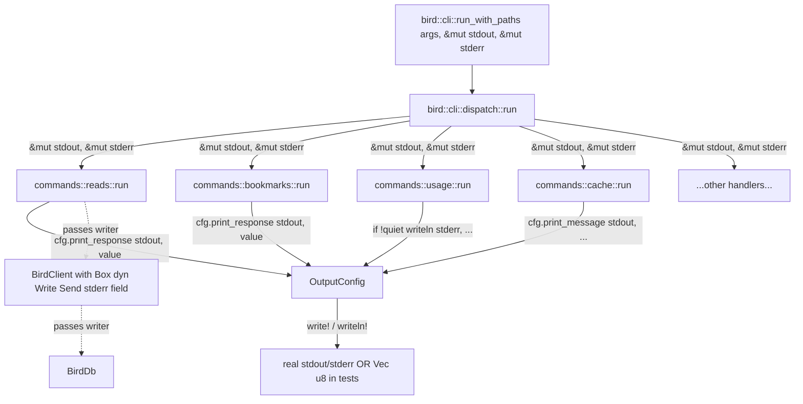

# refactor: Replace `out_println!` / `out_print!` / `diag!` with writer injection

## Summary

Reshape `OutputConfig` print methods to accept `out: &mut dyn Write` at the call site. Replace every `out_println!`,
`out_print!`, and `diag!` macro invocation throughout bird (~120 sites across 13 files) with explicit writer threading,
then delete the three macros from `src/output.rs`. Normalize the 10 leaf handlers (`raw`, `bookmarks`, `profile`,
`search`, `thread`, `usage`, `doctor`, `watchlist`, `skill_install`, `cost`) that currently take bare `use_color: bool,
quiet: bool` parameters to accept `&OutputConfig` plus `&mut dyn Write` writers. Preserve `diag!`'s lazy-argument-
evaluation property (zero allocation when suppressed) via a call-site quiet-gate pattern. Leave `BirdError::print()`'s
bare `eprintln!` chokepoint untouched per the deliberate exception documented in
`docs/solutions/architecture-patterns/quiet-flag-diagnostic-suppression-pattern.md`.

Sequenced after Plan 1 (`2026-06-02-002-refactor-lib-lift-and-path-injection-plan.md`). Plan 1 establishes the
`bird::cli::run_with_paths(args, stdout, stderr, paths)` entrypoint that hands the writers down to the dispatcher; Plan
2 threads those writers from the dispatcher into every handler and every formatter that currently reaches for
globally-locked stdout/stderr via the macros.

After Plan 2 lands: `OutputConfig` is a pure `Send + Sync + Clone` configuration struct with no I/O behavior; every
print path is testable in-process by passing a `Vec<u8>` writer; a CI grep guard forbids `println!`/`eprintln!`/
`out_println!`/`diag!` outside the legitimate survivors (`src/error.rs::BirdError::print`, the binary's `src/main.rs`
shim).

---

## Problem Frame

bird's output path runs through three macros that all dead-end at globally-locked stdout/stderr:

- **`out_println!`** (`src/output.rs:85-93`) — wraps `std::io::stdout().lock()`. **82 call sites across 13 files.**
- **`out_print!`** (`src/output.rs:97-101`) — same shape, no trailing newline. **7 call sites.**
- **`diag!`** (`src/output.rs:107-113`) — wraps `eprintln!` with a quiet-flag gate. **38 call sites across 9 files**
  (`watchlist.rs` 8, `db/client.rs` 7, `usage.rs` 7, `main.rs` 5, `db/db.rs` 4, `thread.rs` 3, `search.rs` 2,
  `bookmarks.rs` 1, `transport.rs` 1 — verified via `rg -c '\bdiag!\(' src/`).

The macros exist to keep call sites off the anc `p7-naked-println` audit (per the comment at `src/output.rs:64-67`), not
because the underlying I/O choice is correct. They have three structural problems:

1. **Tests can't capture output without subprocess isolation.** The library entrypoints added by Plan 1 give callers the
   ability to pass `Vec<u8>` writers, but the call sites still bypass those writers and reach for global `stdout()`
   directly. Plan 1's in-process tests work for the entrypoint surface (clap parse, dispatcher routing, exit codes) but
   cannot assert on command output without forking.
2. **`OutputConfig` is half a configuration struct.** The struct itself owns no I/O handles (good — `Send + Sync +
   Clone`), but the macros that take it as context still write to global FDs. The split is invisible from the type
   system; readers can't tell which calls capture writers and which don't.
3. **Per-call `stdout().lock()` overhead.** Every `out_println!` re-acquires the stdout lock. For the streaming handlers
   (`bookmarks`, `usage`, the JSONL/NDJSON paths) this is measurable. The one handler that does it right
   (`run_watchlist_check` at `src/watchlist.rs:243-245`) uses a single `BufWriter<StdoutLock>` for the whole stream.

`diag!` adds a fourth problem on top: it carries a deliberate lazy-evaluation property — the macro skips `format_args!`
allocation when the quiet flag is true. Per `docs/solutions/architecture-patterns/quiet-flag-
diagnostic-suppression-pattern.md` this is load-bearing for performance (hot diagnostic paths in `BirdClient` and
`watchlist::check` would otherwise pay format-string cost even when suppressed). A naive replacement with
`writeln!(stderr, ...)` regresses this property unless the call site guards explicitly: `if !quiet { writeln!(...)?; }`.

The xurl-rs PR #29 refactor (the model for Plan 1) did writer injection in the same PR as the lib lift. bird is doing
them as separate plans because bird has 4× more call sites and the diag-lazy-evaluation concern that xurl-rs didn't
face. Combining them would push the diff past reviewable.

---

## Requirements

Each requirement carries a stable plan-local R-ID.

### `OutputConfig` print methods take writers

- **R1.** `OutputConfig` retains its existing fields (`format`, `use_color`, `quiet`, `raw`) and methods
  (`suppress_diag`, `is_raw_text`). It gains no I/O state. The `Send + Sync + Clone` compile-time assertions from Plan 1
  R19 continue to hold.
- **R2.** A new `OutputConfig::print_envelope(&self, out: &mut dyn Write, env: &serde_json::Value) -> io::Result<()>`
  method writes a JSON envelope to the provided writer. Used by `emit_dry_run`, the `--examples` path, and any command
  emitting a success envelope.
- **R3.** A new `OutputConfig::print_message(&self, out: &mut dyn Write, msg: &str) -> io::Result<()>` method writes a
  plain text line to the provided writer. Used for status/info text.
- **R4.** A new `OutputConfig::print_error(&self, err: &BirdError, stderr: &mut dyn Write) -> io::Result<()>` method
  replaces the existing free-function `print_error(err, cfg)` at `src/output.rs:217-243`. Takes an explicit stderr
  writer.
- **R5.** A new `OutputConfig::print_diag(&self, stderr: &mut dyn Write, msg: &str) -> io::Result<()>` method encodes
  the quiet-gate: returns `Ok(())` without writing when `self.suppress_diag()` is true. Replaces the `diag!` macro for
  non-hot-path sites.
- **R5a.** A new `OutputConfig::print_response_json(&self, out: &mut dyn Write, value: &serde_json::Value) ->
  io::Result<()>` method writes a serialized response body to the provided writer. Handles the JSON/JSONL/Ndjson format
  cases only — when `cfg.format` is `Text`, the method panics (`debug_assert!`) or returns an error variant per KTD-4,
  and callers are expected to dispatch to their handler's local text renderer instead. Used by `bookmarks`, `usage`'s
  JSON-mode paths, `watchlist::check`, plus the `cache` and `writes` modules per KTD-4. Text mode stays per-handler
  because each handler's human-readable output is bespoke (usage report ≠ bookmarks stream ≠ watchlist tweet-per-line).
  R5a is numbered out of sequence (between R5 and R6) to avoid cascading R-ID renumbering elsewhere in the plan;
  numbering convention here is "stable insertion order, not contiguous".
- **R6.** Formatter functions in modules that produce streaming output keep their existing shape but gain an explicit
  `out: &mut dyn Write` parameter and propagate `io::Result<()>` instead of dropping errors.

### Handler signature normalization

- **R7.** The 10 leaf handlers that currently take `use_color: bool, quiet: bool` migrate to `&OutputConfig`:
- `raw::run_raw` (`src/raw.rs`)
- `bookmarks::run_bookmarks` (`src/bookmarks.rs`)
- `profile::run_profile` (`src/profile.rs`)
- `search::run_search` (`src/search.rs`)
- `thread::run_thread` (`src/thread.rs`)
- `usage::run_usage` (`src/usage.rs`)
- `doctor::run_doctor` (`src/doctor.rs`)
- `watchlist::run_watchlist_list`, `run_watchlist_add`, `run_watchlist_remove` (`src/watchlist.rs`)
- `skill_install::run` (`src/skill_install.rs`)
- `cost::display_cost` (`src/cost.rs`)
- **R8.** Each handler also accepts `stdout: &mut dyn Write` and (where it emits diagnostics) `stderr: &mut dyn Write`.
  Handlers that don't emit diagnostics skip the stderr parameter.
- **R9.** `login::run_oauth2_authenticate_headless` (`src/login.rs`) already takes `&OutputConfig`; it gains the writer
  parameters per the same pattern.
- **R10.** `schema_print::run` (`src/schema_print.rs`) already takes `&OutputConfig`; same pattern.
- **R11.** `BirdClient` (`src/db/client.rs:216-275`) gains a `stderr: Arc<Mutex<dyn Write + Send>>` field for the shared
  stderr writer used by its 7 internal `diag!` sites (and shared with `BirdDb` per R12). Per the documented
  hybrid-threading rule (`quiet-flag-diagnostic-suppression-pattern.md`), threading the writer through every internal
  method is the wrong shape; struct-field storage is the canonical pattern. The `Arc<Mutex>` choice over `Box` is per
  KTD-2 (async-ready design). Constructor: `BirdClient::new(transport, store_path, cache_opts, max_size_mb, username,
  quiet, stderr: Arc<Mutex<dyn Write + Send>>)`. The binary passes `Arc::new(Mutex::new(std::io::stderr()))`; tests pass
  `Arc::new(Mutex::new(Vec::new()))` or `Arc::new(Mutex::new(io::sink()))` when output is unimportant. The per-call lock
  cost is paid only inside the `if !quiet` branch per KTD-1, so suppressed sites skip the lock entirely.
- **R12.** `BirdDb` (`src/db/db.rs`) has 4 internal `diag!` sites. Storage: `stderr: Arc<Mutex<dyn Write + Send>>` field
  plus `quiet: bool` field, both set at construction from `Arc::clone(&client.stderr)` and `client.quiet`. `BirdDb` and
  `BirdClient` share the same backing writer and quiet state through the `Arc`. `BirdDb::open`'s signature gains the two
  fields. `BirdDb::migrate_usage_from_cache(&self, cache_db_path: &Path)` drops its existing `quiet: bool` parameter —
  uses `self.quiet` instead. All 4 diag sites become `if !self.quiet { let mut w = self. stderr.lock().unwrap();
  writeln!(*w, "...").ok(); }` per KTD-1.

### Macro removal and call-site replacement

- **R13.** All 82 `out_println!` call sites convert to `writeln!(out, ...)?;` where `out` is the runner-injected stdout
  writer. Each handler's signature carries the writer down.
- **R14.** All 7 `out_print!` call sites convert to `write!(out, ...)?;`.
- **R15.** All 38 `diag!(quiet, ...)` call sites convert to a single uniform pattern per KTD-1. For sites where the
  writer arrives as a borrowed parameter: `if !quiet { writeln!(stderr, ...).ok(); }`. For sites inside `BirdClient` or
  `BirdDb` where the writer lives as a struct field (per R11/R12): `if !self.quiet { let mut w = self.stderr.lock
  ().unwrap(); writeln!(*w, ...).ok(); }`. The `.ok()` preserves today's fire-and-forget semantics (stderr write
  failures don't propagate to the API error path, matching the current `eprintln!`-via-`diag!` behavior). The `if
  !quiet` short-circuit preserves the zero-allocation property — no `format_args!` runs when suppressed. There is no
  "cold-path" alternative — that form silently regressed the zero-allocation property and is explicitly rejected per
  KTD-1.
- **R16.** The raw `eprintln!` at `src/cost.rs:118,120` (in `display_cost`) routes through the new
  `print_diag`/`writeln!` pattern with an injected stderr.
- **R17.** The raw `eprint!` at `src/main.rs:155` (the confirmation prompt) is already addressed by Plan 1 R14 —
  `require_confirmation` takes `&mut dyn Write` for the prompt. Plan 2 does not re-touch it.
- **R18.** The single permitted `eprintln!` survivor — the fatal-error chokepoint that today lives inside the free
  function `print_error` at `src/output.rs:217-243` — moves into a new tiny module file `src/error/fatal.rs` containing
  only one private helper function (e.g., `pub(crate) fn fatal_eprintln(line: &str) { eprintln!("{line}"); }`).
  `BirdError::print()` (extracted from `output::print_error` during this refactor) calls `fatal_eprintln`. This scopes
  the CI grep guard's carve-out to a single tiny file by exact path (per R20) rather than excluding an entire module.
  Any future `eprintln!` added elsewhere — including elsewhere in `src/error.rs` — is caught by CI. Tests that want to
  capture fatal errors use the subprocess harness (`tests/cli_smoke_subprocess.rs` from Plan 1 R25), not in-process.
- **R19.** After all call sites convert, the three macros (`out_println!`, `out_print!`, `diag!`) are deleted from
  `src/output.rs:85-113`. The two helper functions (`write_line`, `write_fragment`) at `src/output.rs:68-81` are also
  deleted — they exist only to back the macros.

### CI guard against regression

- **R20.** A new pre-push hook step and CI step run a `rg`-based check:

  ```text
  rg -n '\bprintln!|\beprintln!|\bprint!|\beprint!|\bout_println!|\bout_print!|\bdiag!' \
     --glob 'src/**/*.rs' \
     --glob '!src/main.rs' \
     --glob '!src/error/fatal.rs'
  ```

  Output must be empty. The only legitimate survivors are `src/main.rs` (binary shim — should have nothing after
  Plan 1+2 lands, this is the safety net) and the single-purpose `src/error/fatal.rs` (the `fatal_eprintln` helper
  introduced by R18). The exclusion is scoped to one tiny file by exact path — anywhere else in `src/error/`,
  including `src/error.rs` and any future siblings, the guard still fires. Future contributors cannot accidentally
  re-introduce a forbidden macro into `src/error.rs` itself.
- **R21.** The pre-push hook at `scripts/hooks/pre-push` (per `AGENTS.md:134-146`) gains the R20 grep step. CI mirrors
  it via the existing `ci.yml` workflow.

### Test coverage

- **R22.** Library-style tests added in Plan 1 (U9, U10) gain new assertions on captured output. For example, the `bird
  doctor` in-process test asserts on the captured stdout content directly, not just on exit code.
- **R23.** New unit tests in `src/output.rs` cover each `OutputConfig::print_*` method end-to-end with a `Vec<u8>`
  writer, validating envelope shape, message formatting, color codes (when `use_color = true`), and the quiet-gate
  behavior of `print_diag`.
- **R24.** A `tests/diag_quiet_lazy_eval_test.rs` regression test verifies the lazy-eval property of the hot-path `if
  !quiet { writeln!(...) }` pattern. Constructs a writer that would panic on any `write_*` call, passes `quiet = true`,
  runs a path that has the guard, asserts no panic. Catches future regressions where someone replaces the call-site
  guard with `writeln!(stderr, "...{}", expensive_format())`.
- **R25.** Existing test count is preserved (91 functions before Plan 1, 91 after Plan 1, same 91 after Plan 2 plus the
  new R23/R24 unit tests).

---

## Key Technical Decisions

### KTD-1. Single uniform `diag!` replacement: `if !quiet { writeln!(...).ok(); }`

**Decision.** Every `diag!(quiet, fmt, args...)` call site converts to exactly one pattern:

```text
if !quiet {
    let mut w = self.stderr.lock().unwrap();
    writeln!(*w, fmt, args...).ok();
}
```

(For non-`BirdClient`/`BirdDb` sites where the writer arrives as a borrowed `&mut dyn Write`, the inner lock-acquire
drops out: `if !quiet { writeln!(stderr, fmt, args...).ok(); }`.) No `DiagWriter` newtype. No "cold-path" alternative.
No per-site judgment.

**Rationale.** Four reasons:

1. **Preserves the load-bearing zero-allocation property.** The `if !quiet` guard short-circuits the entire `writeln!`
   call before `format_args!` runs. No `String` allocation when suppressed. This matches today's `diag!` macro's
   documented contract from `quiet-flag-diagnostic-suppression-pattern.md`.
2. **Uniformity beats clever variations.** Any "cold-path" form that builds a `format!(...)` argument allocates the
   string eagerly regardless of the gate — that's how Rust evaluates function arguments. Allowing the cold-path form was
   the original design's mistake; removing it eliminates per-site judgment and the documented R-1 risk that contributors
   would silently regress the property over time.
3. **`.ok()` preserves fire-and-forget semantics.** Today's `eprintln!` ignores write failures; the `.ok()` keeps that.
   Propagating `io::Error` via `?` would wrap stderr write failures into the API error path (`BirdClient::get` etc.), a
   behavior change with no caller benefit.
4. **CI-enforceable.** R20's grep guard checks for `eprintln!`/`println!`/the deleted macros. With a single replacement
   pattern, future contributors can't accidentally pick a worse form.

**Alternatives considered.**

- **`DiagWriter` newtype** (`struct DiagWriter<'w> { inner: &'w mut dyn Write, quiet: bool }` with quiet-gated `impl
  Write`): rejected for the call-site clarity reason — the guard is invisible inside the wrapper impl, and a reader
  scanning the code can't tell the diagnostic is suppressed.
- **Reshape `diag!` to take a writer** (`diag!(quiet, stderr, "msg {}", x)`): rejected because R20's CI guard forbids
  the `diag!` symbol entirely. Half-removing the macros is worse than removing them.
- **`tracing::debug!` for all diagnostics:** rejected because bird's `diag!` sites carry user-facing semantic content
  ("Cleared 7 stored entries after login") that belongs in the foreground stderr stream, not in tracing's debug filter.

### KTD-2. Async-ready writer storage: `Arc<Mutex<dyn Write + Send>>` on `BirdClient`; `Arc::clone` to `BirdDb`

**Decision.** `BirdClient` gets `stderr: Arc<Mutex<dyn Write + Send>>` (plus `quiet: bool` already present). `BirdDb`
gets `Arc::clone(&client.stderr)` (and a copy of `quiet`) at construction. Both share the same backing writer; both
acquire the lock per-write when emitting. The lock is acquired only inside the `if !quiet` branch, so suppressed
diagnostic sites pay zero — not even the lock cost.

**Rationale.** Bird is sync today, but the writer-injection design is **async-ready** by deliberate choice — making
`BirdClient: Send + Sync` provable lets the future add `async`/multi-threaded library consumers without rewriting the
writer plumbing. The `Arc<Mutex>` choice does this at cost of one mutex acquire per emitted diagnostic (microsecond
cost, paid only when not suppressed). The alternative — `Box<dyn Write + Send>` — works for sync code but is
single-owner, blocking shared ownership patterns the future might need.

**Trade-off.** Per-write lock acquire is real but tiny (sub-microsecond on contended paths, less when uncontended).
Bird's diagnostic surface fires at most a few times per CLI invocation today; the lock cost is invisible against clap
parsing and config load. Suppressed paths (the common case under `--quiet` / `BIRD_QUIET`) skip the lock entirely
because of the call-site `if !quiet` gate per KTD-1.

**Hard prerequisite.** This design requires Plan 1 R20 (`Transport: Send + Sync` bound) to land — without it,
`BirdClient: Send + Sync` cannot be proven (the `Box<dyn Transport>` inside the client would not be `Send + Sync`). Plan
1's R20 "defer if MockTransport needs structural change" escape hatch is removed by Finding 5 of this review; the
`MockTransport` `RefCell → Mutex` swap is part of Plan 1's required scope.

**Alternatives considered.**

- **`Box<dyn Write + Send>` (single-owner):** rejected because it blocks future shared-ownership patterns and gives no
  upside today vs. `Arc<Mutex>` (which has equivalent compile-time `Send` properties and trivially-better evolvability).
- **Thread `&mut dyn Write` through every internal method:** rejected per parameter-inflation across `BirdClient`'s 7
  sites and `BirdDb`'s 4 sites.
- **`BirdDb` takes `stderr: &mut dyn Write` as a parameter** (extending the existing `quiet: bool` parameter pattern):
  considered (this was reviewer-suggested option 3); rejected in favor of `Arc::clone` because the shared- ownership
  pattern matches the async-ready posture and avoids signature changes on every `BirdDb` method.
- **Use `parking_lot::Mutex` for lower contention:** deferred — `std::sync::Mutex` is fine at current bird scale; adding
  a dependency for a single-static, low-contention use case is premature.

### KTD-3. `OutputConfig` print methods are `&self` methods; color/format decisions are set once at runner-entry

**Decision.** `print_envelope`, `print_message`, `print_response_json`, `print_error`, `print_diag` become methods on
`OutputConfig` (`&self`). The current standalone `output::print_error(err, cfg)` (`src/output.rs:217-243`) becomes
`OutputConfig::print_error(&self, &err, &mut stderr)`. Methods read `self.use_color`, `self.format`, `self.quiet`
unchanged from how they were set at runner-entry — they do NOT re-derive these from per-call writer inspection (no
`stderr.is_terminal()` lookups inside print methods).

The runner constructs `OutputConfig.use_color` once at entry-time from `EnvOverrides.no_color` (Plan 1 R8a) plus a TTY
detection done on the real process stderr (binary path) or an explicit caller-provided flag (library path). Tests pass
`use_color: true` or `false` explicitly in the constructed `OutputConfig`; the captured `Vec<u8>` writer never makes the
color decision. This locks in production-mirroring assertion behavior — a test capturing colored output sees colored
output if and only if the `OutputConfig.use_color` it built said so, regardless of the writer's TTY-ness.

**Rationale.** Two-part: methods (for IDE discoverability via dot-completion, matching xurl-rs PR #29's shape) plus
set-once color/format decisions (so captured tests don't drift from production behavior via per-call writer inspection).
The set-once part also avoids paying `is_terminal()` syscall cost per `print_*` call.

**Alternatives considered.**

- **Keep standalone functions:** rejected for discoverability.
- **Re-derive color per call from the writer:** rejected because `Vec<u8>` writers in tests are never TTYs, so captured
  tests would always see uncolored output even when the production binary's behavior is colored — the two surfaces drift
  silently.
- **Pass `use_color: bool` as a per-method parameter:** rejected because it duplicates state already on `&self`.

### KTD-4. `print_response_json` for JSON/JSONL/Ndjson body output; text format stays per-handler

**Decision.** The streaming handlers (`bookmarks`, `usage`, `watchlist::check`) currently format with `out_println!
("{}", serde_json::to_string(...).unwrap())` inside a `match cfg.format` branch. The JSON/JSONL/Ndjson branches
centralize into `cfg.print_response_json(out, &value)?`. The Text branch stays per-handler — each handler renders text
bespoke (`usage`'s aggregation report ≠ `bookmarks`'s JSON-prettified stream ≠ `watchlist`'s tweet-per-line), and
centralizing would either force a UX regression (text mode becomes pretty JSON everywhere) or create a leaky abstraction
(`print_response` returns `Ok(false)` for text and the caller re-branches anyway).

Call sites become: `if cfg.format.is_text() { handler_local_text_render(out, &value)?; } else { cfg.print_response_
json(out, &value)?; }`. The method is named `print_response_json` (not bare `print_response`) so the JSON-only scope is
visible at the call site.

**Rationale.** Today every JSON-mode streaming site duplicates the `match cfg.format` arms for Json/Jsonl/Ndjson — the
rendering differs only in the serializer (pretty vs compact vs one-line). Centralizing the JSON dispatch in
`print_response_json` deduplicates the three near-identical arms. Text mode is heterogeneous and per-handler; forcing it
through a centralized method would be wrong. Keeping the scope explicit in the method name removes the risk that a
future caller accidentally passes Text format and gets either a panic or a wrong rendering.

**Alternatives considered.**

- **Single `print_response` covering all formats** (the original KTD-4): rejected because text-mode handlers diverge
  enough that centralizing forces either a UX regression or escape hatches per call site.
- **Keep format branching at call sites for JSON too:** rejected because Json/Jsonl/Ndjson share enough structure that
  centralizing them is a real win.
- **Add `print_response_json` in Plan 1:** Plan 1 is structural lift only; reshaping `OutputConfig`'s method set belongs
  here.

### KTD-5. Migration order: writer field first, signatures second, call sites third, macros deleted last

**Decision.** The implementation units order as:

1. U1: Add new `OutputConfig` methods (additive; existing macros still work).
2. U2: Normalize handler signatures to `&OutputConfig` + writers (additive overload via deprecation shim or by
   reordering params; existing call sites updated in U3+).
3. U3-U5: Replace `out_println!`/`out_print!` call sites by file/module, exercising the new methods.
4. **U6a: Add the `Arc<Mutex<dyn Write + Send>>` writer field to `BirdClient` and `BirdDb` (and the `quiet` field to
   `BirdDb`)**. Macros still in place; new fields not yet read. This unit exists to break the original plan's U6↔U7
   circular dependency where U6's `BirdClient`/`BirdDb` `diag!` replacements would have referenced a field that didn't
   exist yet.
5. U6: Replace `diag!` call sites uniformly per KTD-1, including the `BirdClient`/`BirdDb` sites that now have
   `self.stderr` available from U6a.
6. U7: Delete the macros from `src/output.rs`; extract `BirdError::print` into `src/error/fatal.rs`.
7. U9: Add the CI grep guard (U8 gap intentional per stability rule).

**Rationale.** Each step compiles cleanly. The writer field exists before any code reads it; the macros are deleted
last, after every call site has migrated, so there's no "macro exists but call site uses the new method" intermediate
state. The compiler enforces completeness — if any `out_println!` or `diag!` survives U6, U7 fails to compile.

**Alternatives considered.**

- **Delete macros first, fix compile errors as they appear:** Rejected because the file count is high (13 files
  touched); a 120-error compile is harder to review than 7 surgical PRs.
- **Single PR for everything:** Risk of mergeability and review fatigue. Sequencing as 7 small units allows per-unit
  verification.

---

## High-Level Technical Design

### Data flow: writers from runner to handler



### Method surface on `OutputConfig` after Plan 2

```text
impl OutputConfig {
    // unchanged from today
    pub fn suppress_diag(&self) -> bool;
    pub fn is_raw_text(&self) -> bool;

    // new in Plan 2
    pub fn print_message(&self, out: &mut dyn Write, msg: &str) -> io::Result<()>;
    pub fn print_envelope(&self, out: &mut dyn Write, env: &serde_json::Value) -> io::Result<()>;
    pub fn print_response(&self, out: &mut dyn Write, value: &serde_json::Value) -> io::Result<()>;
    pub fn print_error(&self, stderr: &mut dyn Write, err: &BirdError) -> io::Result<()>;
    pub fn print_diag(&self, stderr: &mut dyn Write, msg: &str) -> io::Result<()>;

    // deleted in Plan 2 U8
    // (the standalone print_error function)
}
```

### Single uniform `diag!` replacement


Every `diag!(quiet, fmt, args...)` site converts to exactly one pattern (see KTD-1 for the canonical form). No hot-path
vs cold-path dichotomy — that choice was the original design's mistake and silently regressed the
zero-allocation-when-suppressed property whenever someone reached for the cold-path's perceived ergonomics. The uniform
pattern preserves the property by construction: `if !quiet` short-circuits the entire `writeln!` before `format_args!`
runs, so no `String` is allocated when the diagnostic is suppressed. `.ok()` preserves today's fire- and-forget
semantics — stderr write failures don't propagate into the API error path.

---

## Implementation Units

Each unit is sized for a single PR. U1-U2 are additive (no behavior change); U3-U5 are per-module `out_println!`
migrations; U6a adds the writer field to `BirdClient`/`BirdDb`; U6 converts `diag!` sites uniformly; U7 deletes the
macros and extracts the fatal-stderr helper; U9 adds the CI guard (U8 is a deliberate gap, see KTD-5). U10-U11 are test
additions.

### U1. Add new `OutputConfig` methods (additive)

- **Goal.** Introduce the print methods that replace the macros, without changing any existing call site.
- **Requirements.** R1, R2, R3, R4, R5, R5a.
- **Dependencies.** Plan 1 complete (`bird::cli::run_with_paths` exists).
- **Files.**
- `src/output.rs` (modified — add `print_envelope`, `print_message`, `print_response`, `print_error`, `print_diag`
  methods on `OutputConfig`)
- **Approach.** Each method is 5-15 LOC. `print_envelope` serializes with `serde_json::to_string` and writes one line.
  `print_message` writes one line plain. `print_response` branches on `cfg.format` (Text → pretty-print, Json → compact,
  Jsonl → compact one-per-line, Ndjson → same). `print_error` ports the existing `output::print_error` logic
  (`src/output.rs:217-243`) into a method taking explicit stderr. `print_diag` short-circuits when
  `self.suppress_diag()` is true.
- **Patterns to follow.** xurl-rs PR #29's `OutputConfig::print_response` and `print_message` shapes. The branching in
  `print_response` mirrors the existing macro-call-site format checks done by handlers today.
- **Test scenarios.**
- U1.1. `cfg.print_message(&mut buf, "hello")` writes `"hello\n"` to buf.
- U1.2. `cfg.print_envelope(&mut buf, &json!({"status":"ok"}))` writes a single line of valid JSON ending in `\n`.
- U1.3. `cfg.print_response(&mut buf, &value)` with `cfg.format = Json` writes compact JSON; with `Jsonl` writes one
  compact line; with `Text` writes pretty JSON.
- U1.4. `cfg.print_diag(&mut buf, "x")` with `cfg.quiet = true` writes nothing and returns `Ok(())`.
- U1.5. `cfg.print_diag(&mut buf, "x")` with `cfg.quiet = false` writes `"x\n"`.
- U1.6. `cfg.print_error(&mut buf, &BirdError::config("missing"))` with `cfg.format = Json` writes a 4-key envelope
  (`status`, `data`, `errors`, `meta`). With `Text`, writes a human-readable line.
- U1.7. Test file: `src/output.rs` (`#[cfg(test)] mod method_tests`).
- **Verification.**
- `cargo test --lib bird::output::method_tests`
- `cargo build --workspace` (nothing else changes; existing call sites still use macros).

### U2. Normalize handler signatures to `&OutputConfig` + writers (additive bridge)

- **Goal.** Add a `&OutputConfig` parameter and writer parameters to the 10 handlers that take bare `use_color, quiet`
  today. Keep the macros working temporarily by wiring the handlers to also accept (and use) the new parameters.
- **Requirements.** R7, R8, R9, R10.
- **Dependencies.** U1, Plan 1.
- **Files.**
- `src/raw.rs` (modified — `run_raw` signature)
- `src/bookmarks.rs` (modified — `run_bookmarks` signature)
- `src/profile.rs` (modified — `run_profile` signature)
- `src/search.rs` (modified — `run_search` signature)
- `src/thread.rs` (modified — `run_thread` signature)
- `src/usage.rs` (modified — `run_usage` signature)
- `src/doctor.rs` (modified — `run_doctor` signature)
- `src/watchlist.rs` (modified — `run_watchlist_list`, `run_watchlist_add`, `run_watchlist_remove` signatures)
- `src/skill_install.rs` (modified — `run` signature)
- `src/cost.rs` (modified — `display_cost` signature)
- `src/cli/commands/*.rs` (modified — the per-command modules from Plan 1 update their handler calls to pass `cfg` +
  writers)
- **Approach.** Each handler's new signature is `pub fn run_X(client, ..., cfg: &OutputConfig, stdout: &mut dyn Write,
  stderr: &mut dyn Write) -> Result<(), BirdError>`. Handlers that don't write to stdout (e.g., `run_watchlist_add` is
  silent-on-success) drop the stdout param. Inside the handler body, `use_color = cfg. use_color; quiet =
  cfg.suppress_diag();` — the body keeps its existing macro calls for U2. The point of U2 is the signature
  normalization; macro replacement is U3-U6.
- **Patterns to follow.** Per-handler signature update is mechanical. The `cli/commands/*.rs` dispatchers from Plan 1
  already have `cfg` and writers in scope.
- **Test scenarios.**
- U2.1-U2.10. Each handler's existing tests continue to pass (they didn't assert on the new params, so the addition is
  transparent).
- U2.11. `cargo build --workspace` passes. `cargo test --workspace` passes.
- **Verification.**
- `cargo build --workspace && cargo test --workspace`
- Smoke: every handler invokable through the binary produces unchanged output (the binary passes real stdout/stderr, so
  behavior is identical).

### U3. Replace `out_println!` and `out_print!` in `src/main.rs` and `src/cli/commands/`

- **Goal.** Convert the 23 call sites in `src/main.rs` (Plan 1 has shrunk this surface to almost nothing — most of these
  will have already moved into `src/cli/commands/*.rs`) and the per-command-module call sites.
- **Requirements.** R13, R14.
- **Dependencies.** U1, U2.
- **Files.**
- `src/main.rs` (modified — replace any remaining `out_println!` / `out_print!` with `writeln!` / `write!` to the
  runner's stdout)
- `src/cli/dispatch.rs` (modified — `emit_dry_run`, `print_examples` (if it ended up in dispatch) replace macros with
  `cfg.print_envelope` / `cfg.print_message`)
- `src/cli/commands/cache.rs` (modified — Cache::Clear, Cache::Stats body has 11 `out_println!` sites; convert to
  `cfg.print_message` and `cfg.print_response`)
- `src/cli/commands/writes/mod.rs` (modified — the `execute` helper's `out_println!` of the response JSON converts to
  `cfg.print_response`)
- **Approach.** Mechanical: `out_println!("{}", x)` → `writeln!(stdout, "{}", x)?;`. Where the line is plain text, use
  `cfg.print_message`. Where it's a JSON envelope, use `cfg.print_envelope` or `cfg.print_response`.
- **Patterns to follow.** Same as xurl-rs PR #29's per-module migrations.
- **Test scenarios.**
- U3.1. `bird cache stats --pretty` produces unchanged output.
- U3.2. `bird cache clear --dry-run` produces unchanged output.
- U3.3. `bird like 123 --dry-run` produces unchanged dry-run envelope.
- U3.4. `bird --examples` produces unchanged examples block.
- U3.5. The Plan-1 in-process tests for `--examples`, dry-run, and cache assert on captured stdout matching pre-U3
  byte-for-byte (add the assertions as new test scenarios).
- **Verification.**
- `cargo test --workspace`
- Manual: smoke each of the commands above with `BIRD_OUTPUT=json` and confirm envelope shape.

### U4. Replace `out_println!` / `out_print!` in three streaming handlers — bounded BufWriter spread

- **Goal.** Convert the highest-density call-site clusters (`usage.rs` 20 sites, `bookmarks.rs` 14, `watchlist.rs` 4).
  BufWriter adoption is **bounded** to these three streaming sites where buffering meaningfully amortizes the per-call
  `stdout().lock()` cost. Non-streaming handlers (U5's surface) keep direct `writeln!` against the injected writer —
  they write a small number of lines per invocation and gain nothing from buffering.

- **Requirements.** R13, R14.
- **Dependencies.** U2.
- **Files.**
- `src/usage.rs` (modified — 20 `out_println!` sites convert to a function-local `BufWriter::new(stdout)`)
- `src/bookmarks.rs` (modified — 9 `out_println!` + 5 `out_print!` sites convert to streaming `BufWriter` per R6)
- `src/watchlist.rs` (modified — 4 `out_println!` sites + the existing `BufWriter<StdoutLock>` pattern at lines 243-245,
  290-295 is normalized to use the injected stdout writer)
- **Approach.** For the three streaming handlers, wrap the injected `stdout: &mut dyn Write` in a local
  `BufWriter::new(stdout)` once at the top of the function and write into the buffered writer for the whole stream.
  Flush at end. This is the pattern `run_watchlist_check` already uses (`src/watchlist.rs:243-245`); spread bounded to
  its two streaming siblings. Do NOT generalize to non-streaming handlers in U5 — they don't benefit.
- **Patterns to follow.** `run_watchlist_check`'s `BufWriter<StdoutLock>` shape is the model. Replace the
  `stdout().lock()` part with the injected writer.
- **Test scenarios.**
- U4.1. `bird bookmarks --pretty` produces unchanged JSON stream.
- U4.2. `bird bookmarks --jsonl` produces unchanged JSONL.
- U4.3. `bird usage --pretty` for a populated DB produces unchanged report.
- U4.4. `bird watchlist fetch --dry-run` (or equivalent) produces unchanged output.
- U4.5. **Debug-only**: BufWriter's unwind-path flush flushes written-so-far data before unwinding. Test constructs a
  writer that panics on the 3rd write and asserts the first 2 writes are visible. **Explicit limitation comment in the
  test**: this verifies the debug-mode unwind path only. In release mode bird uses `panic = "abort"` (`Cargo.toml:64`),
  where the buffer is lost — same as `run_watchlist_check`'s existing behavior pre-Plan-2, no regression. Document the
  panic-abort-mid-stream truncation as an accepted property of bird's streaming output, not a fixable property of this
  unit.
- **Verification.**
- `cargo test --workspace`
- Walltime: `bird bookmarks --pretty` on a large bookmark set should be measurably faster than pre-U4 (the per-call
  `stdout().lock()` cost is gone).

### U5. Replace `out_println!` in `login.rs`, `schema_print.rs`, `profile.rs`, `search.rs`, `thread.rs`, `raw.rs`, `skill_install.rs`, `doctor.rs`

- **Goal.** Convert the remaining handler call sites (35 sites total across these 8 files).
- **Requirements.** R13.
- **Dependencies.** U2.
- **Files.**
- `src/login.rs` (modified — 7 `out_println!` sites plus the stray `std::io::stdout().flush().ok();` at
  `src/login.rs:158` that must convert to `out.flush().ok();` against the injected writer; otherwise the prompt content
  stays buffered in the test's `Vec<u8>` while the test reads the wrong handle)
- `src/schema_print.rs` (modified — 5 sites)
- `src/profile.rs` (modified — 2 sites)
- `src/search.rs` (modified — 2 sites)
- `src/thread.rs` (modified — 2 sites)
- `src/raw.rs` (modified — 2 sites)
- `src/skill_install.rs` (modified — 2 sites)
- `src/doctor.rs` (modified — 2 sites)
- **Approach.** Per-file mechanical replacement. Each handler has the writer in scope from U2's signature update. Where
  the call is plain status text, use `cfg.print_message`; where it's structured data, use `cfg.print_response` /
  `cfg.print_envelope`.
- **Patterns to follow.** Same as U3, U4.
- **Test scenarios.**
- U5.1. `bird login --no-browser` produces unchanged interactive output (note: this hits an interactive code path —
  verify with a scripted test that pipes pre-canned input).
- U5.2. `bird schema` (list) and `bird schema bookmark` (specific) produce unchanged output.
- U5.3. `bird me --pretty` produces unchanged profile.
- U5.4. `bird search 'query'` produces unchanged results stream.
- U5.5. `bird thread <id>` produces unchanged thread output.
- U5.6. `bird get /2/users/me` produces unchanged raw output.
- U5.7. `bird skill install --dry-run --host claude-code` produces unchanged install plan.
- U5.8. `bird doctor --pretty` produces unchanged diagnostic report.
- **Verification.**
- `cargo test --workspace`
- Manual smoke of each command.

### U6a. `BirdClient` and `BirdDb` writer-field addition (prerequisite for U6's internal-site replacement)

- **Goal.** Add the `stderr: Arc<Mutex<dyn Write + Send>>` field to `BirdClient` and `BirdDb` (with shared `Arc::clone`)
  plus the `quiet: bool` field on `BirdDb` per R11/R12, BEFORE U6 converts call sites that read those fields. This unit
  exists to break the circular dependency that the original plan had between U6 (which writes `self.stderr`) and U7
  (which added the field).
- **Requirements.** R11, R12.
- **Dependencies.** U2.
- **Files.**
- `src/db/client.rs` (modified — `BirdClient::new` signature gains `stderr: Arc<Mutex<dyn Write + Send>>`; field added;
  internal `diag!` macros remain in place at this unit; they are converted in U6)
- `src/db/db.rs` (modified — `BirdDb::open` signature gains the same shared `Arc<Mutex<dyn Write + Send>>` plus a
  `quiet: bool` field; the existing `migrate_usage_from_cache(&self, cache_db_path: &Path, quiet: bool)` drops its
  `quiet` parameter and uses `self.quiet` instead; macros remain at this unit; conversion in U6)
- `src/cli/runner.rs` (modified — the runner constructs `BirdClient` with `Arc::new(Mutex::new(std::io::stderr()))` for
  the binary path; `BirdClient` passes `Arc::clone(&self.stderr)` to `BirdDb::open`)
- `tests/common/mod.rs` (new or modified — `TestEnv` passes `Arc::new(Mutex::new(Vec::new()))` or
  `Arc::new(Mutex::new(io::sink()))` for the client's stderr in library-style tests)
- **Approach.** Add the fields without converting call sites yet. The macros continue to write to global stderr in
  `BirdClient`/`BirdDb` internals (they did pre-U6a). The fields exist so U6 has a valid receiver to convert into.
  Update every `BirdClient::new` caller across the codebase (primarily `runner.rs` and `BirdClient::new_test` at
  `src/db/client.rs:279`).
- **Patterns to follow.** KTD-2 (async-ready `Arc<Mutex>` shape). Plan 1 R20 (`Transport: Send + Sync`) must have
  already landed — verify before starting this unit.
- **Test scenarios.**
- U6a.1. `BirdClient::new(...)` constructs successfully with `Arc<Mutex<dyn Write + Send>>` stderr.
- U6a.2. `BirdClient::new_test(...)` continues to pass — no behavior change beyond the new field.
- U6a.3. `BirdDb::open(...)` accepts the cloned `Arc<Mutex<...>>` and stores it; `migrate_usage_from_cache` no longer
  takes `quiet` as a parameter and uses `self.quiet` instead.
- U6a.4. Compile-time assertion `assert_impl_all!(BirdClient: Send, Sync)` passes — proves the async-ready posture for
  the future.
- U6a.5. `cargo test --workspace` passes — no diagnostic behavior change yet (macros still in place).
- **Verification.**
- `cargo test --workspace`
- `cargo build --workspace` produces zero compile errors.
- Manual smoke: `bird me`, `bird cache stats` produce identical output to pre-U6a (no diag behavior change yet).

### U6. Replace `diag!` macro across all 9 files (38 sites) — single uniform pattern per KTD-1

- **Goal.** Convert every `diag!` call site to the single uniform pattern `if !quiet { writeln!(stderr, ...).ok(); }`
  (or `if !self.quiet { let mut w = self.stderr.lock().unwrap(); writeln!(*w, ...).ok(); }` for sites inside
  `BirdClient`/`BirdDb` where the writer is a struct field). No hot-path/cold-path dichotomy. No `cfg.print_diag` for
  `diag!`-replacement.
- **Requirements.** R15, R16.
- **Dependencies.** U2, U6a.
- **Files.**
- `src/watchlist.rs` (modified — 8 sites)
- `src/db/client.rs` (modified — 7 sites; use `self.stderr` field added in U6a)
- `src/usage.rs` (modified — 7 sites)
- `src/main.rs` or `src/cli/dispatch.rs` (modified — 5 sites)
- `src/db/db.rs` (modified — 4 sites; use `self.stderr`/`self.quiet` fields added in U6a)
- `src/thread.rs` (modified — 3 sites)
- `src/search.rs` (modified — 2 sites)
- `src/bookmarks.rs` (modified — 1 site)
- `src/transport.rs` (modified — 1 site)
- `src/cost.rs` (modified — `display_cost`'s raw `eprintln!` at lines 118, 120 converts to the same single pattern, per
  R16)
- **Approach.** Apply the single replacement pattern from KTD-1 mechanically to every site. Sites where the writer is a
  borrowed `&mut dyn Write` parameter use the simpler form (no lock needed). Sites inside `BirdClient`/`BirdDb` use the
  lock-and-write form against `self.stderr` (the field exists from U6a). The `.ok()` drops `io::Result` failures
  silently — matches today's `eprintln!`-via-`diag!` fire-and-forget behavior.
- **Patterns to follow.** KTD-1 (the canonical single pattern). No per-site judgment.
- **Test scenarios.**
- U6.1. `bird` with verbose diagnostics enabled produces unchanged stderr output.
- U6.2. `bird --quiet` suppresses all diagnostic output exactly as pre-U6.
- U6.3. `BIRD_QUIET=1 bird ...` suppresses all diagnostic output exactly as pre-U6.
- U6.4. The replaced sites in `BirdClient` don't allocate when `quiet = true` (verified via regression test in R24 — see
  U10).
- U6.5. CI grep guard fixture: `rg 'diag!' src/` returns zero matches.
- **Verification.**
- `cargo test --workspace`
- Manual: every command with and without `--quiet` produces unchanged stderr.

### U7. Delete the macros from `src/output.rs`; extract `BirdError::print` to `src/error/fatal.rs`

- **Goal.** Remove `out_println!`, `out_print!`, `diag!`, `write_line`, `write_fragment` from `src/output.rs`. Move the
  single permitted `eprintln!` from `output::print_error` into a tiny new module file `src/error/fatal.rs` containing
  only the `fatal_eprintln` helper (per R18). After this unit, `src/error.rs` has zero `eprintln!` calls and the CI grep
  guard can scope its carve-out exclusion to `src/error/fatal.rs` only.
- **Requirements.** R18, R19.
- **Dependencies.** U3, U4, U5, U6.
- **Files.**
- `src/output.rs` (modified — delete `out_println!`, `out_print!`, `diag!` macros, `write_line`, `write_fragment`
  helpers; `output::print_error` becomes a method on `OutputConfig` per KTD-3)
- `src/error.rs` (modified — `BirdError::print()` extracted; calls `crate::error::fatal::fatal_eprintln(line)`)
- `src/error/fatal.rs` (new — tiny module file with `pub(crate) fn fatal_eprintln(line: &str)`; one function, ≤ 10 LOC,
  the only permitted `eprintln!` survivor)
- **Approach.** Run `cargo build --workspace`. If anything fails, find the surviving call site and migrate it (catches
  any miss from U3-U6). When the build is green, delete is final. Then extract `fatal_eprintln` to `src/error/fatal.rs`.
- **Patterns to follow.** Pure deletion + tiny-file extraction. No new logic.
- **Test scenarios.**
- U7.1. `cargo build --workspace` passes.
- U7.2. `cargo test --workspace` passes.
- U7.3. `rg 'out_println!|out_print!|diag!' src/` returns zero matches.
- U7.4. `rg 'eprintln!' src/` returns one match (in `src/error/fatal.rs`).
- **Verification.**
- `cargo build --workspace && cargo test --workspace`
- `rg 'out_println!|out_print!|diag!' src/`

### U9. Add CI grep guard

(U8 from the original plan — "Delete the macros from src/output.rs" — was absorbed into U7's expanded scope per the
ce-doc-review F10 fix. U8's number is intentionally left as a gap per the U-ID stability rule.)

- **Goal.** Prevent regression: future contributors can't accidentally re-introduce `println!` / `eprintln!` / the
  deleted macros into non-survivor files.
- **Requirements.** R20, R21.
- **Dependencies.** U7.
- **Files.**
- `scripts/hooks/pre-push` (modified — append the `rg` check)
- `.github/workflows/ci.yml` (modified — add a step that runs the same check; or invoke `scripts/hooks/pre-push` in a
  no-push mode if the repo has that convention)
- **Approach.** The check command from R20:

  ```bash
  if rg -n '\bprintln!|\beprintln!|\bprint!|\beprint!|\bout_println!|\bout_print!|\bdiag!' \
        --glob 'src/**/*.rs' \
        --glob '!src/main.rs' \
        --glob '!src/error.rs'; then
      echo "ERROR: forbidden output macro in src/. Use OutputConfig methods."
      exit 1
  fi
  ```

  Pre-push hook exits non-zero on match. CI mirrors. Survivors: `src/main.rs` (binary shim — should have
  nothing after Plan 1+2) and `src/error.rs` (the `BirdError::print` fatal chokepoint per R18).
- **Patterns to follow.** `docs/solutions/best-practices/cli-unified-log-module-with-no-color-support-2026-04-20. md`
  documents this exact CI-guard pattern: "Add a `rg` CI guard after the migration; without it, scattered `println!`
  calls regrow within 3 months."
- **Test scenarios.**
- U9.1. The pre-push hook exits 0 with the current `src/` (no forbidden macros).
- U9.2. The pre-push hook exits 1 if a forbidden macro is added (deliberately introduce one in a scratch branch, verify
  the hook catches it, revert).
- U9.3. CI workflow run produces a green check on the post-Plan-2 `dev` branch.
- **Verification.**
- Run the hook locally on the post-U7 working tree.
- Push a scratch branch with a deliberate `println!` in `src/usage.rs`, verify CI fails. Revert.

### U10. Regression test: `diag!`-replacement lazy-eval property

- **Goal.** Encode the lazy-eval guarantee from KTD-1 as an executable test.
- **Requirements.** R24.
- **Dependencies.** U6.
- **Files.**
- `tests/diag_quiet_lazy_eval_test.rs` (new — 1-2 test functions)
- **Approach.** Define a `struct PanicOnWrite;` that implements `Write` and panics on `write`/`write_all`/ `write_fmt`.
  Construct a `BirdClient` with `quiet = true` and `stderr_writer: Box::new(PanicOnWrite)`. Trigger a code path with a
  hot-path `if !quiet { writeln!(...) }` guard. Assert no panic. Then flip `quiet = false` and assert the panic fires
  (verifies the test isn't a false negative).
- **Patterns to follow.** Standard `#[should_panic]` / `std::panic::catch_unwind` patterns.
- **Test scenarios.**
- U10.1. With `quiet = true` and `PanicOnWrite` as the diagnostic writer, calling a known hot-path diagnostic site does
  not panic.
- U10.2. With `quiet = false` and `PanicOnWrite`, the same call panics — confirming the test is wired right.
- **Verification.**
- `cargo test --test diag_quiet_lazy_eval_test`

### U11. Extended assertions on Plan-1 in-process tests; new `OutputConfig` method tests

- **Goal.** Strengthen Plan 1's in-process tests by adding stdout-content assertions (previously they asserted only on
  exit code). Add per-method coverage for `print_envelope`, `print_message`, `print_response`, `print_error`,
  `print_diag`.
- **Requirements.** R22, R23.
- **Dependencies.** U1, U7.
- **Files.**
- `src/output.rs` (modified — `#[cfg(test)] mod method_tests` expanded from U1 with more scenarios)
- `tests/cli_smoke.rs` (modified — add `.stdout(...)` assertions to in-process tests that previously checked only exit
  code)
- `tests/json_envelope.rs` (modified — add envelope-shape assertions on captured stdout)
- **Approach.** Walk the migrated in-process tests; for each, add an assertion on the captured `(stdout, stderr)`
  content that matches the pre-Plan-2 subprocess assertion exactly. Add edge-case tests for `OutputConfig` method
  behavior (empty input, large input, special characters, color codes when `use_color = true`).
- **Patterns to follow.** Standard test scenarios from U1.1-U1.7, expanded.
- **Test scenarios.**
- U11.1-U11.10. Per-method extended coverage (e.g., `print_message` with a multi-line input writes each line correctly;
  `print_envelope` with a nested object serializes correctly; `print_error` with `cfg.use_color = true` includes ANSI
  codes; etc.).
- U11.11-U11.40. Plan-1 in-process tests gain stdout assertions (~30 sites across `cli_smoke.rs` and
  `json_envelope.rs`).
- **Verification.**
- `cargo test --workspace`
- `cargo test --workspace -- --test-threads=16` still passes (no regression from the new tests).

---

## Scope Boundaries

### In scope

- Adding `OutputConfig::print_envelope`, `print_message`, `print_response`, `print_error`, `print_diag` methods
- Replacing every `out_println!`, `out_print!`, `diag!` call site in `src/` (120 total)
- Deleting the three macros and the two backing functions from `src/output.rs`
- Adding `Box<dyn Write + Send>` writer fields to `BirdClient` and `BirdDb`
- Normalizing the 10 leaf handlers' signatures to `&OutputConfig` + writers
- Adding the CI grep guard against re-introduction
- Strengthening Plan-1 in-process tests with captured-output assertions
- New regression test for the `diag!` lazy-eval property

### Out of scope — not this product's identity

- Switching to a `tracing`-based diagnostic stream for the `diag!` sites. The bird user-facing diagnostic contract is
  "stderr lines suppressed by `--quiet` / `BIRD_QUIET`"; routing through `tracing` would change the user contract.

### Deferred for later

- `BirdError::print()` chokepoint refactor — explicitly preserved per R18.
- Per-call `BufWriter` adoption beyond the streaming handlers — the leaf handlers that don't stream (single-shot output)
  don't need a `BufWriter`. Address per-site only where there's measurable latency benefit.
- Full async/concurrent `BirdClient` (async runtime adoption, `Transport::request` going async, `BirdDb` to `sqlx`) —
  out of scope here. KTD-2's `Arc<Mutex<dyn Write + Send>>` writer storage is async-ready (Send + Sync bounds on
  `BirdClient` are provable post-Plan-2), but adding an actual async runtime is a separate dedicated plan. The
  writer-injection design accommodates the future move without rework.

### Deferred to Follow-Up Work

- **Per-PR breakdown:** Plan 2's units are sized for individual PRs. Sequencing: U1 + U2 (additive) as one PR; U3, U4,
  U5 (call-site replacement) as one PR each; U6a (writer field addition) as one PR; U6 (`diag!` replacement) as one PR;
  U7 + U9 (delete macros + CI guard) as one PR; U10 + U11 (tests) as one PR. Total: ~8 PRs. Execution-time decision
  whether to merge some pairs.
- **Solutions-docs follow-up:** Capture the macro-removal + writer-injection pattern as
  `docs/solutions/best-practices/bird-writer-injection-2026-06.md` after Plan 2 lands. Especially the hot-path/cold-path
  `diag!` replacement decision and the `Box<dyn Write + Send>` client-field rationale. Recorded via `/ce-compound`
  post-merge.

---

## Risks & Dependencies

### Risks

- **R-1 (resolved by KTD-1).** The `diag!` lazy-eval property cannot regress per-site because the cold-path form was
  removed entirely. KTD-1 commits to a single uniform replacement pattern (`if !quiet { writeln!(...).ok(); }`) with no
  per-site judgment. CI grep guard (R20) catches future `diag!`/`println!`/`eprintln!` re-introduction.
- **R-2 (medium).** `Arc<Mutex<dyn Write + Send>>` per KTD-2 requires `Send`. The binary constructs
  `Arc::new(Mutex::new(std::io::stderr()))` — global `Stderr` is `Send`. Per-write lock acquire is paid only inside the
  `if !quiet` branch (negligible cost, never paid when suppressed). Documented in KTD-2; tested in U6a.
- **R-3 (low).** 120 call-site changes across 13 files is high-churn. PR review fatigue is real. Mitigation: U3-U6 are
  explicitly broken into separate units sized for individual PRs.
- **R-4 (low).** The CI grep guard (R20) may flag legitimate `println!` usage in `src/main.rs` if Plan 1's binary shim
  ends up needing a `println!`. The `!src/main.rs` exclusion in R20 covers this; if main.rs ends up with a forbidden
  macro in normal code, that's a Plan-1 leftover and should be cleaned up before R20 is enforced.
- **R-5 (low).** `BufWriter::new(injected_writer)` (per U4) buffers writes; if a streaming handler panics mid-stream in
  release builds (`panic = "abort"` per `Cargo.toml:64`), the buffer is lost. This is identical to today's
  `run_watchlist_check` behavior (`src/watchlist.rs:243-245`); no regression. U4.5 verifies the debug-mode unwind-flush
  path; release-mode behavior is documented as accepted per the explicit panic-abort scoping note in U4.
- **R-6 (medium).** Some handlers use `eprintln!` directly today (e.g., `src/cost.rs:118,120`, `src/output.rs:239,256`).
  The CI guard (R20) catches these. U6's site list explicitly enumerates them so they are not missed during call-site
  replacement. U7's verification step greps for any survivors before deletion is finalized.

### Dependencies

- **Plan 1 must be merged.** Plan 2 starts after `bird::cli::run_with_paths` exists, the per-command modules are in
  place, and the in-process test infrastructure (`tests/common/mod.rs`) is wired.
- **Plan 1 R20 (`Transport: Send + Sync` bound) is a HARD prerequisite, not deferrable.** KTD-2's `Arc<Mutex<dyn Write +
  Send>>` storage requires `BirdClient: Send + Sync` to be provable, which requires `Box<dyn Transport>: Send + Sync`.
  Plan 1's original R20 "defer if MockTransport needs structural change" escape hatch is removed by this dependency: the
  `MockTransport` `RefCell → Mutex` swap is mandatory scope in Plan 1, not optional. Plan 1 cannot be considered "done"
  for Plan 2's purposes until R20 lands with the `MockTransport` swap completed and `assert_impl_all!(BirdClient: Send,
  Sync)` compiling.
- No new crate dependencies. (`Arc<Mutex<dyn Write + Send>>` and `&mut dyn Write` are std-only.)

---

## Acceptance Examples

- **AE1.** After Plan 2 lands, this code in a library consumer or test:

  ```text
  use bird::cli::run_with_paths;
  use bird::config::ResolvedPaths;
  let paths = ResolvedPaths::from_temp(&tmpdir);
  let (mut stdout, mut stderr) = (Vec::new(), Vec::new());
  let exit = run_with_paths(["bird", "cache", "stats", "--pretty"],
                            &mut stdout, &mut stderr, paths);
  assert_eq!(exit, ExitCode::SUCCESS);
  assert!(String::from_utf8_lossy(&stdout).contains("Cache statistics"));
  ```

  …captures the cache-stats output for assertion without any subprocess.

- **AE2.** `rg 'out_println!|out_print!|diag!' src/` returns zero matches after U8.

- **AE3.** `rg 'println!|eprintln!|print!|eprint!' src/` returns matches only in `src/main.rs` and `src/error.rs` after
  U9.

- **AE4.** A test that runs the `BirdClient` hot-path diagnostic with `quiet = true` and `PanicOnWrite` as the writer
  does not panic. The same test with `quiet = false` does panic. (R24, U10.)

- **AE5.** `bird` invoked through the binary produces byte-identical stdout and stderr before and after Plan 2 for every
  command in the smoke suite (`me`, `bookmarks`, `usage`, `doctor`, `cache stats`, `like 123 --dry-run`, `--examples`,
  `--help`, `--version`, `--bogus-flag`). Verified by capturing pre-Plan-2 output, applying Plan 2, re-running, diffing.

---

## Sources & Research

- **xurl-rs PR #29** — [brettdavies/xurl-rs#29](https://github.com/brettdavies/xurl-rs/pull/29) — the canonical
  template. xurl-rs did writer injection in the same PR as the lib lift; bird is splitting them. The `OutputConfig`
  method shapes (`print_message`, `print_response`, `print_error`) come directly from this PR.
- `docs/solutions/architecture-patterns/quiet-flag-diagnostic-suppression-pattern.md` — **the critical reference for
  Plan 2.** Documents the current `diag!` design as intentional and load-bearing: zero-allocation when suppressed,
  `BIRD_QUIET` env support, fatal errors via bare `eprintln!`. Drives KTD-1 (call-site guard pattern) and R18
  (`BirdError::print` chokepoint preservation).
- `docs/solutions/best-practices/separate-io-from-parsing-at-write-time-for-testability-2026-04-20.md` — the
  pure-formatter pattern: takes `&T` and `&mut dyn Write`, never reaches for `std::io::stdout()`. Drives R1, R6, and the
  method-shape decisions in KTD-3.
- `docs/solutions/best-practices/cli-unified-log-module-with-no-color-support-2026-04-20.md` — one module owns output
  policy; `NO_COLOR` and TTY are once-at-startup decisions; add a `rg` CI guard or scattered `println!` regrows. Drives
  R20, R21, U9.
- `docs/solutions/best-practices/rust-library-ergonomics-api-design.md` — own mutable state by value; structured print
  methods are methods on the config object (xurl-rs precedent). Drives KTD-3.
- `docs/solutions/architecture-patterns/shell-completions-main-dependency-gating.md` — SIGPIPE fix stays in `main.rs`;
  `BirdError::print()` stays bare. Drives R18.
- `docs/solutions/security-issues/rust-cli-security-code-quality-audit.md` — `BirdError` exit codes are a public
  contract. R18 ensures the fatal-error path is not refactored under Plan 2.
- **AGENTS.md** (`/home/brett/dev/bird/AGENTS.md`) — `usage.rs` (921 LOC), `watchlist.rs` (588 LOC), `thread.rs` (539
  LOC), `output.rs` (356 LOC) all past the 200-line refactor trigger. Plan 2 reduces output.rs further by removing ~50
  LOC of macro definitions; doesn't address the others.
- **Sibling Plan 1** (`docs/plans/2026-06-02-002-refactor-lib-lift-and-path-injection-plan.md`) — establishes the
  entrypoints and test infrastructure Plan 2 builds on.

External research: not run. Same rationale as Plan 1 — the design is grounded in the xurl-rs PR #29 template and the
bird-specific solutions docs above.
