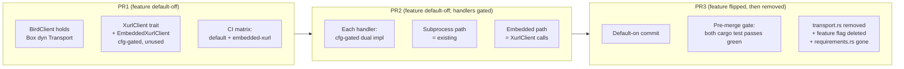

# refactor: embed xurl-rs v2.0.0 as a library, eliminate subprocess transport

## Summary

Replace bird's xr/xurl subprocess transport with the xurl v2.0.0 crate so bird ships as a single binary. The cutover
happens across three sequential PRs on `dev`, gated by a Cargo feature `embedded-xurl` whose lifecycle is `default-off
(PR1, PR2) → flipped to default-on then removed in PR3 (same commit)`. Bird's `BirdClient` gains a
`Mutex<xurl::ApiClient>` field; a new `XurlClient` trait wraps the xurl shortcuts bird actually calls (~18 methods at
PR2 close — exceeds R18's ~15 trip-point, see Open Questions resolution) so tests substitute a hand-rolled fake at the
bird/xurl boundary; `bird doctor` is rebuilt with presence-only credential reporting; and `bird raw` adopts
`xurl::RequestTarget::Template` so xurl owns path substitution and `auth_matrix` lookup atomically. The xurl-rs P0 todo
`012-honor-user-supplied-authorization-header` is tracked as an upstream dependency for R13 but does not gate this plan
— bird ships R13 with the duplicate-`Authorization` limitation documented and bumps xurl-rs by SHA in a follow-up once
the upstream fix lands.

---

## Problem Frame

(see origin: `docs/brainstorms/2026-06-05-embed-xurl-crate-requirements.md`)

The March 2026 PR #8 moved bird off embedded `reqwest`/`tokio`/OAuth onto an `xr`/`xurl` subprocess transport because
xurl had no library API at the time. xurl-rs v2.0.0 ships an ergonomic library surface (no-lifetime `ApiClient`,
`from_env`, 27 typed shortcut methods, structured `XurlError`, generated `auth_matrix`). The remaining install-step
friction (`brew install brettdavies/tap/{xurl,bird}` or `cargo install xr && cargo install bird`) is now removable. The
brainstorm scopes a 3-PR phased cutover; this plan executes it.

---

## Requirements

Every brainstorm requirement R1-R22 is covered. Trace:

| R-ID                                                               | Covered by Implementation Unit(s)                     |
| ------------------------------------------------------------------ | ----------------------------------------------------- |
| R1 (xurl crate dep)                                                | U1                                                    |
| R2 (remove subprocess surface)                                     | U15                                                   |
| R3 (`BirdClient` + `Mutex<ApiClient>` + `RequestTarget::Template`) | U2, U3, U6                                            |
| R4 (XurlError exit-code mapping, inherit + overrides)              | U5, U7                                                |
| R5 (bird raw via send_request)                                     | U9                                                    |
| R6 (dissolve requirements.rs)                                      | U13                                                   |
| R7 (auth_matrix lookup via template)                               | U6                                                    |
| R8 (lazy ApiClient construction, doctor carve-out)                 | U3, U11                                               |
| R9 (AuthMethodMismatch diagnostic)                                 | U7                                                    |
| R10/R11 (--app flag, BIRD_APP, XURL_APP migration warn)            | U12                                                   |
| R12 (--auth flag, value-space resolution)                          | U12                                                   |
| R13 (bird raw -H/--header)                                         | U9                                                    |
| R14 (existing global flags unchanged)                              | (no work — invariant)                                 |
| R15 (out-of-scope xr flags)                                        | (no work — invariant)                                 |
| R16 (doctor rebuild, presence-only)                                | U11                                                   |
| R17a (doctor migration to library calls)                           | U11                                                   |
| R17b (doctor richer per-command output)                            | U11                                                   |
| R18 (XurlClient trait + hand-rolled fake)                          | U2, U4                                                |
| R19 (contract tests preserved, new test surfaces)                  | U5, plus test scenarios on every feature-bearing unit |
| R20 (documented breaking changes)                                  | U14, U17 (CHANGELOG entries)                          |
| R21 (3-PR phased sequence, feature flag mechanics)                 | U1, U14, U15, U17                                     |
| R22 (storage interface preserved)                                  | (no work — invariant)                                 |

### Open Questions resolution

The brainstorm carries 5 deferred Open Questions; each is resolved inline below.

1. **`--auth none` semantics** — Resolved: `--auth none` is rejected at clap parse time for any command whose
   `auth_matrix::supported_auth(method, template)` returns a non-empty scheme list. The xurl-rs verification in the
   brainstorm's deferred entry confirmed no X v2 API endpoint accepts unauthenticated requests; the `none` value is
   reserved for bird-internal `CallOptions { no_auth: true }` paths only. Implementer adds clap validation in U12.
2. **`--app` flag scope** — Resolved: included in PR2 (U12) per user direction at planning synthesis. R10/R11 are
   in-scope for this plan; `--app`/`BIRD_APP` precedence is `--app > BIRD_APP > xurl token-store default`; bird emits a
   stderr migration warning when `XURL_APP` is set and `BIRD_APP` is unset (R20 clause d).
3. **`bird raw -H` xurl-rs dependency** — Resolved: bird ships R13 with the duplicate-`Authorization`-header limitation
   documented in CHANGELOG; xurl-rs is pinned by SHA in `Cargo.toml`; a follow-up `fix(deps): bump xurl-rs` PR (Deferred
   to Follow-Up Work) bumps the pin once xurl-rs P0 todo `012-pending-p0-honor-user-supplied-authorization-header`
   lands.
4. **Typed-adapter trip-point** — Resolved with calibration: post-research verification against
   `xurl-rs/src/api/shortcuts.rs` shows the trait ships at ~18 methods on day one (17 typed shortcuts + 1 generic
   `send_request`), **exceeding R18's ~15 trip-point at PR2 close, not nearly-hit**. The plan accepts this for the
   cutover (preempting now would reopen Deferred Open Question on typed-adapter in this plan's scope), and the next bird
   command added past PR3 fires the typed-adapter revisit immediately. The follow-up is named in Deferred to Follow-Up
   Work as a fire-soon-after-cutover item, not a vague "when bird grows."
5. **xurl v3.0.0 lifecycle** — Genuinely deferred. The Dependencies/Assumptions clause in the origin stands. No work in
   this plan.

---

## Key Technical Decisions

**KTD-1. `BirdClient` holds `Mutex<ApiClient>`; public methods stay `&self`.** `xurl::ApiClient::send_request` is `&mut
self`; bird's existing `Transport::request` is `&self`. Wrapping the embedded client in `Mutex<ApiClient>` and acquiring
the lock inside `BirdClient`'s methods (mirroring the existing `Mutex<rusqlite::Connection>` pattern at
`src/db/store/mod.rs:114-120`) lets every command handler signature stay `&self`. When xurl v3.0.0 introduces async,
this becomes `tokio::sync::Mutex` or moves inside `ApiClient` — local change. Pattern reference:
`docs/solutions/architecture-patterns/bird-library-lift-2026-06.md` (lines 249-280) — the `Send + Sync` compile-time
assertion at `src/db/client/mod.rs:131-134` tracks to the new field.

**KTD-2. `XurlClient` trait wraps typed xurl methods, not a generic `send_request` adapter.** Trait grows with bird's
command surface — one method per xurl shortcut bird uses (`get_me`, `lookup_user`, `read_post`, `get_bookmarks`,
`search_posts`, `get_usage`, plus the 11 write verbs `create_post`/`reply_to_post`/`like_post`/`unlike_post`/`repost`/
`unrepost`/`follow_user`/`unfollow_user`/`send_dm`/`mute_user`/`unmute_user`) plus a generic `send_request` for `bird
raw` (and for the bird `block`/`unblock` verbs since xurl has no shortcut for them — see U2). Production impl is
`xurl::ApiClient`; test impl is a hand-rolled fake returning canned typed responses. Bird preserves xurl's typed
`ApiResponse<T>` + structured `XurlError` ergonomic surface at every call site. Trip-point at ~15 methods (R18) is
**exceeded** on day one at ~18 methods; the typed-adapter revisit is named in Deferred to Follow-Up Work and fires on
the next bird command added after PR3. Pattern reference:
`docs/solutions/architecture-patterns/xurl-subprocess-transport-layer.md` (the existing `Transport` trait +
`MockTransport` pattern with canned-response queues — same shape, different surface).

**KTD-3. Cargo feature `embedded-xurl` selects transport at `BirdClient` construction time only.** No per-call-site
`#[cfg]` checks; no runtime toggle. The flag is `default-off` in PR1 and PR2 so the subprocess transport runs by default
and every CI run on dev exercises the unchanged path. PR3 flips `default-on` and removes the flag itself in the same PR.
PR3's pre-merge gate runs `cargo test --features embedded-xurl` AND `cargo test` (default) and asserts both pass green —
without this, the embedded path ships untested in PR1/PR2 except when explicitly enabled. Pattern reference:
`docs/solutions/build-errors/rust-ci-feature-matrix-additive-gotcha.md` — CI matrix MUST include `--no-default-features
--features embedded-xurl` for the duration of PR1+PR2 or the embedded-only path is silently not tested.

**KTD-4. Bird inherits xurl's `exit_code_for_error` mapping verbatim, with two overrides.** `XurlError::Validation` → 78
(bird's config exit code), `XurlError::AuthMethodMismatch` → 77 (bird's auth exit code, avoiding clap's `EX_USAGE = 2`
collision); all other variants pass through. Inheriting means bird automatically picks up future xurl exit codes without
bird-side changes. Codes 78/77/1 preserved; xurl's 3/4/5 (rate-limited/not-found/network) become new user-visible signal
documented in CHANGELOG. Pattern reference: `docs/solutions/architecture-patterns/xurl-subprocess-transport-layer.md`
(lines 122-136) — exit codes are public API; write contract tests before refactoring.

**KTD-5. `RequestTarget::Template` end-to-end; bird's `resolve_path` is removed.** Today bird substitutes path templates
via `resolve_path` in `src/schema.rs:44-70` and passes a fully-rendered URL to `BirdClient`. xurl's
`auth_matrix::supported_auth(method, path)` requires the template (`/2/users/{id}/likes`), not the rendered URL. Bird
passes `RequestTarget::Template { path, path_params, query }` to xurl; xurl substitutes path params and resolves the
auth scheme atomically. Removing bird's `resolve_path` collapses the duplicated substitution surface. Caveat: whether
bird keeps the existing `validate_param_value` clap-layer validation (stricter than xurl-rs's `InvalidPathParam` check)
or falls back to xurl-rs's looser rules is deferred to implementation — see U6.

**KTD-6. Doctor credential reporting is presence-only, covering env vars AND token-store struct fields.**
`CLIENT_ID`/`CLIENT_SECRET` (env), `App.client_id`/`App.client_secret` (struct fields persisted by xurl),
`OAuth1/2Token.*_token`/`*_secret`/`consumer_*` (struct fields) all report `set/not set` or `present/absent`, never the
value or any truncation. Implementation reads `has_tokens()`-style checks on xurl's token-store types; no field access
that could carry credential material into doctor output. R17b's `accepted_schemes` / `credentialed_schemes` /
`reachable` fields honor this rule by name.

**KTD-7. xurl-rs is pinned by SHA, not by tag or `^2.0`.** Per `~/.claude/CLAUDE.md` supply-chain pinning rule + the
cross-repo dependency learnings: SHA pin with a trailing version comment (`xurl = { git = "...", rev = "<sha>" # v2.0.0
}`) lets bird control upgrade timing precisely. xurl-rs P0 todo 012 (suppress duplicate `Authorization` when caller
supplied) lands separately; bird picks it up via a `fix(deps): bump xurl-rs` PR with the new SHA. Pattern reference:
`docs/solutions/architecture-patterns/cross-repo-artifact-sync-commit-over-fetch-20260420.md`.

---

## High-Level Technical Design

**Transport lifecycle across the 3-PR sequence:**



**BirdClient post-refactor shape (illustrative, directional — not implementation specification):**

```text
pub struct BirdClient {
    // Existing fields (db, cache, output config) unchanged.

    // cfg-gated: which transport is active is decided at construction time only.
    #[cfg(feature = "embedded-xurl")]
    xurl: Mutex<xurl::ApiClient>,
    #[cfg(not(feature = "embedded-xurl"))]
    transport: Box<dyn Transport>,
}

impl BirdClient {
    // Typed method per xurl shortcut bird uses; cfg-gated impl bodies, &self signature stays uniform.
    pub fn bookmarks(&self, user_id: &str, opts: &CallOptions) -> Result<Bookmarks> {
        #[cfg(feature = "embedded-xurl")]
        return self.xurl.lock().unwrap().bookmarks(user_id, opts).map_err(BirdError::from);

        #[cfg(not(feature = "embedded-xurl"))]
        return self.xurl_get(&format!(".../{}/bookmarks", user_id), &ctx).and_then(deserialize);
    }
    // ... ~14 such methods at PR2 close
}

// Send+Sync compile-time assertion at src/db/client/mod.rs:131-134 tracks to whichever field is active.
```

**Doctor JSON envelope shape change (R17b adds, R16 removes — both in PR2):**

```text
{
  "xurl": { ... },                        // R16: keep version field, drop xurl_installed/xurl_version_compatible
  "auth": { ... per app ... },            // R16: per-app auth state (was global)
  "commands": {
    "bookmarks": {
      "available": true,
      "reason": null,
      "accepted_schemes": ["oauth2", "oauth1"],   // R17b NEW
      "credentialed_schemes": ["oauth2"],         // R17b NEW
      "reachable": true                            // R17b NEW
    },
    ...
  },
  "linked_xurl_version": "2.0.0",         // R16 NEW
  "cache": { ... }                         // unchanged
}
```

`schema/doctor.schema.json` regenerates from the runtime emitter in PR2 U11; `tests/schema_parity.rs` enforces the
committed-artifact-stays-in-sync invariant.

---

## Implementation Units

Organized into three phases matching the 3-PR sequence. Within each phase, units are dependency-ordered.

### Phase 1 — PR1: Foundation + feature scaffolding

Commit: `feat(transport): add embedded xurl client behind embedded-xurl feature flag`. Default-off; subprocess transport
runs unchanged. PR body's `## Changelog` section documents the opt-in feature.

### U1. Add xurl-rs dep and `embedded-xurl` Cargo feature

**Goal:** Bird depends on xurl-rs v2.0.0 via SHA-pinned git dep; `embedded-xurl` Cargo feature exists, default-off; CI
matrix exercises both the default (subprocess) and `--features embedded-xurl` paths.

**Requirements:** R1, R21.

**Dependencies:** none.

**Files:**

- `Cargo.toml` (add `xurl = { git = "https://github.com/brettdavies/xurl-rs", rev = "<latest-v2.0.0-sha>" # v2.0.0 }` to
  a new optional dependencies block; add `[features] embedded-xurl = ["dep:xurl"]`)
- `.github/workflows/ci.yml` (add matrix axis: default, `--no-default-features --features embedded-xurl`,
  `--all-features`)
- `RELEASES-PREFLIGHT.md` (note the dual-feature CI invariant for the 3-PR window)

**Approach:** SHA pin per KTD-7. Make xurl an optional dependency so the subprocess path doesn't pay any compile-time
cost when the feature is off. The CI matrix gotcha from
`docs/solutions/build-errors/rust-ci-feature-matrix-additive-gotcha.md` — explicit `--no-default-features --features
embedded-xurl` matrix entry, not just `--all-features`.

**Patterns to follow:**

- `.github/workflows/ci.yml` existing matrix shape
- `~/.claude/CLAUDE.md` supply-chain pinning rule (SHA + trailing comment)

**Test scenarios:**

- `cargo build` succeeds with default features (subprocess only).
- `cargo build --features embedded-xurl` succeeds.
- `cargo build --no-default-features --features embedded-xurl` succeeds (catches accidental default-feature coupling).
- **PR1 CI matrix runs builds only under `--features embedded-xurl`, NOT `cargo test`.** Test runs on the embedded axis
  enter the matrix in PR2 (U6 close), once the U6-U13 handler bodies replace the U3 stubs. Running `cargo test
  --features embedded-xurl` in PR1 would panic on the stubs (see U3's stub strategy) — the matrix entry is `cargo build
  --features embedded-xurl`, explicitly build-only.
- `cargo test` (default features) on PR1 passes — subprocess path is untouched.

**Verification:** `Cargo.toml` has the SHA pin with trailing version comment; CI matrix on the PR1 PR run shows
build-success across all three feature configurations + test-success on default.

---

### U2. Define `XurlClient` trait + production impl

**Goal:** New `XurlClient` trait declared in bird; production impl wraps `Mutex<xurl::ApiClient>` and delegates each
trait method to the corresponding xurl shortcut.

**Requirements:** R3, R18.

**Dependencies:** U1.

**Files:**

- `src/xurl_client/mod.rs` (NEW — trait definition + production impl, `#[cfg(feature = "embedded-xurl")]`)
- `src/lib.rs` (declare the new module)

**Approach:** Trait has one method per xurl shortcut bird uses today, named per xurl-rs's verified API surface
(`xurl-rs/src/api/shortcuts.rs:162-926`): `get_me`, `lookup_user`, `read_post`, `get_bookmarks`, `search_posts`,
`get_usage`, plus write verbs `create_post`, `reply_to_post`, `like_post`, `unlike_post`, `repost`, `unrepost`,
`follow_user`, `unfollow_user`, `send_dm`, `mute_user`, `unmute_user`, plus the catch-all `send_request(options)` for
`bird raw`. **Block/unblock have no xurl shortcuts** — bird's `block`/`unblock` write verbs call `send_request` with a
hand-built `RequestTarget::Template { path: "/2/users/{id}/blocking", ... }` rather than a typed method. (Filing an
upstream xurl-rs PR to add `block_user`/`unblock_user` shortcuts is tracked in Deferred to Follow-Up Work.)

Typed shortcut methods return `Result<ApiResponse<T>, XurlError>` with `T` matching xurl's response type for that
endpoint (e.g., `Tweet`, `User`, `Bookmarks` — verify in `xurl-rs/src/api/shortcuts.rs`). The catch-all
`send_request(options)` returns `Result<serde_json::Value, XurlError>` since xurl's generic `send_request` is
`Value`-shaped, not `ApiResponse<T>`. All methods take `&self`. Production impl acquires `MutexGuard<ApiClient>`, calls
the shortcut, returns the typed result.

**Method count and trip-point:** the trait ships at ~18 methods on day one (17 typed shortcuts + 1 generic
`send_request`; block/unblock route through `send_request` so they don't add methods). The R18 trip-point of ~15 is
**exceeded at PR2 close, not nearly-hit**. The next bird command added past PR3 fires the typed-adapter revisit
immediately. See Deferred to Follow-Up Work.

**Patterns to follow:**

- `src/db/store/mod.rs:114-120` — `Mutex<Connection>` + `MutexGuard` accessor pattern
- `docs/solutions/architecture-patterns/bird-library-lift-2026-06.md` (lines 249-280) — `Send + Sync` compile-time
  assertion pattern; mirror it on `XurlClient` impl

**Test scenarios:**

- `XurlClient` trait compiles in isolation (test in same file with a stub impl).
- Production impl: const assertion `fn _assert<T: XurlClient + Send + Sync>() {}` invoked with the production type —
  compile-time check.
- (Behavior tests on the production impl live in U4's fake-driven test fixtures, not here.)

**Verification:** Trait declared; production impl compiles under `--features embedded-xurl`; `Send + Sync` compile-time
assertion passes.

---

### U3. Restructure `BirdClient` for cfg-gated transport

**Goal:** `BirdClient` holds either `Box<dyn Transport>` (default) or `Mutex<xurl::ApiClient>` (under `embedded-xurl`),
selected at construction time. Public method signatures stay `&self`.

**Requirements:** R3, R8, R21 (construction-time-only flag selection).

**Dependencies:** U2.

**Files:**

- `src/db/client/mod.rs` (modify the `BirdClient` struct: cfg-gated fields; constructor branches on feature)
- `src/cli/runner.rs` (lines 307-314: replace the `Result<PathBuf, String>` "error-stored transport" pattern with a
  cfg-gated branch — embedded constructs via `xurl::ApiClient::from_env()`; subprocess preserves existing
  `XurlTransport::new` / `from_error` shape)
- `src/db/client/get.rs`, `src/db/client/write.rs`, `src/db/client/mod.rs:245-249` (`BirdClient::transport_request`) —
  these are touched only structurally in PR1; bodies are NOT yet migrated (that's PR2). PR1's embedded-variant stub
  methods return a benign error rather than panicking (see Approach), so even if a test accidentally constructs a
  `BirdClient` under the embedded feature, the failure surfaces as a clean error path with a useful message rather than
  a panic stack trace.

**Approach:** PR1 introduces the structural restructure without yet migrating any handler bodies. Under `embedded-xurl`,
`BirdClient` constructs an `xurl::ApiClient::from_env()` and wraps it in `Mutex`. Embedded-variant stub methods return
`Err(BirdError::Internal("embedded transport stub — handler migration lands in PR2"))` rather than `unimplemented!()`
(panic). This keeps PR1 CI green even if a test path exercises the embedded variant before U6-U13 land — the behavior is
wrong but observable as an error, not a process crash. PR1's CI matrix only runs `cargo build --features embedded-xurl`
(per U1's test-scenario clarification), so the stubs won't be exercised at all under normal PR1 CI; the benign-error
fallback is the defense-in-depth for accidental matrix expansion or local `cargo test --features embedded-xurl` runs.

The `Send + Sync` compile-time assertion at `src/db/client/mod.rs:131-134` tracks to the new field — if it stops
compiling, that's the rusqlite `Connection: !Sync` precedent reappearing (per learnings) and must be resolved at PR1.

**Execution note:** Test-first on the `Send + Sync` assertion. Land it before the field change, watch it red, then add
the field and watch it green.

**Patterns to follow:**

- `src/db/store/mod.rs:114-120` — `Mutex<T>` field + acquire-lock-in-methods discipline
- `docs/solutions/architecture-patterns/bird-library-lift-2026-06.md` — lib-lift's per-instance state discipline; no
  process globals (`OnceLock<Mutex<...>>` is explicitly the antipattern to avoid)

**Test scenarios:**

- `cargo build` succeeds with default features (subprocess BirdClient unchanged behaviorally).
- `cargo build --features embedded-xurl` succeeds (embedded BirdClient compiles; unimplemented bodies don't trigger
  monomorphization errors).
- `Send + Sync` compile-time assertion passes for both feature states.
- Existing `tests/cli_smoke.rs` exit-code asserts still pass with default features (subprocess path unchanged).

**Verification:** Both feature configurations build cleanly. Send+Sync assertion holds. No behavioral regression in the
default (subprocess) path.

---

### U4. Hand-rolled `XurlClient` test fake

**Goal:** `#[cfg(test)]` test fake implementing `XurlClient`; takes canned typed responses and returns them in order;
also supports error injection per method.

**Requirements:** R18, R19.

**Dependencies:** U2.

**Files:**

- `src/xurl_client/fake.rs` (NEW, `#[cfg(test)]`)
- `src/xurl_client/mod.rs` (module declaration)

**Approach:** Fake struct holds a `Mutex<HashMap<String, VecDeque<Result<Value, XurlError>>>>` keyed by method name,
with a builder that pushes responses per method. Each trait method pops from its queue and returns the result. Calls to
methods with empty queues return a sensible default error so tests fail loudly when they undercount expected calls.
Mirrors `MockTransport`'s existing `Mutex<VecDeque<...>>` shape (per learnings + repo research §5).

**Patterns to follow:**

- `src/transport.rs:487-513` — existing `MockTransport` shape (queue + Mutex)
- `docs/solutions/architecture-patterns/bird-library-lift-2026-06.md:263-280` — Mutex over RefCell for Send+Sync

**Test scenarios:**

- Fake constructed with no responses returns an error on the first call (test-failure surfacing).
- Fake constructed with `[Ok(...), Ok(...)]` for `bookmarks` returns those in order.
- Fake constructed with `[Err(XurlError::Api { status: 429, ... })]` returns the error.
- Fake is `Send + Sync` (compile-time assertion).
- Calling two different methods uses two different queues independently.

**Verification:** Fake unit tests pass under `cargo test --features embedded-xurl`. Fake is the only test substitute
bird uses going forward.

---

### U5. Exit-code contract tests (R4 anchor)

**Goal:** Lock the exit-code contract before handler migration: 78 (config), 77 (auth), 1 (command), plus the new 3/4/5
codes inherited from xurl per R4.

**Requirements:** R4, R19, R20 clause (b).

**Dependencies:** none.

**Files:**

- `tests/exit_codes.rs` (NEW — dedicated contract tests for every documented exit code)

**Approach:** Tests invoke bird subprocess (`assert_cmd::Command::cargo_bin("bird")`) with inputs that deterministically
produce each exit code; assert the code matches. This is test-first — they MUST pass under the current subprocess
transport before any handler migration begins, so PR2 commits can verify the contract holds during migration.

Code-trigger map for PR1 (78/77/1 only per R19):

- 78: invalid `--output xml` (clap validation failure) → existing `tests/cli_smoke.rs` asserts this; the new file
  collects all 78-triggers in one place
- 77: missing auth on an auth-required command (use existing `tests/cli_smoke.rs` patterns)
- 1: command-level failures (network error, no internet — mock via env var override or xurl path point-at-fail)

Codes 3 / 4 / 5 (xurl-inherited rate-limited / not-found / network) are written as active tests in U7 where the
error-mapping refactor lands, not pre-scaffolded with `#[ignore]` in U5. R19 only requires the 78/77/1 contract pass
unchanged; PR1's responsibility is exactly that.

**Execution note:** Test-first per `docs/solutions/architecture-patterns/xurl-subprocess-transport-layer.md`'s "Exit
codes are public API. Write contract tests for them before refactoring."

**Patterns to follow:**

- `tests/cli_smoke.rs` (existing exit-code patterns at lines 170, 396, 399, 431, 445, 628, 631)
- `tests/json_envelope.rs:69, 72` (exit-78 envelope test pattern)

**Test scenarios:**

- 78: `bird --output xml` → exit 78 with usage error.
- 78: `bird raw <invalid-path>` → exit 78 (config / validation error).
- 77: `bird tweet "hello"` without `bird login` having run → exit 77.
- 77: `bird bookmarks` without auth → exit 77.
- 1: any command with `BIRD_XURL_PATH=/nonexistent` → exit 1 (transport failure today; covered by today's
  transport_integration patterns).

**Verification:** All 78/77/1 tests pass under PR1 (default features). The 3 / 4 / 5 tests land in U7, written as active
(non-ignored) tests against the new error-mapping path.

---

### Phase 2 — PR2: Handler migration + cutover-shape work

Commit: `refactor(transport): migrate handlers and consolidate auth onto embedded xurl path`. Feature still default-off;
each handler gains a `#[cfg(feature = "embedded-xurl")]` embedded path alongside the subprocess one. PR body's `##
Changelog` documents the per-handler migration and the new flags (`--app`, `--auth`, `-H/--header`).

### U6. Adopt `RequestTarget::Template`; remove `resolve_path`

**Goal:** Bird passes `RequestTarget::Template { path, path_params, query }` to xurl. The current `resolve_path` helper
in `src/schema.rs:44-70` is deleted in PR3's U15 (not here — see Execution note). The `bird raw -p` param-validation
question (whether to elevate `validate_param_value` at `src/schema.rs:6-23` to `pub` and keep bird's stricter
alphanumeric/_/-/. rules at the clap layer, OR delete it and accept xurl-rs's looser `InvalidPathParam` check rejecting
only `/`/`?`/`#`/`%`) is **deferred to implementation**. The implementer picks based on whether they hit cases that
motivate one direction; if they delete, they document the behavior change in CHANGELOG.

**Requirements:** R5, R7, KTD-5.

**Dependencies:** U3 (BirdClient restructure must exist).

**Files:**

- `src/schema.rs` (NO body changes in PR2 — `resolve_path` stays intact for the subprocess arm; PR3's U15 deletes it
  alongside the rest of the subprocess code. Only the `bird raw` embedded arm constructs `RequestTarget::Template`
  directly, bypassing `resolve_path`.)
- `src/raw.rs` (cfg-gated: embedded arm constructs `RequestTarget::Template`; subprocess arm still calls `resolve_path`
- `format!`)
- `src/db/client/mod.rs` (`RequestContext` may gain a `template` field alongside the URL, or be replaced by direct
  `RequestTarget` plumbing — implementer decides)

**Approach:** `bird raw <method> <path> -p key=val -q k=v -d body` constructs:

```text
RequestTarget::Template {
    path: "/2/users/{id}/likes".to_string(),
    path_params: HashMap::from([("id".to_string(), value)]),  // xurl's actual field type is HashMap, not Vec
    query: vec![("k".to_string(), v.to_string())],
}
```

and passes it to `xurl_client.send_request(target, options)`. Body and method come via `CallOptions`. xurl's
`auth_matrix::supported_auth(method, path)` runs internally with the template, returning the auth schemes; xurl then
substitutes path_params and dispatches.

For the typed handler call sites (bookmarks, tweets, etc.), the call shape is `xurl_client.bookmarks(user_id, opts)` —
xurl owns the template internally. No bird-side `RequestTarget::Template` construction needed.

**Execution note:** `resolve_path` is NOT cfg-gated in PR2. The embedded arm of `bird raw` constructs
`RequestTarget::Template` directly without calling it; the subprocess arm continues to use it unchanged. PR3's U15
deletes `resolve_path` as part of removing the subprocess transport entirely (U15's Files list now includes
`src/schema.rs`). This avoids `dead_code` warnings during PR2 under `--features embedded-xurl` and keeps the deletion in
one place.

**Patterns to follow:**

- xurl-rs `src/api/request.rs` `RequestTarget` enum + `send_request` signature
- xurl-rs `src/api/auth_matrix.rs` `supported_auth(method, path_template)` — the lookup expects the template

**Test scenarios:**

- `bird raw GET /2/users/me` constructs `RequestTarget::Template { path: "/2/users/me", path_params: [], query: [] }`
  (test via fake `XurlClient`).
- `bird raw GET /2/users/{id}/bookmarks -p id=12345` constructs the right path_params vec; xurl sees the template, not
  the rendered URL.
- `bird raw GET /2/tweets/search/recent -q query=hello -q max_results=10` constructs the right query vec.
- Param validation: `-p id=foo;bar` (semicolon) is rejected somewhere — either bird's clap layer (if implementer
  elevates `validate_param_value` to `pub`) or xurl-rs's `InvalidPathParam`. The test asserts rejection happens; the
  exact rejection layer depends on the deferred-to-implementation decision in U6.
- The fake `XurlClient::send_request` records the `RequestTarget` it received; tests inspect the recorded value.

**Verification:** Bird raw's smoke tests pass with the new RequestTarget shape. resolve_path is no longer called on the
embedded path.

---

### U7. Error-mapping refactor

**Goal:** Centralize `XurlError → BirdError → exit-code` mapping; inherit xurl's `exit_code_for_error` for codes 3/4/5;
override `Validation` to 78 and `AuthMethodMismatch` to 77.

**Requirements:** R4, R9, KTD-4.

**Dependencies:** U3.

**Files:**

- `src/error/mod.rs` (add `From<XurlError> for BirdError` impl behind `#[cfg(feature = "embedded-xurl")]`; preserve
  existing subprocess `XurlError` classifier under the non-feature path)
- `src/cli/dispatch.rs` (the centralized error chokepoint `BirdError::from_source` and `command_needs_xurl` — exhaustive
  `match` over `XurlError` variants so rustc enforces completeness on new variants)

**Approach:** The mapping is a single `match` over xurl's `XurlError` variants (verified in repo research §6 against
`xurl-rs/src/error.rs`):

```text
XurlError::Validation(_)             → BirdError::Config(...)      → exit 78
XurlError::Auth(_)                   → BirdError::Auth(...)        → exit 77
XurlError::AuthMethodMismatch { .. } → BirdError::Auth(detail)     → exit 77 (NOT xurl's 2)
XurlError::Api { status, body }      → BirdError::Command(...)     → inherit xurl's exit_code (3/4/5 for 429/404/io,
                                                                     1 for everything else)
XurlError::Io(_)                     → inherit xurl's exit_code    → 5
```

The exhaustive match is the load-bearing safeguard — when xurl ships a new variant, rustc fails the bird build until the
mapping is updated.

**Patterns to follow:**

- `docs/solutions/architecture-patterns/xurl-subprocess-transport-layer.md` (lines 122-136, bug #2 lines 195-198) —
  `map_cmd_error` downcast pattern + "Exit codes are public API"
- xurl-rs `src/error.rs` `exit_code_for_error` (the function bird inherits)

**Test scenarios:**

- Fake `XurlClient` returns `XurlError::Api { status: 429, ... }`; the bird command exits 3.
- Fake returns `XurlError::Api { status: 404, ... }`; exit 4.
- Fake returns `XurlError::Io(...)`; exit 5.
- Fake returns `XurlError::Auth(...)`; exit 77.
- Fake returns `XurlError::AuthMethodMismatch { ... }`; exit 77 with diagnostic detail per R9 (endpoint, supported
  schemes, scheme bird selected).
- Fake returns `XurlError::Validation(...)`; exit 78.
- **Land 3 / 4 / 5 contract tests in `tests/exit_codes.rs`** as active (non-ignored) tests in this unit's commit —
  written against the new embedded error-mapping path, not pre-scaffolded `#[ignore]`'d in U5. The 3 / 4 / 5 cases
  exercise the fake-driven error injections above end-to-end through `BirdError::from_source` to the process exit code.
- 4xx codes not in {401, 403, 404, 429} (e.g., 408, 409, 422, 451): fake returns `XurlError::Api { status: 422, ... }`;
  exit 1 (inherited xurl mapping). CHANGELOG documents this is the default for unmapped 4xx.

**Verification:** All exit codes (78 / 77 / 1 / 3 / 4 / 5) in `tests/exit_codes.rs` pass under `--features
embedded-xurl`. Subprocess path unchanged.

---

### U8. Migrate read handlers

**Goal:** Each read handler (bookmarks, profile, search, thread, watchlist/check, usage/sync) gains an embedded path
that calls the typed `XurlClient` method. Subprocess path stays under the cfg-off arm.

**Requirements:** R3, R7, R8, R19.

**Dependencies:** U6, U7.

**Files:**

- `src/bookmarks.rs` (lines 46, 113: cfg-gated dual impl)
- `src/profile.rs` (line 47)
- `src/search.rs` (line 60)
- `src/thread.rs` (lines 128, 220)
- `src/watchlist/check.rs` (line 137)
- `src/usage/sync.rs` (line 31)
- `src/db/client/get.rs` (`xurl_get` — gets the cfg-gated dispatch to typed methods vs. existing transport.request)

**Approach:** Each handler's API call site gets:

```text
#[cfg(feature = "embedded-xurl")]
let data = client.bookmarks(user_id, &opts)?;

#[cfg(not(feature = "embedded-xurl"))]
let data = client.xurl_get(&format!("https://api.x.com/2/users/{}/bookmarks", user_id), &ctx)?;
```

Or — cleaner — push the cfg into `BirdClient::bookmarks(...)` itself so handlers call one method:

```text
let data = client.bookmarks(user_id, &opts)?;   // BirdClient dispatches internally
```

The second shape is preferred (cfg lives in one place: BirdClient's typed method body). Handlers stay clean.

Whole-handler batches per KTD-3: each commit in PR2 fully migrates one handler's embedded path. Don't ship a
half-migrated handler.

**Patterns to follow:**

- `src/db/client/get.rs:235` — current dispatch shape (preserve under cfg-off arm)
- xurl-rs `src/api/shortcuts.rs` — typed shortcut signatures bird's methods delegate to

**Test scenarios (per handler):**

- Happy path: fake returns canned `Bookmarks` (or `User`, `Tweet`, etc.); handler emits correct JSON envelope.
- Auth-required: fake returns `XurlError::Auth(...)`; handler exits 77 with correct envelope.
- Not-found: fake returns `XurlError::Api { status: 404, ... }`; handler exits 4.
- Rate-limited: fake returns `XurlError::Api { status: 429, ... }`; handler exits 3.
- Pagination (bookmarks, thread): fake returns sequenced page responses; handler walks them correctly.
- Integration: existing `tests/cli_smoke.rs` and `tests/json_envelope.rs` continue to pass for subprocess (default
  features) AND embedded (`--features embedded-xurl`).

**Verification:** `cargo test --features embedded-xurl` passes for every read handler. `cargo test` (default) still
passes (subprocess path unchanged).

---

### U9. Migrate write handlers + `bird raw -H`/`--header`

**Goal:** Each write handler (tweet/reply/like/unlike/repost/unrepost/follow/unfollow/dm/block/unblock/mute/unmute)
gains an embedded path via typed `XurlClient` write methods. `bird raw` adds `-H/--header` flag flowing through
`CallOptions` to xurl.

**Requirements:** R3, R5, R13, R19.

**Dependencies:** U6, U7, U8.

**Files:**

- `src/cli/commands/writes/mod.rs` (each write verb's embedded path)
- `src/cli/dispatch.rs` (`xurl_write_call` at lines 611-626 — cfg-gated)
- `src/raw.rs` (add `-H`/`--header` clap arg; thread into `RequestOptions.headers` after constructing it via
  `CallOptions::to_request_options()` — see Approach below)
- `src/cli/commands/raw_write.rs` (POST/PUT/DELETE variants — same `-H` plumbing)
- `src/cli/mod.rs` (clap definition for `bird raw -H` referencing the parser)
- `src/cli/parsers.rs` (NEW or extended — `pub fn parse_header_kv(s: &str) -> Result<String, String>` used as the clap
  `value_parser` for `-H/--header`; splits on first `:`, trims, returns descriptive `Err` on malformed input)

**Approach:** Write handlers follow the same pattern as reads — typed method on `XurlClient` (`tweet`, `like`, `dm`,
etc.) called from `BirdClient::tweet`, etc. The `WriteSpec.xurl_args` argv-shape (used by current `xurl_write_call`)
stays for the subprocess path; the embedded path constructs `CallOptions` directly.

For `bird raw -H`: clap accepts `-H/--header` as a repeatable `String` value, validated by a custom `value_parser`
(`parse_header_kv` — see Files) that splits on the first `:`, trims both sides, and returns `Err("header must be in Key:
Value form")` on malformed input so clap surfaces a usage error (mapped to exit 78 via bird's clap-error path).
Validated `"Key: Value"` strings are then plumbed into xurl through `RequestOptions.headers` — bird's `bird raw` path
constructs `RequestOptions` via `CallOptions::to_request_options()` and pushes the header strings onto `opts.headers`
(xurl's actual field is on `RequestOptions`, NOT `CallOptions`; verified at `xurl-rs/src/api/request.rs:88-105`). Typed
shortcut methods have no header-injection point, so `-H` is bird-raw-only (consistent with R13 scope). The
duplicate-`Authorization`-header limitation is documented in CHANGELOG until xurl-rs todo 012 lands; whether to also
emit a runtime stderr warning when the user passes `-H "Authorization: ..."` is a P2 judgment call resolved during plan
walkthrough (see brainstorm Open Question).

**Patterns to follow:**

- `src/cli/commands/writes/mod.rs:471-483` — current `WriteSpec` shape (preserve for subprocess)
- xurl-rs `CallOptions` field shape (the `headers: Vec<String>` field that takes `"Key: Value"` strings today)
- `~/.config/github/pull_request_template.md` style for the CHANGELOG entry on `-H` limitation

**Test scenarios (per write handler):**

- Happy path: fake returns canned success response for `tweet("hello", opts)`; bird exits 0 with success envelope.
- Auth failure: fake returns `XurlError::Auth`; exit 77.
- Validation failure (e.g., tweet too long): fake returns `XurlError::Api { status: 422, ... }`; exit 1 (per R4 — 4xx
  not in {401, 403, 404, 429} falls through to 1).
- Cache-only short-circuit: existing test pattern at `src/cli/commands/writes/mod.rs:514` — preserved under cfg-off and
  cfg-on.
- Dry-run envelope: existing patterns at lines 574, 600, 623 — preserved.

**Test scenarios for `bird raw -H`:**

- `bird raw GET /2/users/me -H "X-Custom: foo"` flows `("X-Custom", "foo")` into `CallOptions.headers`.
- Repeatable: `-H "X-A: a" -H "X-B: b"` flows two headers.
- `bird raw GET /2/users/me -H "Authorization: Bearer abc"` emits a stderr warning naming the duplicate-header
  limitation (per brainstorm Open Question).
- Malformed header (no `:`): clap rejects with exit 78.

**Verification:** Every write verb's smoke/integration test passes under both feature configurations. `bird raw -H`
behavior matches the documented contract.

---

### U10. Rewire `bird login` to library calls

**Goal:** Replace `bird login`'s subprocess passthrough with direct calls to `xurl::auth::Auth::oauth2_flow` /
`remote_oauth2_step1` / `remote_oauth2_step2`.

**Requirements:** R3 (Key Decision: xurl owns auth), R8, R19.

**Dependencies:** U3.

**Files:**

- `src/cli/commands/login.rs` (41 lines; current shape: clap dispatch + `transport::xurl_passthrough(&["auth",
  "oauth2"], ...)`)
- `src/login.rs` (304 lines; headless OAuth2 step1/step2 driver — `Stdio::piped` xurl subprocess)
- `src/error/mod.rs` (any `LoginError` ↔ `XurlError::Auth` mapping shifts to direct typed errors)

**Approach:** Under `#[cfg(feature = "embedded-xurl")]`:

- `bird login` (default, interactive): construct the Auth instance in the correct order:

1. Build `Config::new()` (or load via xurl's config-resolution path).
2. Construct `Auth::new(&cfg)` (or `Auth::new_with_store_path(&cfg, path)` when bird needs to pin the token-store
   location for tests).
3. If `--app <name>` is set, mutate the instance: `auth.with_app_name(name);` — this is `&mut self -> ()`, not a builder
   chain.
4. Call `auth.oauth2_flow(username, &out, &mut stdout)` where `out: &OutputConfig` is bird's output config and `stdout:
   &mut dyn Write` is bird's writer. The TTY prompt + browser-open behavior lives inside `Auth::oauth2_flow` per xurl's
   existing implementation; bird passes the output sink through and lets xurl drive prompts (per
   `docs/solutions/best-practices/rust-library-cli-separation-for-interactive-concerns-2026-04-20.md` — the binary owns
   the writer but the library owns the prompt protocol).

- `bird login --no-browser` (headless): same `Auth` construction (steps 1-3 above), then call
  `Auth::remote_oauth2_step1(...)` for the auth URL, emit bird's existing prompt envelope, read stdin for the callback
  URL, call `Auth::remote_oauth2_step2(...)` with it. Verify exact signatures of the two `remote_*` methods at
  implementation time — the planning verification (repo research §7) confirmed they exist but did not enumerate
  parameters.
- On success, call `client.db_clear()` (existing behavior) and report rows cleared on stderr.

Subprocess path (default features in PR1/PR2): unchanged from today.

**Patterns to follow:**

- Existing `src/login.rs` envelope shape (prompt and success envelopes) — preserve exactly
- xurl-rs `src/auth/mod.rs` `Auth::oauth2_flow` / `remote_oauth2_step1` / `remote_oauth2_step2` signatures

**Test scenarios:**

- Embedded happy path (interactive): fake `Auth` returns success; `bird login` exits 0 and clears db.
- Embedded headless (`--no-browser`): step1 returns auth URL → prompt → step2 with callback URL succeeds.
- Embedded error path: step1 returns `XurlError::Auth`; exit 77 with original error message preserved.
- Subprocess path (default features): existing `tests/cli_smoke.rs` login tests continue to pass.

**Verification:** Both code paths (subprocess and embedded) successfully complete an OAuth2 flow (interactive +
headless) using the test fake.

---

### U11. Doctor rebuild (R16 + R17a + R17b)

**Goal:** `bird doctor` is rebuilt per the brainstorm's R16/R17a/R17b. Presence-only credential reporting (env vars AND
token-store struct fields per KTD-6). Per-command AuthScheme + credential matrix output. `xurl_installed`/
`xurl_version_compatible` probes removed. Linked xurl crate version reported. `schema/doctor.schema.json` regenerated.

**Requirements:** R16, R17a, R17b, R20 clause (c).

**Dependencies:** U3.

**Files:**

- `src/doctor.rs` (lines 9-354 — full rebuild: new `DoctorReport` fields, new `format_pretty`, new `report` flow)
- `src/schema_print.rs` (line 32 — embedded schema is regenerated)
- `schema/doctor.schema.json` (regenerated artifact, committed)
- `tests/schema_parity.rs` (verifies regenerated schema matches runtime emitter)

**Approach:** Under `#[cfg(feature = "embedded-xurl")]`, `report(client, ...)` reads:

- xurl's linked crate version via `xurl::VERSION`. **Prerequisite upstream change:** xurl-rs needs `pub const VERSION:
  &str = env!("CARGO_PKG_VERSION");` added to `xurl-rs/src/lib.rs`. This lands as a tiny upstream PR before U1's SHA pin
  — same maintainer, ~5 minutes of work. U1 cites the post-change SHA.
- xurl token-store introspection: `App.client_id.is_empty()`, `App.client_secret.is_empty()`, `has_tokens()` per app,
  accepted schemes per command via `auth_matrix::supported_auth(method, path_template)`
- Per-command: `accepted_schemes`, `credentialed_schemes`, `reachable` (boolean = AuthScheme list ∩ credentialed schemes
  is non-empty)
- `CLIENT_ID`/`CLIENT_SECRET` env: presence-only

**Schema regeneration is hand-authored**, not codegen. bird has no `schemars` derive on `DoctorReport`, no schema
build.rs, no generation script — `schema/doctor.schema.json` is a static JSON file. U11's commit hand-edits the JSON to
add the new fields (`accepted_schemes`, `credentialed_schemes`, `reachable`, `linked_xurl_version`) matching the new
`DoctorReport` shape. `tests/schema_parity.rs` only checks the embedded `include_str!` bytes equal the on-disk file (per
repo research §12 verification) — so a separate test rounds-trips a fixture `DoctorReport` through
`serde_json::to_value` and asserts the keys match the schema's `required`/`properties`. That round-trip test is the
load-bearing safeguard against runtime-emitter / schema drift; the parity test alone is insufficient. (Introducing
`schemars` for true generation is tracked as a future option, not in scope for this plan.)

Subprocess path: unchanged from today (still calls `transport::check_xurl_version` etc.).

Schema regen happens in this unit's commit; `tests/schema_parity.rs` enforces the parity at PR2 close.

**Patterns to follow:**

- `docs/solutions/architecture-patterns/cross-repo-artifact-sync-commit-over-fetch-20260420.md` — committed-artifact +
  --check gate pattern; mirror for `schema/doctor.schema.json`
- Existing `tests/schema_parity.rs` shape — extend the doctor schema check

**Test scenarios:**

- Doctor report serializes successfully under embedded; new fields (`accepted_schemes`, `credentialed_schemes`,
  `reachable`, `linked_xurl_version`) present.
- Credential reporting — env vars: `CLIENT_ID=secret` → output shows `set`, NOT the value; `CLIENT_SECRET=secret` →
  same.
- Credential reporting — token-store `App` fields: fake xurl client with non-empty `App.client_id` → output shows `set`;
  non-empty `App.client_secret` → same. Empty → `not set`.
- Credential reporting — `OAuth2Token` fields: fake with `access_token` present → output shows `present`; with
  `refresh_token` present → same.
- Credential reporting — `OAuth1Token` fields: fake with `access_token`, `token_secret`, `consumer_key`,
  `consumer_secret` populated → all four report `present`; never the value.
- **Negative assertion**: for every credential test above, the serialized `DoctorReport` (as JSON via
  `serde_json::to_string(&report)`) must NOT contain the literal credential value anywhere in the output. Use a
  string-contains negative assertion.
- **Schema round-trip test** (new file `tests/doctor_schema_runtime.rs`): construct a fixture `DoctorReport`, run
  through `serde_json::to_value`, and assert every key matches the schema's `required` and `properties` arrays. This
  catches runtime-emitter / schema drift that `tests/schema_parity.rs` cannot.
- Per-command output: `bird doctor bookmarks` returns the bookmarks command's accepted/credentialed schemes; same shape
  as full report scoped down.
- Schema parity: `tests/schema_parity.rs` passes (committed schema matches runtime emitter).
- JSON envelope: `bird doctor --json` emits the documented shape per R20 clause (c) — strict-schema consumers
  (agent-skill bundle in the separate `brettdavies/bird-skill` repo) regenerate against this.
- Pretty output: `bird doctor` produces human-readable per-section output (Xurl / Auth / Commands / Cache) — section
  shapes change per R16/R17b but the section list stays.

**Verification:** All doctor test scenarios pass. `schema/doctor.schema.json` is regenerated and committed. Schema
parity test passes. Subprocess path unchanged.

---

### U12. Add `--app` / `BIRD_APP` / `XURL_APP` migration warn + `--auth` flag

**Goal:** R10/R11/R12 land: `--app <name>` global flag with `BIRD_APP` env binding; stderr warning when `XURL_APP` set +
`BIRD_APP` unset; `--auth` flag with the resolved value semantics (`none` gated at clap parse time for commands with
non-empty `auth_matrix` scheme lists).

**Requirements:** R10, R11, R12, R20 clause (d).

**Dependencies:** U3, U6.

**Files:**

- `src/cli/mod.rs` (clap definitions for `--app <name>` global, `BIRD_APP` env, `--auth <type>` per-call)
- `src/cli/runner.rs` (XURL_APP migration warn check — gated to API-hitting commands only per R8's non-API carve-out,
  fires inside the BirdClient-needed branch and skips for `bird --help`, `bird --version`, `bird completions`, `bird
  examples`, `bird schema`, `bird cache`, `bird watchlist` local ops, `bird skill`, bare `bird`)
- `src/cli/dispatch.rs` (`--auth` value gating: query `auth_matrix::supported_auth(method, template)` at clap parse
  time; reject `--auth none` for commands with non-empty scheme list)

**Approach:** `--app` flag (`#[arg(global = true, long = "app", env = "BIRD_APP")]`) wires the resolved value into
`Auth::with_app_name(...)` before `ApiClient` construction. Precedence is automatic via clap: flag wins over env;
absence falls through to xurl's token-store default.

XURL_APP migration warn — gated to API-hitting commands so it doesn't fire on `bird --help`, `bird completions zsh`,
`bird examples`, or any other R8 non-API command (those don't construct an `ApiClient` and won't reach the multi-app
routing surface):

```text
// Inside the "is the resolved command API-hitting?" branch in runner, BEFORE BirdClient construction
if env::var("XURL_APP").is_ok() && env::var("BIRD_APP").is_err() {
    writeln!(stderr, "warning: XURL_APP is set but bird does not read it; set BIRD_APP or pass --app to pin the
    app selection")
}
```

The R8 non-API command list (cache ops, schema, completions, skill, examples, version, bare bird, watchlist local ops)
is the same set that already skips `ApiClient` construction; reusing it for the warn skip keeps the rule coherent in one
place.

`--auth` value gating: at clap parse time (after dispatch identifies the command), look up the command's `auth_matrix`
template and method. If `supported_auth(method, template)` returns `Some(schemes)` and the schemes are non-empty, reject
`--auth none` with clap exit-2-style usage error. If `--auth` is not `none`, the value passes through to `CallOptions {
auth_scheme: ... }`.

R12's value-space question (`bearer` vs. xurl's wire `app`) — resolved in favor of xurl's wire strings (`app`, `oauth1`,
`oauth2`) for transparent xr parity. Documented in CHANGELOG.

**Patterns to follow:**

- Existing global flags in `src/cli/mod.rs` (`--username/-u`, `--timeout`, `--verbose/-v`, etc.) — same arg-define shape
- xurl-rs `src/api/auth_matrix.rs` `WireScheme::as_wire()` (the `"app"/"oauth1"/"oauth2"` strings)

**Test scenarios:**

- `bird --app prod tweet "hello"` constructs the embedded `Auth::with_app_name("prod")` before ApiClient.
- `BIRD_APP=prod bird tweet "hello"` (no flag) uses env-bound value.
- `BIRD_APP=prod bird --app dev tweet "hello"` resolves to `dev` (flag wins).
- `XURL_APP=work bird tweet "hello"` (no BIRD_APP) emits stderr warning + uses token-store default.
- `XURL_APP=work BIRD_APP=prod bird tweet "hello"` — no warning, uses `prod`.
- `bird tweet --auth none "hello"` exits 78 with usage error (tweet command has supported schemes).
- `bird raw --auth app GET /2/users/me` succeeds (raw command + valid scheme).
- `bird raw --auth bearer GET /2/users/me` exits 78 — "bearer" not in xurl's wire vocabulary (per CHANGELOG decision to
  ship xurl's wire strings).
- `bird --auth none cache list` succeeds (cache list doesn't construct ApiClient).

**Verification:** All `--app`/`--auth`/XURL_APP scenarios pass under embedded. Subprocess path unchanged.

---

### U13. Dissolve `requirements.rs`

**Goal:** Remove `src/requirements.rs` and reroute all 12 consumers to either the typed `XurlClient` calls (which encode
auth-scheme selection internally via xurl's `auth_matrix`) or to default-auth resolution from `auth_matrix` directly.
Bird state no longer carries per-command auth tables.

**Requirements:** R6.

**Dependencies:** U8, U9, U10, U11, U12 (every requirements.rs consumer must already work via xurl's auth_matrix before
requirements.rs can be dropped).

**Files:**

- `src/requirements.rs` (DELETE, 155 lines)
- `src/db/client/mod.rs` (line 9 — drop AuthType import)
- `src/db/client/get.rs` (lines 6, 218 — drop `requirements::auth_flag` call; subprocess path constructs argv inline or
  via a helper, cfg-gated)
- `src/db/client/write.rs` (lines 5, 19 — same)
- `src/cli/dispatch.rs` (line 13, 434-437 — `default_auth_type(command_name)` rewritten to query `auth_matrix`)
- `src/doctor.rs` (line 4 — replaced by U11's auth_matrix integration)
- `src/raw.rs` (line 6 — drop AuthType import)
- `src/thread.rs` (line 8 — same)
- `src/bookmarks.rs` (line 7 — same)
- `src/profile.rs` (line 7 — same)
- `src/search.rs` (line 7 — same)
- `src/usage/sync.rs` (line 6 — same)
- `src/watchlist/check.rs` (line 7 — same)

**Approach:** After U8-U12 land, every `crate::requirements::*` import is either:

- Dead (the new typed call path doesn't need it), or
- Replaceable with a direct `auth_matrix::supported_auth` query

This unit grep's for every `requirements::` import and routes the consumer to the right replacement. The `AuthType`
enum's role (declaring per-command auth) is fully subsumed by `auth_matrix`.

Subprocess path: the cfg-off arm still needs SOMETHING to map command names to xurl argv flags (`--auth oauth2`, etc.).
Under cfg-off, retain a minimal inline mapping (a 6-line `match`) in `src/cli/dispatch.rs` — this dies in PR3 along with
the entire subprocess path.

**Patterns to follow:**

- xurl-rs `src/api/auth_matrix.rs::supported_auth` and `WireScheme::as_wire()` — the embedded-side replacements
- Existing `src/db/client/get.rs:216-226` `build_get_args` — the subprocess argv-construction pattern

**Test scenarios:**

- After deletion, `cargo build` succeeds for both feature configurations.
- All previously-passing tests continue to pass.
- Doctor's per-command auth-scheme list comes from `auth_matrix`, not `requirements.rs` (R17b correctness).
- `bird tweet` (write) still selects OAuth2 by default via the typed `XurlClient::tweet` method.
- Subprocess path: the inline 6-line argv mapping in `dispatch.rs` produces correct `xr` args for default-features CI
  runs.

**Verification:** `requirements.rs` no longer exists. No `crate::requirements::` imports remain in src/. Both feature
configurations build and pass tests cleanly.

---

### Phase 3 — PR3: Cutover + cleanup

Commit: `refactor(transport): default to embedded xurl, remove subprocess transport and feature flag`. This is the
cutover — `embedded-xurl` flips to default-on, then is removed in the same PR along with the entire subprocess transport
surface.

### U14. Flip feature default + PR3 pre-merge gate

**Goal:** `embedded-xurl` flag flips to default-on. PR3 pre-merge gate runs `cargo test --features embedded-xurl` AND
`cargo test` (default) and asserts both green. If either fails, PR3 doesn't merge.

**Requirements:** R21 (PR3 pre-merge gate clause).

**Dependencies:** All Phase 2 units (U6-U13) complete.

**Files:**

- `Cargo.toml` (`[features] default = ["embedded-xurl"]`)
- `.github/workflows/ci.yml` (add a PR3-only gate job that runs both feature configurations)
- `RELEASES-PREFLIGHT.md` (add a pre-merge checklist item: "Run `cargo test --features embedded-xurl` AND `cargo test`
  locally; both must be green before PR3 merge.")
- **GitHub branch protection on `dev`**: configure the new CI gate job as a required status check before PR3 opens. This
  is NOT a file change — it lives in GitHub repo settings → Branches → branch protection rules → `dev`, or in
  `.github/rulesets/` if rulesets are in use. **Implementer step before PR3 opens**: navigate to repo settings and add
  the gate job name (e.g., `embedded-xurl-gate`) to the required-status-checks list for `dev`. Without this step, PR3
  can merge while the gate job is failing or skipped. Logged as an explicit RELEASES-PREFLIGHT.md checklist item:
  "Confirm `embedded-xurl-gate` is in required-status-checks on `dev` before opening PR3."

**Approach:** This unit's commit is the flag flip — single-line `Cargo.toml` change. The CI matrix already exercises
both paths from U1; PR3 adds an additional invariant gate that wraps both checks into a single CI step bird's
mergeability rule keys on.

The flag flip alone doesn't change behavior in CI; what changes is which path is exercised by `cargo test` without
explicit `--features` args. After flip: `cargo test` exercises embedded; `cargo test --no-default-features` would
exercise subprocess. The pre-merge gate makes sure both still pass.

**Patterns to follow:**

- `docs/solutions/build-errors/rust-ci-feature-matrix-additive-gotcha.md` — feature-additivity invariants

**Test scenarios:**

- `cargo test` (default features after flip — now embedded) passes.
- `cargo test --features embedded-xurl` passes (redundant with default after flip but documents the contract, kept as a
  CI axis through PR3 because the contract is what the gate asserts).
- `cargo test --no-default-features` is removed from the matrix — it has no implementation (subprocess path doesn't
  survive the flip; only embedded exists and it requires the feature). Don't keep "expected to fail" rows in the matrix.
- The PR3-only gate job runs both axes above and reports a single pass/fail status; the job name is added to GitHub
  branch protection on `dev` as a required status check before PR3 opens (per Files list).

**Verification:** After this commit, `cargo test` runs the embedded path. PR3's required-status-check gate passes.

---

### U15. Remove subprocess transport surface

**Goal:** Delete every file, function, type, and test that exists only to support the subprocess transport.

**Requirements:** R2, R20 clause (a) (BIRD_XURL_PATH removal documented).

**Dependencies:** U14.

**Files (DELETE):**

- `src/transport.rs` (788 lines — `Transport` trait, `XurlTransport`, `MockTransport`, `xurl_call`, `xurl_passthrough`,
  `xurl_write_call`, `resolve_xurl_path`, `verify_xurl_binary`, `check_xurl_version`, `XURL_INSTALL_HINT`, `XurlError`
  classifier, `wait_with_timeout`, all internal helpers)
- `tests/transport_integration.rs` (14.6K — bash-script mock-xurl tests; entirely subprocess-specific)
- `tests/cli_smoke_subprocess.rs` (subprocess-specific smoke; subsumed by `cli_smoke.rs` for embedded)

**Files (MODIFY):**

- `src/db/client/mod.rs` (remove the `Box<dyn Transport>` field; remove `xurl_path()`, `transport_request()`; preserve
  only the embedded shape)
- `src/cli/runner.rs` (lines 307-314 — drop the `xurl_path` resolution; `BirdClient` constructs `ApiClient::from_env`
  unconditionally)
- `src/cli/commands/login.rs` (drop subprocess passthrough; only the embedded path from U10 remains)
- `src/login.rs` (drop the xurl subprocess driver; only direct `Auth::remote_oauth2_step1`/`step2` calls remain)
- `src/error/mod.rs` (drop the subprocess `XurlError` classifier; only the `From<XurlError> for BirdError` for xurl-rs's
  typed error remains)
- `src/cli/dispatch.rs` (drop the inline subprocess argv mapping introduced in U13)
- `src/db/client/get.rs` and `src/db/client/write.rs` (drop subprocess-path bodies; embedded becomes the only path)
- `src/schema.rs` (DELETE `resolve_path` body + the now-orphaned `validate_param_value` if not made `pub` and called
  from clap per U6's validate_param_value decision — coordinate with U6's resolution)
- README.md (drop `BIRD_XURL_PATH` mention at line 73)
- AGENTS.md (drop `BIRD_XURL_PATH` documentation at line 289-291)
- `RELEASES-PREFLIGHT.md` (drop subprocess-specific preflight items)
- CHANGELOG.md — NOT touched here; generated on release branch via `generate-changelog.py`

**Approach:** This is the cutover commit. After U14 flipped the default, the subprocess code is dead in CI's default
run. U15 deletes the dead surface. All references must be removed cleanly — `cargo build` must succeed with no warnings
about unused imports of subprocess types.

The deletion is sizable (>1000 lines removed) but mechanical — every site identified during U13 + the structural sites
in U3 and U10.

**Patterns to follow:**

- `docs/solutions/architecture-patterns/xurl-subprocess-transport-layer.md` "Refactoring Checklist" (lines 229-258) —
  reverse direction (the same checklist, applied to demolition)

**Test scenarios:**

- `cargo test` passes (only the embedded path exists now).
- `cargo build --no-default-features` fails with a clear "no transport implementation" error (acceptable — the feature
  is going to be removed in U16; this is the expected state in U15's commit).
- `grep -r "BIRD_XURL_PATH" src/ tests/ README.md AGENTS.md` returns nothing.
- `grep -r "Transport" src/` returns only the removed-Transport-trait CHANGELOG note (if any).
- Every existing test continues to pass against the embedded-only codebase.

**Verification:** Repo is structurally cutover. Subprocess code is entirely gone. `cargo test` is green.

---

### U16. Remove `embedded-xurl` feature flag + version bump prep

**Goal:** The `embedded-xurl` Cargo feature itself is removed — bird's xurl dep becomes unconditional. The CI matrix
collapses to a single default run. Bird is ready for a release-branch version bump.

**Requirements:** R21 (feature flag removed in PR3 along with subprocess transport).

**Dependencies:** U15.

**Files:**

- `Cargo.toml` (remove `[features]` block entirely; xurl moves from optional to unconditional dep — drop `optional =
  true` and the `dep:xurl` indirection)
- `.github/workflows/ci.yml` (collapse the feature matrix to a single default-features run)
- `src/xurl_client/mod.rs` and `src/xurl_client/fake.rs` (drop the `#[cfg(feature = "embedded-xurl")]` gating; trait +
  production impl + fake are unconditional)
- `src/db/client/mod.rs` (drop the cfg gating on the `Mutex<ApiClient>` field; unconditional)
- Every file in src/ with `#[cfg(feature = "embedded-xurl")]` / `#[cfg(not(feature = "embedded-xurl"))]` (drop the
  gates; keep only the embedded-path body)
- `RELEASES-PREFLIGHT.md` (drop the dual-feature CI invariant note from U1)

**Approach:** Mechanical cfg removal. The cfg attributes were the only thing left of the feature flag after U14's flip +
U15's subprocess deletion. After this unit's commit, no `embedded-xurl` references exist anywhere in the repo.

This unit's commit is `refactor(transport): remove embedded-xurl feature flag, xurl is unconditional`. PR3 merges to dev
after this commit lands. The release ritual (version bump + CHANGELOG + git tag + GitHub release) happens on a release
branch FROM main, per bird's documented release process — NOT in this PR.

**Patterns to follow:**

- `docs/solutions/workflow-issues/deterministic-release-workflow-pr-provenance-generated-changelogs-20260325.md` — PR3
  lands on dev; release branch cherry-picks PR1/PR2/PR3 commits (each carrying `(#N)` provenance), bumps `Cargo.toml`
  version, runs `scripts/generate-changelog.py`, PRs to main, tags after merge

**Test scenarios:**

- `cargo build` succeeds (no features).
- `cargo build --no-default-features` succeeds (no features means no opt-out).
- `cargo test` passes (one impl, one CI matrix entry).
- `grep -r "embedded-xurl" .` returns nothing.
- CI green on PR3's final commit.

**Verification:** PR3 is ready to merge to dev. After merge, a release branch can cherry-pick all three PRs into a
single version bump.

---

### U17. Documentation + CHANGELOG accountability

**Goal:** Documentation work for the 3-PR cutover has an owner and a checklist. Per-PR `## Changelog` body sections land
in PR descriptions; README/AGENTS prose updates accompany the breaking changes; RELEASES-PREFLIGHT.md tracks the
dual-feature CI invariant during the cutover window. The release-branch CHANGELOG.md regeneration is the finalization
step.

**Requirements:** R20 (all four clauses a/b/c/d), R21 (per-PR changelog discipline).

**Dependencies:** U1 (preflight notes), U11 (doctor schema commit), U15 (README/AGENTS edits), U16 (preflight notes
removal). U17 work for each PR lands in the SAME PR that ships the code change — this isn't a separate PR sequenced
after U16; it's the documentation slice of PR1, PR2, PR3 made explicit.

**Files:**

- PR1 body's `## Changelog` section (lives in the GitHub PR description, not committed to the repo) — `### Added:
  embedded-xurl Cargo feature (default-off) for evaluation`
- PR2 body's `## Changelog` section — `### Changed: bird doctor JSON envelope per R20 clause (c) (accepted_schemes /
  credentialed_schemes / reachable / linked_xurl_version added; xurl_installed / xurl_version_compatible removed);
  --app/--auth/-H/--header flags added; bird inherits xurl exit codes 3/4/5 per R20 clause (b); XURL_APP migration
  warning gated to API commands per R20 clause (d)`
- PR3 body's `## Changelog` section — `### Removed: subprocess xurl transport, BIRD_XURL_PATH env var per R20 clause
  (a), embedded-xurl Cargo feature itself`
- `README.md` (U15 — drop `BIRD_XURL_PATH` mention at line 73; verify no other subprocess language survives)
- `AGENTS.md` (U15 — drop `BIRD_XURL_PATH` documentation at lines 289-291; refresh "bird depends on xr/xurl" framing to
  reflect embedded reality)
- `RELEASES-PREFLIGHT.md` (U1 adds the dual-feature CI invariant note; U16 removes it after PR3 cutover; U14 adds the
  `embedded-xurl-gate` required-status-check confirmation step)
- `CHANGELOG.md` — **NOT touched in any of PR1/PR2/PR3**. Regenerated on the release branch via
  `scripts/generate-changelog.py` reading each PR body's `## Changelog` section; the release-branch step is the
  authoritative CHANGELOG mutation per the bird release process.

**Approach:** Documentation is sliced per-PR so each lands atomically with its code change. The accountability question
the C1/C2 review surfaced — "who owns R20 documentation work?" — resolves to: **the same PR that ships the code change
owns its CHANGELOG body section and any in-repo doc edits**. U17 names this discipline so the traceability table can
reference U17 without ambiguity. Release-branch CHANGELOG generation is its own unit of work (covered in Operational /
Rollout Notes), separate from per-PR body authoring.

**Patterns to follow:**

- `docs/solutions/best-practices/pr-body-driven-changelog-generation-20260423.md` — per-PR `## Changelog` body sections
  are the source of truth
- `docs/solutions/architecture-patterns/changelog-as-committed-artifact-20260319.md` — CHANGELOG.md is generated; never
  manually edited
- `docs/solutions/best-practices/ci-changelog-skip-non-release-prs-20260402.md` — the changelog generation skips PRs
  without a version bump, so PR1/PR2 land with their `## Changelog` bodies queued for PR3's eventual release branch

**Test scenarios:** No automated tests for documentation discipline — verification is by inspection during PR review:

- Each PR's body has a `## Changelog` section with `### Added` / `### Changed` / `### Removed` subsections as
  appropriate.
- After PR3 lands and the release branch runs `scripts/generate-changelog.py`, the generated `CHANGELOG.md` contains
  entries for all three PRs covering all four R20 clauses (a/b/c/d).
- README.md and AGENTS.md greps for `BIRD_XURL_PATH` / `xurl subprocess` return nothing after PR3.

**Verification:** Manual review during each PR; final review during release-branch CHANGELOG generation. The
release-branch `git cliff` output covers R20 clauses (a) BIRD_XURL_PATH, (b) exit codes 3/4/5, (c) doctor JSON envelope,
(d) XURL_APP migration warning.

---

## Scope Boundaries

### Deferred for later

(see origin: `docs/brainstorms/2026-06-05-embed-xurl-crate-requirements.md`, Scope Boundaries / Deferred for later)

- **Full async + multi-threaded bird** — gated on xurl-rs v3.0.0. The brainstorm's clause stands. R22's storage-layer
  preservation in this plan keeps the future async migration local.
- **Streaming and media-upload bird commands** — bird has no commands consuming these today; the corresponding xr flags
  (`-s`/`--stream`, `-F`/`--file`, `--media-*`) stay out of scope. When bird gains streaming or media commands, the
  flags come with the command.

### Outside this refactor's identity

(see origin: same section)

- **Re-implementing OAuth** — bird does not own OAuth1, OAuth2 PKCE, Bearer, the token store, or the headless OAuth2
  pending-state file. Those remain xurl-rs's responsibility.
- **Changing bird's intelligence layer** — entity store, SQLite cache, cost-tracking ledger, watchlist persistence, JSON
  output envelope (except R17/R20-c doctor envelope changes), JSON Schema generation (except `doctor.schema.json` regen
  in U11), agent-skill bundle (separate repo `brettdavies/bird-skill`), and reused global flags stay out of scope.
- **Re-litigating the previous subprocess decision** — March 2026 PR #8 was correct for the constraints at the time;
  this refactor adapts to xurl-rs v2.0.0's new library surface, not arguing against PR #8.

### Deferred to Follow-Up Work

- **`fix(deps): bump xurl-rs`** — when xurl-rs P0 todo `012-pending-p0-honor-user-supplied-authorization-header` lands
  and ships in a tagged release, bird bumps its SHA pin to the new release. **This PR also removes the bird-side stderr
  warning** introduced in U9 that fires when the user passes `-H "Authorization: ..."` (the warning was a UX guardrail
  until the upstream fix landed; once it lands, the warning becomes a spurious false-positive and must be deleted in the
  same PR that pins the fixed SHA). CHANGELOG entry: "Fixed: bird raw -H Authorization no longer produces
  duplicate-header requests (upstream xurl-rs fix); the related stderr warning is removed."
- **Typed-adapter trip-point revisit (fire-soon-after-cutover)** — the `XurlClient` trait ships at ~18 methods,
  exceeding R18's ~15 trip-point. The next bird command added past PR3 fires the revisit of the brainstorm's deferred
  typed-adapter Open Question. Treat as a near-term, not far-future, follow-up.
- **Add `block_user` / `unblock_user` shortcuts upstream in xurl-rs** — bird's `block`/`unblock` write verbs go through
  `send_request` with hand-built `RequestTarget::Template` because xurl-rs has no typed shortcuts for them (verified at
  `xurl-rs/src/api/shortcuts.rs`). A small upstream PR adding the shortcuts lets bird drop the hand-built RequestTarget
  construction at the next xurl-rs SHA bump.
- **xurl v3.0.0 lifecycle decision** — picks a path (async-migrate / v2.x maintenance fork / pin-and-stale) when v3 is
  announced. Not before.
- **Agent-skill bundle schema update (`brettdavies/bird-skill`)** — the bundle consumes `bird doctor --json`; R20 clause
  (c) names the doctor JSON envelope changes as a breaking change. After PR3 merges, re-validate the bundle against the
  new `schema/doctor.schema.json` and update any field-path references to `accepted_schemes`, `credentialed_schemes`,
  `reachable`, and `linked_xurl_version`.

---

## Risks & Dependencies

**Risk 1 (high): `BirdClient: Send + Sync` compile-time assertion fails after wrapping `ApiClient` in `Mutex`.** The
lib-lift learning's exact failure mode. Mitigation: U3's execution note (test-first on the assertion); land the
assertion before the field change, watch it red, fix at PR1 if it fails. If `xurl::ApiClient` itself isn't `Send`,
that's a xurl-side bug to file (it's intended to be — verify in repo research §1.1).

**Risk 2 (medium): `requirements.rs` consumer left behind in U13.** Twelve consumer files; missing one causes a compile
error in PR3's final state. Mitigation: U13's verification step is `grep -r "crate::requirements" src/` = nothing.

**Risk 3 (medium): Schema parity test fails after U11's doctor rebuild.** The new fields must match between the runtime
`DoctorReport` serialization and `schema/doctor.schema.json`. Mitigation: U11 regenerates the schema as the unit's
commit; `tests/schema_parity.rs` catches drift.

**Risk 4 (low): Test fake (U4) undercounts calls and tests pass falsely.** Mitigation: fake errors loudly on empty-queue
dequeue (U4 test scenarios). U7+'s exit-code tests verify error paths surface correctly through the fake.

**Risk 5 (low): xurl-rs SHA pin moves under bird.** SHA is immutable, so the pin is stable. The bump cadence is
controlled — `fix(deps): bump xurl-rs` PRs happen when bird-side needs them, not on xurl-rs's schedule. The v3.0.0
lifecycle decision (deferred Open Question) handles the eventual major bump.

**Dependency 1: xurl-rs v2.0.0 is published somewhere bird can pin to.** The SHA pin uses `git = "..."` not `version =
"2.0"`; bird depends on xurl-rs git, not crates.io. If xurl-rs publishes to crates.io during this plan, bird can switch
to the registry — but git pin is the assumed baseline.

**Dependency 2: xurl-rs's documented API surface matches the brainstorm's load-bearing list.** The Dependencies section
of the origin enumerates `ApiClient`, `CallOptions`, the shortcut methods, `XurlError` variants, `Auth::oauth2_flow` /
`remote_oauth2_step1` / `step2` / `with_app_name`, and `api::auth_matrix`. Repo research verified all of these. If a
future xurl-rs minor bump introduces a breaking change, bird stays pinned to the working SHA until the change is
addressed.

**Dependency 3: bird's release process accommodates the 3-PR sequence.**
`docs/solutions/workflow-issues/deterministic-release-workflow-pr-provenance-generated-changelogs-20260325.md` covers
this — each PR lands on dev with `(#N)` provenance; release branch cherry-picks all three at once.

---

## Alternative Approaches Considered

**Alt-1 (rejected). Single atomic PR cutover.** The brainstorm's original framing was single-PR. Round-2 of the
`ce-doc-review` flipped this to 3-PR phased because: (a) `cargo test --features embedded-xurl` AND `cargo test` must
both pass during transition for bisectability; (b) the PR3 pre-merge gate requires both states; (c) a >2000 LOC delta
single PR is unreviewable. The 3-PR sequence pays the cost of dual-impl during PR2 in exchange for bisectability +
green-every-commit.

**Alt-2 (rejected at brainstorm Round-2). Keep a `Transport` trait and swap the subprocess impl for an
`ApiClient`-backed one.** The brainstorm's Key Decision rejects this because the existing trait is shaped as
argv-in/JSON-out and would throw away xurl v2.0.0's typed `ApiResponse<T>` + structured `XurlError`. The plan adopts the
new `XurlClient` trait shape that preserves the typed surface (KTD-2). The deferred Open Question "Typed-adapter
alternative dismissed against a strawman" stays deferred — revisit when bird crosses the ~15-method trip-point.

**Alt-3 (considered at planning synthesis, rejected). `XurlClient` trait restricted to `send_request` only.** The
planning synthesis surfaced this as option (a) at the trip-point fork. User chose option (b): trait grows with bird's
command surface. Rejected because the typed shortcuts at the call site are the ergonomic win bird is embedding for —
losing them at the call site defeats the refactor's stated motive.

**Alt-4 (considered, rejected). Hold R10/R11 (`--app`) out of the cutover entirely.** Brainstorm Round-2 deferred this.
Planning synthesis surfaced as a fork; user redirected to include in PR2. Rejected: hold-out keeps PR2's surface tighter
at the cost of an extra follow-up PR. User judged the inclusion preferable.

---

## Operational / Rollout Notes

- **Release ritual after PR3 lands on dev:** `git checkout -b release/vX.Y.Z origin/main` → cherry-pick PR1, PR2, PR3
  commits (each carries `(#N)` provenance, so `guard-main-provenance` passes on `release/*`) → bump `Cargo.toml` version
  → `GITHUB_TOKEN=$(gh auth token) scripts/generate-changelog.py` → commit CHANGELOG.md → push → PR to main → tag after
  merge.
- **Homebrew tap dispatch:** `release.yml` workflow passes `CI_RELEASE_TOKEN` for the `brettdavies/homebrew-tap`'s
  repository_dispatch (existing pattern). The new release is automatically picked up.
- **Agent-skill bundle (separate repo `brettdavies/bird-skill`) compatibility:** the bundle consumes `bird doctor
  --json`. R20 clause (c) names the JSON envelope changes as a breaking change. The bundle repo needs a follow-up to
  re-validate against the new schema; tracked as a Deferred to Follow-Up Work item if not addressed before release.
- **Rollback path:** PR3 is the cutover. If a regression surfaces post-release, the rollback is `git revert` of the PR3
  merge commit on `dev`, plus a new release-branch from main with the revert; bird ships v(X.Y.Z+1) restoring
  subprocess. Cost is real (PR3 deletes a lot); avoidance is the pre-merge gate (U14) doing its job.

---

## Sources & Research

**Origin document:**

- `docs/brainstorms/2026-06-05-embed-xurl-crate-requirements.md` — fully covers R1-R22, 5 Open Questions, scope
  boundaries, key decisions, dependencies. Reviewed across 2 rounds of `ce-doc-review` before plan-write.

**Codebase research (repo-research-analyst):**

- `Cargo.toml` — no current xurl dep; no Cargo features; `[lib]` + `[[bin]]` both defined
- `src/transport.rs` — 788-line subprocess transport surface to be removed
- `src/requirements.rs` — 155-line per-command auth table to be dissolved; 12 consumers mapped
- API call sites enumerated at `src/db/client/get.rs:235`, `src/db/client/write.rs:30`, `src/cli/dispatch.rs:611-626`,
  `src/doctor.rs:74`, `src/raw.rs:46+55`, `src/thread.rs:128+220`, `src/bookmarks.rs:46+113`, `src/profile.rs:47`,
  `src/search.rs:60`, `src/usage/sync.rs:31`, `src/watchlist/check.rs:137`, `src/cli/commands/login.rs:25`,
  `src/login.rs:102-109+185-199`, plus all write verbs at `src/cli/commands/writes/mod.rs:61-465`
- MockTransport sites at `src/transport.rs:487-513` (definition), consumers at `src/db/client/mod.rs:318-322`,
  `src/cli/commands/writes/mod.rs:471-483`, `src/doctor.rs:360-364`, `src/usage/sync.rs:157-161`,
  `src/usage/mod.rs:235-238`
- `Send + Sync` compile-time assertion at `src/db/client/mod.rs:131-134`
- Storage layer at `src/db/store/mod.rs:114-120` — `Mutex<Connection>` precedent for `Mutex<ApiClient>`
- Schema artifact at `schema/doctor.schema.json` with parity test at `tests/schema_parity.rs`
- Release process artifacts: `RELEASING.md`, `RELEASES-PREFLIGHT.md`, `scripts/generate-changelog.py`, `cliff.toml`,
  guard workflows

**Institutional learnings (learnings-researcher):**

- `docs/solutions/architecture-patterns/xurl-subprocess-transport-layer.md` — PR #8 origin; the 6 bug classes the
  embedded transition must respect; exit-code-contract-tests-first discipline
- `docs/solutions/architecture-patterns/bird-library-lift-2026-06.md` — `Mutex<Connection>` pattern; `Send + Sync`
  compile-time assertion; no-process-globals discipline
- `docs/solutions/best-practices/rust-library-ergonomics-api-design.md` — xurl v2.0.0 design rationale (producer-side
  context for the consumer-side adoption this plan executes)
- `docs/solutions/best-practices/rust-library-cli-separation-for-interactive-concerns-2026-04-20.md` — TTY prompts stay
  in the binary, not the embedded library call site
- `docs/solutions/build-errors/rust-ci-feature-matrix-additive-gotcha.md` — CI matrix `--no-default-features --features
  embedded-xurl` invariant
- `docs/solutions/best-practices/bird-writer-injection-2026-06.md` — `Arc<Mutex<dyn Write + Send>>` pattern
- `docs/solutions/workflow-issues/deterministic-release-workflow-pr-provenance-generated-changelogs-20260325.md` — 3-PR
  sequence on dev + release branch ritual
- `docs/solutions/architecture-patterns/cross-repo-artifact-sync-commit-over-fetch-20260420.md` — SHA-pin discipline for
  xurl-rs cross-repo dependency
- `docs/solutions/best-practices/pr-body-driven-changelog-generation-20260423.md` — per-PR `## Changelog` body sections
  drive `generate-changelog.py`
- `docs/solutions/architecture-patterns/changelog-as-committed-artifact-20260319.md` — CHANGELOG.md is generated; never
  manually edited

**External cross-repo:**

- `xurl-rs/.context/compound-engineering/todos/012-pending-p0-honor-user-supplied-authorization-header.md` — upstream P0
  todo blocking the full R13 contract; tracked as Deferred to Follow-Up Work
