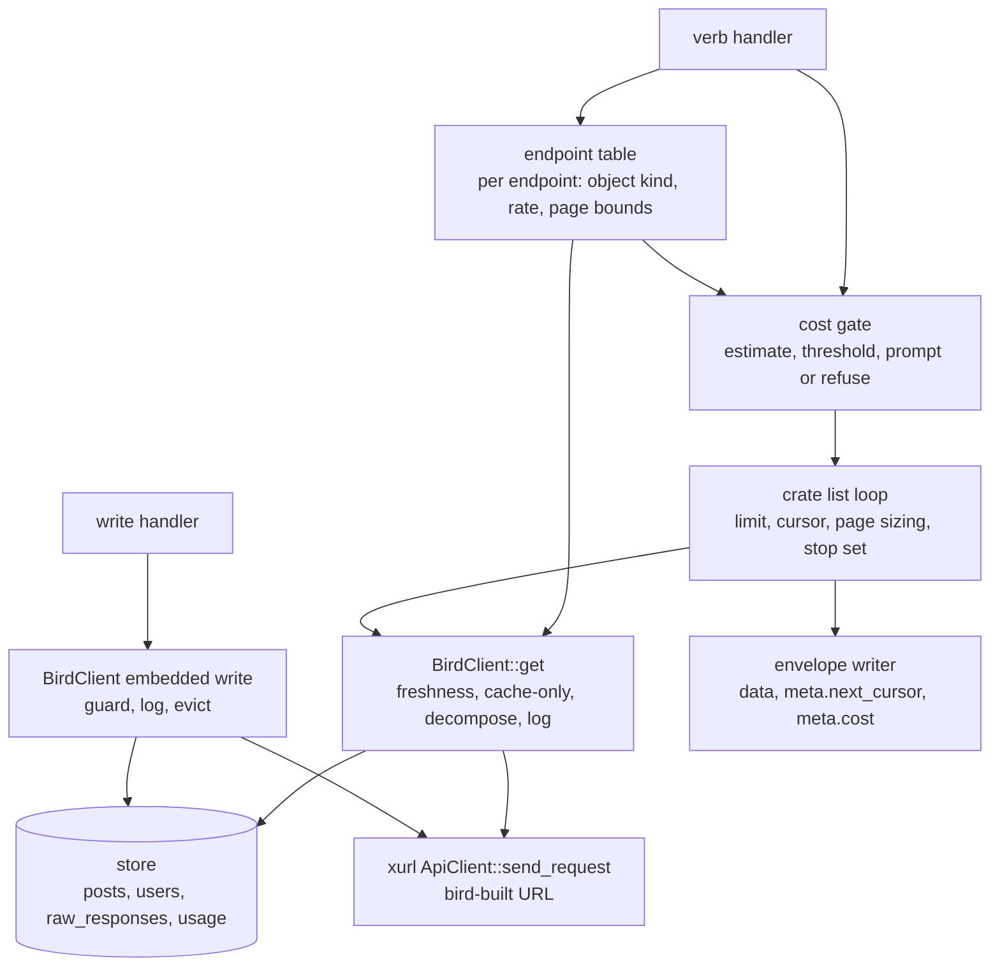

# xurl v3 Post-Vocabulary Cutover - Plan

## Goal Capsule

- **Objective:** A person or agent who knows `xr` can drive bird v1.0.0 with the same verbs and inputs and read the same
  field names back, every list call states what it will fetch and cost before it runs, and nothing bird emits or
  documents carries tweet-era wording.
- **Means:** Move bird to xurl-rs 3.0.0 from crates.io, rename every bird-owned identifier to X's post vocabulary with
  no alias window, map the remaining xurl shortcuts onto bird verbs under xr's names, route every read through bird's
  existing cache-and-cost client path on the crate's list loop, remove the raw HTTP verbs and `block`/`unblock`, and
  purge pre-cutover cache rows once (KD1, KD3, KD9, KTD1, KTD3).
- **Product authority:** This plan owns the crate bump, the vocabulary cutover, shortcut parity, the pagination and cost
  contract, and the store migration. The v1.0.0 release mechanics, CI and release-tooling parity, repo hygiene, and the
  bird-skill refresh are separate areas and not active scope here; see How This Work Fits Together.
- **Execution profile:** Eleven dependency-ordered units in four phases. Each unit lands with `cargo test` green and the
  pre-push hook passing. Live API calls are limited to the single-object smoke in the Verification Contract; the X API
  bills per object read.
- **Stop conditions:** Stop and report if xurl-rs 3.0.0 fails to build on any release target the pre-push Windows
  cross-clippy or the release matrix covers, if the live probe facts in Dependencies stop holding (X rejects
  `post.fields` or stops sending the 2.168 names), or if a unit would require changing a Product Contract requirement
  rather than implementing it.
- **Tail ownership:** The release branch, tag, crates.io publish, Homebrew dispatch, and bird-skill refresh belong to
  the areas named in How This Work Fits Together, not to this plan's units.

---

## Product Contract

### Summary

bird v1.0.0 embeds xurl-rs 3.0.0 and makes the hard cutover to X API 2.168's post vocabulary that xr already made. Every
bird-owned verb, output key, schema, store table, and doc drops tweet and Twitter wording. bird's verb set becomes a
one-to-one mapping of 27 of xr's 28 crate shortcuts under xr's names and inputs, with the raw HTTP escape hatch and the
spec-absent `block`/`unblock` verbs removed. Every read goes through bird's existing client path on the crate's list
loop
that states the spend before the first request.

### Problem Frame

bird pins a pre-v2.1.0 commit of xurl-rs under a `2.0.0` manifest line, and X has since moved its spec to 2.168, which
renames `Tweet` to `Post` across response bodies and query parameters. X answers in the vocabulary of the query
parameter it receives: a request sending `post.fields` gets `referenced_posts`, `public_metrics.repost_count`,
`includes.posts`, and `edit_history_post_ids`; a request sending `tweet.fields` still gets the legacy names. bird sends
`tweet.fields` and reads the legacy keys in its thread, search, watchlist, and cost paths, so it works today and stays
on the vocabulary X has retired from its spec. xurl-rs 3.0.0 switched to `post.fields` with no alias window and shipped
a migration guide for library consumers.

bird's verb set also drifted from xr's. bird calls the create verb `tweet`, the current-user lookup `me`, and the user
lookup `profile`, and it lacks `quote`, `read`, `timeline`, `mentions`, `likes`, `bookmark`, `unbookmark`, `following`,
`followers`, `delete`, and `usage credits`. It still exposes `block` and `unblock` against endpoints X's spec no longer
lists, and four raw HTTP verbs whose `post` name now collides with the create verb. Scripts and skills written for xr do
not transfer.

Pagination diverged the same week without either tool noticing. Both grew `--limit` and `--cursor` on 2026-06-02 and
06-03 to satisfy anc principle P7, but xr makes one request per invocation, so its `--limit` became X's per-page
`max_results` capped at 100, while bird already paged (`search --pages`, bookmarks looping to 100 per page), so its
`--limit` became a total cap with a 1000 ceiling. bird also aliased `--page` to `--cursor` because anc's cursor audit
accepts either name, which turns an agent's `--page 2` into a cursor token sent to X. `search` carries its own
`--max-results` and `--pages` on top, and xr carries `-n`/`--max-results` on all seven of its list verbs. Three flags
say "how many", and none of them state what a call costs.

The embedded-xurl cutover from June has never shipped; bird v0.2.0 still runs the subprocess transport. The next release
is therefore already a major, which makes this the one release where a vocabulary break costs nothing extra.

### Key Decisions

- KD1. **Full cutover to the post vocabulary, no alias window** (session-settled: user-directed — chosen over
  passthrough-only renames and over a translation layer that preserves tweet names: v1.0.0 makes the break free, and xr
  made the same cut). Governs R5, R6, R7, R8, R9.
- KD2. **Drop the raw HTTP escape hatch instead of namespacing it** (session-settled: user-directed — chosen over `bird
  raw ...` and `bird api ...`: xr is the raw tool; bird gives up cache and cost accounting on ad-hoc calls). Governs
  R12.
- KD3. **Map xr's crate shortcuts one-to-one under xr's verb names** (session-settled: user-directed — chosen over
  keeping `me` and `profile` and adding only the missing verbs: identical verbs let bird-skill describe bird as xr's
  verb set plus cache, thread, and watchlist). Governs R10, R11, R14.
- KD4. **Purge cached entities once, in the cutover migration** (session-settled: user-approved — chosen over rewriting
  stored JSON in place and over serving old rows until their daily refresh: no tweet-vocabulary JSON ever leaves v1.0.0,
  and UTC-day freshness bounds the refetch to same-day rows). Governs R21, R22.
- KD5. **Ride-alongs: add `usage credits` and `delete <id>`, drop `block` and `unblock`** (session-settled:
  user-approved — X's spec lists the credits and delete endpoints and no longer lists blocking; xr dropped its block
  shortcuts in v2.0.0). Governs R11, R12.
- KD6. **Defer `dms` to a fast-follow** (session-settled: user-directed — chosen over response-level caching now and
  over a DM-event store now: DM listing needs its own store design). Governs Scope Boundaries.
- KD7. **Depend on xurl-rs 3.0.0 from crates.io, not a git rev.** The shared release workflow runs `cargo publish`, and
  crates.io rejects git dependencies. Governs R1.
- KD8. **The release that carries this work is v1.0.0** (session-settled: user-directed — chosen over v0.3.0: it ships
  the embedded transport and the vocabulary break together). Release mechanics belong to a separate area; recorded here
  as context.
- KD9. **`--limit` means total items and bird pages automatically; `--pages` and `--max-results` go away; `--page` is
  rejected; a limit above the ceiling is rejected before any request** (session-settled: user-directed — chosen over
  xr's per-page `--limit` plus `--pages`, and over clamping to the ceiling with `meta.truncated`, after the provenance
  showed the two tools never shared a meaning: one number states what a call fetches and costs, and for 100 or fewer it
  behaves exactly like xr). Governs R17, R18.
- KD10. **Pass X's `tweet_count` through on user objects** (session-settled: user-approved — chosen over normalizing it
  to `post_count` on output: X still sends `tweet_count` under spec 2.168, so it is a wire string X keeps, not a
  bird-owned name). Governs R6, R8.
- KD11. **A failed page keeps what was fetched and hands back a resume cursor with X's reset time** (session-settled:
  user-approved — chosen over retrying once after the reset and over failing the whole call with no output: a retry
  never re-pays for pages already fetched, and the reset time tells the caller when). Governs R19.
- KD12. **Expensive list fetches confirm before the first request** (session-settled: user-approved — chosen over a
  `--dry-run`-only estimate and over leaving cost reporting after the fact: with `--limit` naming the spend, a
  ten-dollar command should not run on a single keypress; the guard is the one writes already use). Governs R20.
- KD13. **All mapped verbs take xr's inputs, not only the new ones** (session-settled: user-approved — chosen over
  keeping bird's bare-ID inputs on the existing verbs: the transfer promise holds for the whole verb set, and a script
  written for xr runs against bird with the binary name swapped, except for xr's `-n`/`--max-results` and `--after`,
  which fold into `--limit` and `--cursor`). Governs R11.

### Requirements

**Crate integration**

- R1. bird depends on `xurl-rs` from crates.io with no git source or rev pin: 3.0.0 carries the vocabulary cutover
  that U1 through U5 need, and the release carrying the pagination contract (3.2.0 or later) lands before U6, at
  which point bird's client-conformance document cites the contract and scope-policy versions it exposes.
- R2. bird builds and its full test suite passes against xurl-rs 3.0.0 with no compatibility shims over the renamed
  library types.
- R3. `bird doctor` reports the linked xurl crate version as 3.0.0, and no test asserts an older version string.
- R4. The changelog for this work records the inherited TLS change as changed behavior: certificate verification now
  uses the operating system trust store, and the crypto provider is aws-lc-rs.

**Vocabulary**

- R5. Requests bird builds itself send `post.fields`, and request `in_reply_to_user_id` and referenced posts through
  `expansions`, matching xurl's v3.0.0 migration guide.
- R6. bird reads the 2.168 names from post responses: `referenced_posts`, `public_metrics.repost_count`,
  `includes.posts`, and `edit_history_post_ids`. User objects keep X's `public_metrics.tweet_count`, which bird reads
  and emits unchanged per R8; nothing in bird reads that field by name.
- R7. Every bird-owned name drops tweet and Twitter wording: CLI verbs and help text, output keys and summary fields,
  the JSON schemas under `schema/`, store table, column, and index names, module and type names, `examples/`,
  `completions/`, README, AGENTS.md, the `RELEASES*.md` runbooks, the docs under `docs/`, and Cargo package metadata.
- R8. The wire strings X keeps are exempt from R7 and stay verbatim where bird speaks to X: the `/2/tweets` endpoint
  family, the `/2/users/{id}/retweets` and `/2/users/{id}/liked_tweets` paths, the `tweet_id`, `source_tweet_id`, and
  `in_reply_to_tweet_id` body and path keys, the `tweet.read` and `tweet.write` scopes, the `/2/usage/tweets` endpoint,
  the `tweet_image` media category, the `is:retweet` search operator, the `retweeted` result key and reference type, the
  `twitter.com` hosts accepted in post URLs, and `public_metrics.tweet_count` inside user objects.
- R9. A repository check fails when bird-owned text contains tweet or Twitter wording outside the R8 allowlist, so the
  cutover cannot regress silently. The same check covers the retired flags `--pages`, `--max-results`, `--max-pages`,
  and `--page` as an alias, and the subprocess-era terms named in R23.

**Verb surface**

- R10. `post <text>` creates a post, `whoami` returns the authenticated user, and `user <username>` looks up a user;
  these replace `tweet`, `me`, and `profile`.
- R11. bird adds `quote`, `read`, `timeline`, `mentions`, `likes`, `bookmark`, `unbookmark`, `following`, `followers`,
  `delete <id>`, and `usage credits`, each with the same meaning and inputs as xr's verb of the same name: `following`
  and `followers` take an optional `--of <username>` that defaults to the authenticated user, `likes` and `timeline`
  take no user and read the caller's own liked posts and home timeline, and every post-taking verb accepts a post ID or
  a post URL. The verbs bird already has (`post`, `reply`, `like`, `unlike`, `repost`, `unrepost`, `follow`, `unfollow`,
  `dm`, `mute`, `unmute`, `search`, `bookmarks`, `whoami`, `user`, `usage`) adopt xr's inputs too: `post` and `reply`
  take a repeatable `--media-id`, and positional order and flag names match xr verb for verb. xr's per-verb
  `-n`/`--max-results` and its `--after` synonym are not accepted: `--limit` and `--cursor` are bird's only pagination
  inputs. bird's `--pretty` stays available on read verbs as a bird extension that conflicts with nothing in xr.
- R12. bird removes the raw verbs `get`, `post <path>`, `put`, and `delete <path>`, and removes `block` and `unblock`.
  Removed verbs and renamed verbs fail with clap's ordinary unknown-subcommand error; there are no aliases, hidden or
  documented, and no deprecation shim.
- R13. Every write verb (`post`, `reply`, `quote`, `delete`, `like`, `unlike`, `repost`, `unrepost`, `bookmark`,
  `unbookmark`, `follow`, `unfollow`, `dm`, `mute`, `unmute`) carries the existing write guard: `--force` (alias
  `--yes`) and `--dry-run`, with confirmation required under a TTY and `--force` required under `--no-interactive`.
- R14. Every new read verb participates in bird's entity cache and cost accounting the same way existing reads do: post
  and user objects decompose into the store with UTC-day freshness, list responses cache at the response level for
  `--cache-only` replay, and cost estimates apply the existing per-object rates. Writes are recorded in `usage` like
  reads.
- R15. `thread` and `watchlist` keep their bird-only behavior under the new vocabulary.
- R16. `bird doctor`, `bird schema`, shell completions, and `examples/` reflect the final verb set with no entry for a
  removed verb, and every top-level verb carries an example block in its `--help`.
- R17. Every list verb (`search`, `bookmarks`, `timeline`, `mentions`, `likes`, `following`, `followers`) takes
  `--limit N` as the total number of unique items delivered (default 10) and `--cursor <token>` to resume. bird does not
  page: it calls the crate's list loop with a page source and a budget, and the crate sizes pages, threads cursors,
  deduplicates by id, and returns a stop. Page sizes sum to exactly `N`, so a run fetches and bills exactly what was
  asked for. The envelope carries the crate's `meta` core unchanged (`stop`, `next_cursor`, `previous_cursor`,
  `newest_id`, `oldest_id`, `returned`, `requests_made`, `objects_fetched`, `duplicates_dropped`, `rate_limit`,
  `errors`, `waits`, `complete`, `truncated`) plus bird's own `cost`, `checkpoint`, `cache`, and `hydration`.
  `truncated` is true exactly when `next_cursor` is present. One `[cost]` line per API call and a summed total after a
  multi-page run print on stderr unless suppressed by `--quiet` or JSON output. `--limit` bounds what is fetched and
  billed; client-side filters may shrink the output below it and never trigger extra fetching. `--pages` and
  `--max-results` are removed, and `--page <n>` is rejected before any request with the `unsupported-pagination` error.
  `thread --limit N` bounds the posts fetched across its conversation-search pages and replaces `--max-pages`.
  `watchlist fetch` (alias `check`) keeps its cap on watched users; its local position flag is `--offset`, and it
  rejects `--cursor`.
- R18. `--limit` below 1, or below the endpoint's floor (10 for search, 5 for mentions, likes, and a user's posts), is
  rejected at argument validation with a structured usage error naming the floor, before any request. There is no fixed
  item ceiling: the bounds above the default are the spend guard of R20 and the endpoint's depth cap, so
  `BIRD_LIMIT_MAX`
  does not exist. The default limit is configurable through the order every `BIRD_*` variable follows: flag, then
  bird-namespaced environment (`BIRD_LIMIT`), then config file, then built-in default.
- R19. When a page fails mid-run, the crate stops and bird emits the items already delivered inside a well-formed
  closing envelope with the crate's `stop` object, its `next_cursor` for the page that failed, and its rate-limit triple
  with `reset_at`, so a retry with `--cursor` never re-pays for earlier pages. Exit codes follow the contract's
  categories, not the failure kind: 0 for a natural stop, 75 when a bounded or failure stop still delivered at least one
  item, 80 for a bounded stop that delivered nothing, and the tool's own code for a failure stop that delivered nothing.
- R20. Before the first request of a list verb, bird prices the crate's plan with its own price table and refuses if the
  estimate exceeds the effective spend guard, sending nothing. The guard has two tiers: `spend.hard_cap_usd` in the
  config file (default $5.00), which no flag can raise, and `spend.max_spend_usd` (default $1.00), which `--max-spend`
  overrides up to the hard cap. The refusal is a structured usage error naming the estimate, the tier that fired, and
  the exact override, with its own id (`spend-guard-exceeded` or `spend-hard-cap-exceeded`); it never prompts, so there
  is no TTY path and no `--force` on a read. bird also refuses an expansion whose fan-out the registry does not bound,
  because the estimate would not be a ceiling. `--dry-run` prints the plan, the estimate, and the budget, and exits
  without a request. At or below the guard the call proceeds silently. The guard also covers `thread` and
  `watchlist fetch`.

**Store**

- R21. The first store open under v1.0.0 runs one migration that renames tweet-named tables, columns, and indexes to the
  post vocabulary, rewrites stored `usage.object_type` values from `tweet` to `post`, and drops pre-cutover post, user,
  and response rows. Usage history and bookmark positions are kept; the watchlist lives in the config file and the
  migration does not touch it. The migration runs once and is recorded so a second open does nothing; a failed migration
  is reported by `bird doctor`.
- R22. After R21, no output path serves tweet-vocabulary JSON from a cached row.

**Docs**

- R23. README, AGENTS.md, the docs under `docs/`, and command help text describe the embedded transport and the final
  verb set. No subprocess-era wording remains: no runtime delegation to `xr` or `xurl`, no `BIRD_XURL_PATH`, and no
  reference to the `xdevplatform/xurl` project. The exit-code table lists the codes bird inherits from xurl (3
  rate-limited, 4 not-found, 5 network) alongside its own 1, 2, 77, and 78, and states that 77 covers HTTP 401 only.

**Configuration**

- R24. `BIRD_USERNAME` selects the account at the bird-namespaced environment slot (flag, then `BIRD_USERNAME`, then
  config file). `X_API_USERNAME` keeps its current place as the lowest fallback below the config file, so every existing
  setup resolves the same username it does today.

**Verb mapping**

| xurl shortcut                     | bird v1.0.0 verb                                                  | Today                                           |
| --------------------------------- | ----------------------------------------------------------------- | ----------------------------------------------- |
| `create_post`                     | `post <text> [--media-id ...]`                                    | `tweet`                                         |
| `reply_to_post`                   | `reply <id-or-url> <text> [--media-id ...]`                       | `reply`                                         |
| `quote_post`                      | `quote <id-or-url> <text>`                                        | absent                                          |
| `delete_post`                     | `delete <id-or-url>`                                              | `delete <path>` was a raw verb                  |
| `read_post`                       | `read <id-or-url>`                                                | absent                                          |
| `search_posts`                    | `search <query>`                                                  | `search`                                        |
| `get_me`                          | `whoami`                                                          | `me`                                            |
| `lookup_user`                     | `user <username>`                                                 | `profile`                                       |
| `get_timeline`                    | `timeline` (caller's home timeline)                               | absent                                          |
| `get_mentions`                    | `mentions` (caller's mentions)                                    | absent                                          |
| `like_post` / `unlike_post`       | `like` / `unlike <id-or-url>`                                     | same                                            |
| `repost` / `unrepost`             | `repost` / `unrepost <id-or-url>`                                 | same                                            |
| `bookmark` / `unbookmark`         | `bookmark` / `unbookmark <id-or-url>`                             | absent                                          |
| `get_bookmarks`                   | `bookmarks`                                                       | `bookmarks`                                     |
| `follow_user` / `unfollow_user`   | `follow` / `unfollow <username>`                                  | same                                            |
| `get_following` / `get_followers` | `following` / `followers [--of <username>]` (default: the caller) | absent                                          |
| `get_liked_posts`                 | `likes` (caller's liked posts)                                    | absent                                          |
| `send_dm`                         | `dm <username> <text>`                                            | `dm`                                            |
| `get_dm_events`                   | deferred (fast-follow)                                            | absent                                          |
| `mute_user` / `unmute_user`       | `mute` / `unmute <username>`                                      | same                                            |
| `get_usage`                       | `usage`                                                           | `usage`                                         |
| `get_usage_credits`               | `usage credits`                                                   | absent                                          |
| none (spec-absent)                | removed                                                           | `block` / `unblock`                             |
| none (generic request)            | removed                                                           | `get` / `post <path>` / `put` / `delete <path>` |

**Vocabulary mapping (bird-owned names)**

| 2.x name                    | v1.0.0 name             | Where                                         |
| --------------------------- | ----------------------- | --------------------------------------------- |
| `tweet.fields`              | `post.fields`           | queries bird builds                           |
| `referenced_tweets`         | `referenced_posts`      | readers, `schema/thread.schema.json`          |
| `retweet_count`             | `repost_count`          | watchlist activity                            |
| `includes.tweets`           | `includes.posts`        | cost estimation                               |
| `tweet_count` (bird-owned)  | `post_count`            | thread summary, usage output, store column    |
| `tweet_count` (user object) | unchanged, X's name     | profile schema passthrough, per R8            |
| `edit_history_tweet_ids`    | `edit_history_post_ids` | post objects under `post.fields`              |
| `tweets` (array key, table) | `posts`                 | search, thread, bookmarks output; store table |
| `bookmarks.tweet_id`        | `bookmarks.post_id`     | store column                                  |
| `usage.object_type = tweet` | `post`                  | stored usage rows                             |
| `Tweets:` (cache stats)     | `Posts:`                | `cache stats` output                          |
| `twitter` (Cargo keyword)   | removed                 | package metadata                              |

### Key Flows

- F1. Upgrade to v1.0.0
  - **Trigger:** A user with an existing store runs any command that opens it.
  - **Steps:** The store detects the pre-cutover schema; the R21 migration renames tables, columns, and indexes,
    rewrites usage object types, and drops post, user, and response rows; the command proceeds and fetches what it
    needs.
  - **Outcome:** The store carries only post-vocabulary rows. Same-day reads that were cached before the upgrade are
    refetched once.
  - **Covered by:** R21, R22.
- F2. A removed or renamed verb is invoked
  - **Trigger:** A script runs `bird tweet`, `bird me`, `bird profile`, `bird get`, `bird block`, or `bird delete
    /2/...`.
  - **Steps:** clap rejects the unknown subcommand, or bird rejects the path argument where `delete` now expects a post
    ID or URL.
  - **Outcome:** A non-zero exit with a usage error and no API call.
  - **Covered by:** R12.
- F3. A new read verb
  - **Trigger:** `bird timeline`, `bird mentions`, `bird likes`, `bird following --of <username>`, `bird followers --of
    <username>`, or `bird read <id-or-url>`.
  - **Steps:** bird resolves the caller or target user from the store when fresh, estimates the spend and applies the
    R20 gate, then checks the response cache and entity store for freshness; on a miss it fetches through the paging
    engine; post and user objects decompose into the store; the cost estimate reports objects and rate.
  - **Outcome:** Post-vocabulary JSON on stdout with `meta.cost`, cost lines on stderr in text mode, cache
    populated.
  - **Covered by:** R6, R11, R14, R17, R20.

### Acceptance Examples

- AE1. First open after upgrade
  - **Covers R21, R22.**
  - **Given** a store written by v0.2.0 holding a post row whose JSON contains `referenced_tweets`.
  - **When** `bird whoami` runs under v1.0.0.
  - **Then** the migration runs once, the old post row is gone, and a later `bird read 1585341984679469056` returns JSON
    with `referenced_posts`.
- AE2. Removed verb
  - **Covers R12.**
  - **Given** v1.0.0.
  - **When** `bird tweet "hello"` runs.
  - **Then** clap reports an unknown subcommand, exit status is 2, and no request is sent.
- AE3. Delete under a non-interactive run
  - **Covers R11, R13.**
  - **Given** `--no-interactive` and no `--force`.
  - **When** `bird delete 1585341984679469056` runs.
  - **Then** bird refuses with the write guard's `requires-confirmation` error, exit 2, and sends nothing.
- AE4. Delete given a path
  - **Covers R11, R12.**
  - **Given** v1.0.0.
  - **When** `bird delete /2/tweets/1585341984679469056` runs.
  - **Then** the argument is rejected as neither a post ID nor a post URL, exit status is 2, and no request is sent.
- AE5. Credits balance
  - **Covers R11.**
  - **Given** valid credentials.
  - **When** `bird usage credits --output json` runs.
  - **Then** stdout carries the free, prepaid, and total balances from the credits endpoint, and bare `bird usage`
    output is unchanged in shape apart from R7 renames.
- AE6. Legacy wording guard
  - **Covers R7, R8, R9.**
  - **Given** a change that adds `tweet_count` to a bird-owned summary key, not to a passed-through user object.
  - **When** the repository check runs.
  - **Then** it fails naming the file and line, while an unchanged `/2/usage/tweets` endpoint string passes.
- AE7. Limit above one page
  - **Covers R17.**
  - **Given** `bird followers --of elonmusk --limit 250 --output json`.
  - **When** X has more than 250 followers for that account.
  - **Then** bird makes three requests with page sizes 100, 100, and 50, emits 250 users, and includes
    `meta.next_cursor`, `meta.truncated: true`, and `meta.cost.estimate_max_usd` of 2.50; the same run in text mode
    prints one
    `[cost]` lines and a total on stderr.
- AE8. Results run out early
  - **Covers R17.**
  - **Given** `bird likes --limit 250` and the caller has 130 liked posts.
  - **When** the second page returns 30 items and no `next_token`.
  - **Then** bird emits 130 posts, makes no third request, and omits `meta.next_cursor`.
- AE9. Offset pagination requested
  - **Covers R17.**
  - **Given** `bird timeline --page 2`.
  - **When** the command runs.
  - **Then** bird exits 2 before any request with the `unsupported-pagination` usage error on stderr, whose message
    names `--cursor` and `meta.next_cursor`.
- AE10. Limit above the ceiling
  - **Covers R18.**
  - **Given** the default ceiling of 1000 and `bird search "rust" --limit 1500`.
  - **When** the command runs.
  - **Then** bird exits 2 with a structured usage error naming the endpoint's floor, and no request is sent. There is
    no item ceiling to name: the spend guard of R20 and the endpoint's depth cap are the bounds.
- AE11. Failure mid-run
  - **Covers R19.**
  - **Given** `bird followers --of elonmusk --limit 500 --output json` and X rate-limits the third page.
  - **When** the failure arrives.
  - **Then** bird has emitted 200 users inside a well-formed closing envelope, the stderr error envelope carries
    `meta.next_cursor` for the third page, `meta.fetched` 200, `meta.requested` 500, and `meta.retry_at` (`null` until
    upstream supplies it), and the exit status is 3.
- AE12. Cost gate
  - **Covers R20.**
  - **Given** the default $2.00 threshold and `bird followers --of elonmusk --limit 1000 --no-interactive`.
  - **When** the command runs without `--force`.
  - **Then** bird exits 81 with the `spend-guard-exceeded` error whose `meta` names the $10.00 estimate, the $1.00
    threshold, and `--force`, sends nothing, and exits non-zero; the same command with `--force` runs, and with `--limit
    50` it runs without asking.
- AE13. Thread bounded by posts
  - **Covers R17.**
  - **Given** `bird thread 1585341984679469056 --limit 150` on a conversation of 400 posts.
  - **When** the command runs.
  - **Then** bird fetches two pages (100 and 50), reports `complete: false` with the posts it has, and prints two
    `[cost]` lines in text mode.

### Success Criteria

- The R9 check passes on the cutover with zero hits outside the allowlist.
- `cargo build` and `cargo test` pass against xurl-rs 3.0.0 from crates.io.
- `anc audit` on the project directory scores at least the current 99 with no new failing row.
- A live smoke of `whoami`, `read 1585341984679469056`, and `usage credits` returns post-vocabulary JSON and the credits
  balances.
- The verb mapping table above has no row left at "absent" except `get_dm_events`.

### Scope Boundaries

Deferred for later:

- `dms` (DM event listing) and any DM-event store, as a fast-follow with its own design.
- `media upload` and xr's tooling verbs `auth`, `validate`, `examples`, and `version`.
- xr's `csv`, `tsv`, and `yaml` output formats; bird keeps `text`, `json`, `jsonl`, and `ndjson`.
- Revising the USD cost estimator for credits-based billing.
- An async bird; xurl-rs 3.0.0 keeps a blocking client, so nothing gates on it.
- Adopting xurl's `EnvOverrides`, `new_with_no_color`, and skill-install `home` parameter internally; planning may pick
  these up where they simplify the work, but they are not product requirements.

Outside this plan (owned by other areas):

- Cutting and publishing v1.0.0, the Homebrew formula caveats, the site scorecard, and the dev-branch version sync.
- CI, ruleset, and release-tooling parity with xurl-rs and the fleet.
- Repo hygiene files (`CLAUDE.md`, `CONTRIBUTING.md`, `CONCEPTS.md`, `.anc.toml`) and the two open anc source-layer
  findings.
- The bird-skill repository refresh.

#### Deferred to Follow-Up Work

- Per-endpoint page size above 100 for `following` and `followers`, which X allows up to 1000 per page; fewer requests
  for the same spend, revisit once the crate's list loop has shipped.
- Removing the unused typed shortcut methods from the `XurlClient` seam, or replacing the seam with a thinner adapter;
  KTD1 leaves them in place.
- Accepting xr's per-verb `-n`/`--max-results` as an alias of `--limit`, and its `--after` synonym for `--cursor`.
- xurl-rs exposing per-endpoint `max_results` bounds from its vendored spec so bird's endpoint table consumes them
  instead of hardcoding them.
- xurl-rs carrying the transport error kind on its error type so bird stops classifying network failures by message.
- Upstream xurl-rs issues: `UserPublicMetrics.post_count` never populates on live responses, and rate-limit reset
  headers are not surfaced on API errors (see Dependencies).
- A solutions entry documenting the subprocess-to-embedded transport transition; the existing entry describes the
  retired subprocess design.

### Dependencies / Assumptions

- xurl-rs 3.0.0 is published on crates.io and exposes `delete_post`, `get_usage_credits`, and the renamed post types.
- Observed against the live API on 2026-09-02: a post read sending `post.fields` with `expansions=referenced_posts.id`
  returns `referenced_posts`, `public_metrics.repost_count`, `includes.posts`, and `edit_history_post_ids`; the same
  read sending `tweet.fields` is honored and returns `retweet_count` and `edit_history_tweet_ids`; a user read with
  `user.fields=public_metrics` returns `tweet_count` and no `post_count`.
- Observed upstream defect: xurl-rs 3.0.0's typed `UserPublicMetrics.post_count` never populates on a live response
  because X sends `tweet_count`; the value lands in the struct's `extra` bucket. bird reads user JSON directly, so
  nothing here gates on the fix, but xurl-rs deserves an issue.
- Upstream dependency for R19's reset time: xurl-rs 3.0.0's `XurlError::Api` carries only `status` and `body`, and
  `send_request` returns the body alone, so X's `x-rate-limit-reset` header never reaches bird. xurl-rs needs to surface
  rate-limit headers on API errors (or on responses) before bird can fill `retry_at`; until then it is `null`.
- Before the v1.0.0 tag: the changelog Breaking group and blocking advisories from the CI-parity area are required; the
  pre-tag release-matrix check is recommended because the bump pulls in aws-lc-sys, which compiles C per release target.
- Assumption: bird's fixed per-object cost rates ($0.005 per post, $0.010 per user) remain a usable estimate while X
  exposes credits balances.
- Assumption: xurl-rs 3.0.0's `ApiClient` stays blocking and `Send + Sync`, so bird's client seam keeps its shape.
- Assumption: anc's released auditor (0.5.0) reads only help output and bare invocations, so the paging and cost-gate
  behavior is verified by bird's own tests, not by the audit; the audit guards the verb list and help text.

<!-- ce-section: work-relationships -->
### How This Work Fits Together

This plan owns the crate bump, the vocabulary cutover, shortcut parity, the pagination and cost contract, and the store
migration. The breakdown below is the current understanding from the catch-up triage, not a committed roadmap; a later
plan may revise, split, merge, or discard any of it.

- Release v1.0.0 and external truth-sync (Homebrew caveats, site scorecard, dev-branch version sync)
  - Depends on this plan.
  - Still to decide: nothing; v1.0.0 is settled.
- CI, ruleset, and release-tooling parity
  - Can proceed independently of this plan, straight from `docs/research/2026-09-02-catch-up-triage.md`.
  - Enables the v1.0.0 tag: the changelog Breaking group and blocking advisories are required first; the release-matrix
    check is recommended first.
- Repo hygiene and anc findings
  - Can proceed independently of this plan.
  - Shares the final verb list with this plan for `.anc.toml` domain verbs.
- bird-skill refresh
  - Depends on this plan's verb set, inputs, vocabulary, and the `spend-guard-exceeded` recovery; lands before the
    release.
- `dms` and a DM-event store
  - Depends on this plan; fast-follow.

### Sources / Research

- Pagination provenance: bird PR #46 (2026-06-02) and `docs/plans/2026-06-02-001-feat-anc-100-percent-push-plan.md` for
  bird's total-cap `--limit` and the `--page` alias; xurl-rs PRs #39 (2026-06-02) and #46 (2026-06-03) for xr's per-page
  `--limit`, `--cursor`, and the `unsupported-pagination` rejection; agentnative-spec
  `principles/p7-bounded-high-signal-responses.md` for the audits both were satisfying. `src/bookmarks.rs` is the
  existing auto-paging loop the contract generalizes, including the last-page over-fetch R17 corrects.
- `docs/research/2026-09-02-catch-up-triage.md`: the full population of changes across owned repos since 2026-06-06.
- xurl-rs `docs/migrating/v3.0.0.md` at tag v3.0.0: the rename table, request-side changes, and the wire strings X
  keeps. xurl-rs `src/cli/mod.rs` at v3.0.0 for the exact inputs of `followers`/`following` (`--of`), `likes`,
  `timeline`, `--page`, and `--cursor`.
- `docs/plans/2026-06-05-001-refactor-embed-xurl-crate-plan.md` and
  `docs/brainstorms/2026-06-05-embed-xurl-crate-requirements.md`: the embedded-transport cutover this release ships,
  including the `XurlClient` seam and the deferred follow-ups this plan closes.
- `src/fields.rs`, `src/search.rs`, `src/thread.rs`, `src/watchlist/check.rs`, `src/cost.rs`: the request builder and
  readers on the old vocabulary.
- `src/xurl_client/mod.rs`, `src/xurl_client/mock.rs`, `src/db/client/embedded.rs`: the only files that name the renamed
  xurl types, and the seam whose typed methods product code does not call.
- `src/cli/mod.rs`, `src/cli/dispatch.rs`, `src/cli/commands/writes/{mod,spec}.rs`, `src/raw.rs`, `src/doctor.rs`: the
  verb surface, the write guard, the raw escape hatch, and the per-verb lists that must stay in step.
- `src/db/client/get.rs`, `src/db/client/entity.rs`, `src/db/store/mod.rs`, `src/db/store/tweets.rs`: the entity-aware
  client path, the endpoint classification heuristic this plan replaces, the store schema, its three migrations, and
  UTC-day freshness.
- `src/error/mod.rs`, `src/output.rs`, `schema/error-envelope.schema.json`, `tests/envelope_consistency.rs`,
  `tests/schema_parity.rs`: the envelope contract the new error fields extend.
- `docs/solutions/conventions/renaming-an-overloaded-domain-noun.md`,
  `docs/solutions/best-practices/migration-script-over-legacy-fallback.md`,
  `docs/solutions/best-practices/prove-a-freshly-authored-guards-tests-are-non-vacuous-by-temporarily-degrading-the-guard.md`,
  `docs/solutions/best-practices/consistent-json-schema-across-success-and-error-paths-2026-04-20.md`,
  `docs/solutions/architecture-patterns/xurl-subprocess-transport-layer.md` (its refactoring checklist; its transport
  design is retired), `docs/solutions/workflow-issues/anc-pager-substring-false-positive-2026-06-02.md`.

---

## Planning Contract

**Product Contract preservation:** changed, with each change accepted in the planning synthesis: R11 states xr's actual
inputs (`--of` on `following`/`followers`, no user on `likes`/`timeline`) and keeps `--pretty`; R14 adds write usage
logging; R17 states cost-line suppression under `--quiet` and JSON output, in-band `meta.cost`, `meta.truncated`,
the summed total, and `watchlist fetch` as the visible name; R18 rejects `--limit` below 1 and config parsing becomes
fail-fast, a behavior change for every command that loads config; R19 fixes the exit codes and the error-envelope `meta`
fields; R20 adds the two spend tiers and the `spend-guard-exceeded` id; R21 adds index renames, `usage.object_type`
rewrite, and doctor reporting; R7 adds `RELEASES*.md` and index names; R8 adds wire strings found in code; R9 covers
retired flags and subprocess-era terms; R23 states the 401-only scope of exit 77. R24 added for `BIRD_USERNAME` as a
non-breaking addition accepted in review. AE2, AE3, AE4, AE7, AE9, AE10, AE11, AE12 tightened to bird's exit codes and
xr's inputs; every example that needs a handle or a post id uses `elonmusk` and post `1585341984679469056`. Outstanding
Questions were resolved in place and the section removed. No requirement was dropped and no scope was narrowed.

### Key Technical Decisions

- KTD1. **New reads use bird-built URLs through `BirdClient::get`; the `XurlClient` seam does not grow.** Product code
  calls none of the seam's 17 typed shortcuts today; every request is `send_request` with a bird-built URL, and only
  that path has freshness checks, entity decomposition, response storage, and cost logging. xurl's shortcut field sets
  are also narrower than `src/fields.rs`. Writes without a read path (`quote`, `delete`, `bookmark`, `unbookmark`)
  follow the existing raw-URL arm style in `src/db/client/embedded.rs`; `usage credits` is a bird-built GET. Governs
  R11, R14.
- KTD2. **The endpoint table is the crate's registry, imported.** bird carries no table of API facts: object kind per
  endpoint, per-object rate keying, entity decomposition, page-size bounds, depth caps, and expansion fan-out all come
  from `xurl_rs`'s registry by import. This replaces `is_entity_endpoint` in `src/db/client/entity.rs` and the
  `contains("/users/")` rate heuristic in `src/cost.rs` with registry lookups. The scope policy forbids a client copy,
  and bird's conformance tests prove there is none. Governs R14, R17, R20.
- KTD3. **bird has no paging engine; it supplies page sources to the crate's loop** (supersedes the extracted-loop
  decision: the crate now owns page sizing, cursor threading, the empty-page guard, id de-duplication, the below-floor
  stop, and the stop set, so a bird engine would be a fork of it). bird provides two page sources: one wrapping the
  crate's HTTP source to write entities and the query cache per page, and one that never fetches for `--cache-only`.
  bird owns streaming in `json` mode with a guaranteed closing envelope, the exit-code mapping of R19, and nothing else
  about paging. Consumers that post-process across pages (`search --sort`, `thread`) emit their processed partial result
  set with the crate's `next_cursor` before the error envelope. Governs R17, R19.
- KTD4. **A query cache of ordered ids replaces the per-URL page cache.** For each list request identity (endpoint,
  subject, query, filters, `exclude`, `sort_order`, expansions, fields, and never `limit`, page size, or cursor) bird
  stores the ordered ids observed, each id's observation time, and the cursor at which observation stopped. A run that
  starts at the head replaces the stored order for a stable list and merges by id for a time-ordered one; a run from the
  stored end cursor appends. `--cache-only` serves the stored ids in order up to `limit` with entities from the entity
  cache, reports `cache.observed_from` and `cache.observed_to`, and stops with `cache_miss` and the stored end cursor
  when the list runs out. An online run always fetches: X deduplicates billing per resource within a UTC day, so a
  served-from-cache page would save rate limit, not money, and the freshness rules it would need are not evidenced. The
  caller's id (`/2/users/me`) is still served from the users table by the configured username when fresh. Per page, the
  entity upserts, the query-cache update, and any checkpoint change commit in one transaction. Governs R14.
- KTD5. **Cost gate mechanism** (supersedes the threshold-and-prompt design: a prompt cannot run without a TTY, and the
  `--force` bypass it needed is the anc P5 conflict that decision recorded). The estimate is the crate's
  `objects_max` by kind priced with bird's own table, which carries the pricing page's `content_sha256` so a re-vendor
  that changes the page fails a test until the table is reviewed. Owned-read pricing applies only when the config
  asserts the authenticated user owns the developer app, the endpoint is on the owned-read list, and the subject is that
  user. `--hydrate authors` adds one user per post plus the crate's lookup requests; bird never sends
  `expansions=author_id` on a list request, because `author_id` is a free post field and a cached author costs nothing,
  and it refuses `--expand author_id` on a post list with a message naming `--hydrate`. bird derives the loop's budget
  by scaling the crate's plan by `max_spend / estimate`, so short pages fill toward `limit` while spend stays capped.
  Refusal is structured and silent per R20. Governs R20.
- KTD6. **Config knobs enter through `EnvOverrides` and `FileConfig`, never ad-hoc env reads.** `BIRD_LIMIT`,
  `BIRD_MAX_SPEND`, and `BIRD_SPEND_HARD_CAP` join `BIRD_NO_CACHE` in `EnvOverrides`, gain `FileConfig` keys, resolve in
  `load_with_paths` with flag > env > file > default, and the flag layers in the runner where `ListFlags` is built.
  Config parsing becomes fail-fast: today `toml::from_str(..).unwrap_or_default()` drops the whole file, including the
  watchlist, on any typo. `BIRD_USERNAME` joins the bird-namespaced slot and `X_API_USERNAME` stays the lowest fallback,
  and the config module documents the one rule: flag, then `BIRD_*` environment, then config file, then foreign
  environment fallback, then default. Governs R18, R20. Also governs R24.
- KTD7. **Migration M4 is one `rusqlite_migration` step; `user_version` makes it one-shot** (session-settled:
  user-approved via KD4). The step renames `tweets` to `posts`, `bookmarks.tweet_id` to `post_id`,
  `usage_actual.tweet_count` to `post_count` (column order preserved for the `cache.db` copy path), drops and recreates
  the `idx_tweets_*` and `idx_bookmarks_tweet_id` indexes under post names, deletes all rows from `posts`, `users`, and
  `raw_responses`, and rewrites `usage.object_type`. No `migrations_meta` sentinel is needed. M1–M3 text is immutable
  and keeps the tweet-named DDL; M4 must name those identifiers to rename them. `BirdDb::open` failure keeps degrading
  to API-only with a warning, and `bird doctor` reports the store's migration state. M4 is one-way: a pre-v1.0.0 binary
  opening a migrated store fails its migration check and runs API-only, and `doctor` names the store's schema version so
  that state is legible. Governs R21, R22.
- KTD8. **Error envelope grows a structured `meta`; pre-request rejections are usage errors.** `BirdError` gains a
  `meta` map rendered by `print_error` under the existing `meta` key, never as new top-level keys.
  `schema/error-envelope.schema.json` extends its `exit_code` enum with 3, 4, and 5 and declares the `meta` fields
  (`next_cursor`, `fetched`, `requested`, `retry_at`, `estimated_usd`, `threshold_usd`, `limit`, `per_object_usd`,
  `object_kind`, `remedy_flag`). `--page` becomes a dedicated hidden argument that conflicts with `--cursor` and is
  rejected in the runner before dispatch with id `unsupported-pagination`, kind `usage`, exit 2; the alias on `--cursor`
  is deleted. `--after` is not added. Governs R17, R18, R19, R20.
- KTD9. **Runtime output is the truth for schemas; new list verbs share per-shape schemas.** The committed `search`,
  `thread`, and `bookmarks` schemas already disagree with what those commands emit. Schemas are regenerated from runtime
  shape under the new vocabulary, the new verbs map to shared `posts` and `users` list schemas plus `usage-credits`,
  `bird schema <verb>` keeps a per-command mapping, and a test validates each list verb's JSON output against its
  schema. Governs R7, R16.
- KTD10. **Paging and failure tests are unit tests in `src/**` over `MockXurlClient`; envelope and exit-code tests are
  `assert_cmd` smoke tests; the migration has an on-disk fixture test.** The mock is `#[cfg(test)]` inside the library,
  so multi-page acceptance examples cannot live in `tests/`. Governs Verification Contract.
- KTD11. **The legacy-wording guard clones `guard-r20.yml` and the pre-push R20 step.** One allowlist file holds the R8
  wire strings and the generated or historical paths excluded from the scan (`completions/`, `CHANGELOG.md`,
  `docs/plans/`, `docs/brainstorms/`, `docs/research/`, `docs/solutions/`, the issue-template line naming X's own "X
  (Twitter) Developer Platform"). It also exempts the migration SQL region of `src/db/store/mod.rs` (the M1–M3 bodies
  and M4's rename statements) and the U3 fixture builder, because the migration library replays earlier migrations
  verbatim and their tweet-named DDL is immutable. The check runs in pre-push and CI, covers the R9 term set, and is
  proven red first with a planted violation before it is enabled. Governs R9, R23.
- KTD12. **Verb lists derive from `Cli::command()`.** The smoke test's subcommand walk, `doctor`'s command names, and
  the schema list stop being hardcoded so a renamed or new verb cannot be silently skipped. Governs R16.
- KTD13. **Post-write cache consistency.** `delete` evicts the post row on success and no write inserts a post row;
  `bookmark` and `unbookmark` do not touch position rows; the `bookmarks` list upserts positions only for a run that
  starts from the first page, and a cursor-resumed or `--cache-only` run leaves positions untouched. Governs R14, R21.
- KTD14. **Embedded writes are logged to `usage`.** The removed raw verbs were the only writes that reached
  `log_api_call`; the write path gains the same call so `bird usage` stays truthful. Governs R14.
- KTD15. **`thread` takes the global default** (session-settled: user-approved — chosen over a thread-specific default
  near the old ten pages: one default across the CLI, and the changelog names the change). Governs R17.
- KTD16. **Help text is written for the anc auditor as well as for people.** No `less`, `more`, or `pager` substrings
  anywhere in `--help` or `examples/top-level.txt`; every top-level verb has an `after_help` example; `search` and
  `delete` keep those exact names because they are the sole gates for the pagination, read-versus-write, and force-flag
  audits; `--limit` and `--cursor` stay global so they appear in top-level help. Governs R16, R23.

### High-Level Technical Design

Request path after the cutover. Every verb reaches X through the same client; only the entry differs.



Crate list-loop lifecycle for one list call, as bird sees it.

```mermaid
flowchart TB
  A[parse flags] --> B{limit in 1..=ceiling?}
  B -- no --> U1[usage error: ceiling]
  B -- yes --> D{--page given?}
  D -- yes --> U2[usage error: unsupported-pagination]
  D -- no --> R[resolve caller or target id<br/>store first]
  R --> T{estimate > threshold?}
  T -- yes, TTY --> Q[prompt]
  T -- estimate over the guard --> U3[usage error: spend-guard-exceeded]
  T -- no or confirmed --> L[fetch page min(remaining,100)]
  L --> H{ok?}
  H -- error --> F[close envelope, meta.next_cursor + retry_at, exit 3/5/1]
  H -- ok --> M{data empty or no next_token or remaining 0?}
  M -- no --> L
  M -- yes --> Z[close envelope, meta.truncated if more, meta.cost]
```

### Sequencing

Four phases; each unit lands with `cargo test` green and the pre-push hook passing.

1. **Crate** (U1): bump and compile-break renames; no behavior change because bird still sends `tweet.fields` and X
   honors it.
2. **Vocabulary and store** (U2, U3, U4): wire cutover of requests and readers with their fixtures in one unit; the
   store migration and its keys in one unit; the bird-owned rename sweep with the guard authored and proven red but not
   yet enabled.
3. **Verbs and paging** (U5, U6, U7, U8, U9, U10): the verb surface first because the create-verb rename and raw-verb
   removal collide on the `post` name; then the crate list contract, the spend guard, the new reads, the new writes, and
   the
   bird-only commands onto the contract.
4. **Docs** (U11): README, AGENTS.md, runbooks, help text, the changelog entry, and the guard turned on last.

The Windows cross-clippy step of the pre-push hook must pass locally before U1 opens, because aws-lc-sys compiles C per
target and that is the bump's real build risk.

---

## Implementation Units

| U-ID | Title                                      | Key files                                                                                                                      | Depends on      |
| ---- | ------------------------------------------ | ------------------------------------------------------------------------------------------------------------------------------ | --------------- |
| ---- | ------------------------------------------ | ------------------------------------------------------------------------------------------------------------------------------ | --------------- |
| U2   | Wire vocabulary cutover                    | `src/fields.rs`, `src/search.rs`, `src/thread.rs`, `src/watchlist/check.rs`, `src/cost.rs`, `schema/thread.schema.json`        | U1              |
| U3   | Store migration M4                         | `src/db/store/{mod,tweets,entities,bookmarks,maintenance}.rs`, `src/db/usage.rs`, `src/doctor.rs`, `schema/doctor.schema.json` | U2              |
| U4   | Bird-owned rename sweep and wording guard  | `src/**`, `schema/*.json`, `examples/*.txt`, `scripts/hooks/pre-push`, `.github/workflows/`, allowlist file                    | U3              |
| U5   | Verb surface cutover                       | `src/cli/{mod,dispatch}.rs`, `src/cli/commands/**`, `src/raw.rs`, `src/doctor.rs`, `examples/`, `tests/cli_smoke.rs`           | U4              |
| U6   | Adopt the crate list contract              | new `src/list.rs`, `src/bookmarks.rs`, `src/search.rs`, `src/db/client/{get,entity}.rs`, `src/error/mod.rs`, `src/output.rs`   | U5              |
| U7   | Cost gate and config knobs                 | `src/cost.rs`, `src/config.rs`, `src/cli/runner.rs`, `src/cli/dispatch.rs`, `src/doctor.rs`                                    | U6              |
| U8   | New read verbs                             | `src/cli/commands/reads.rs`, `src/paging.rs`, `schema/posts.schema.json`, `schema/users.schema.json`, `examples/`              | U6, U7          |
| U9   | New write verbs and usage credits          | `src/cli/commands/writes/{mod,spec}.rs`, `src/db/client/embedded.rs`, `src/usage/`, `schema/usage-credits.schema.json`         | U5              |
| U10  | `thread` and `watchlist` onto the contract | `src/thread.rs`, `src/watchlist/{mod,check}.rs`, `src/cli/commands/watchlist.rs`                                               | U6, U7          |
| U11  | Docs, help text, and changelog             | `README.md`, `AGENTS.md`, `docs/*.md`, `RELEASES*.md`, `src/cli/mod.rs`, `examples/top-level.txt`                              | U5, U8, U9, U10 |

### U1. Crate bump to xurl-rs 3.0.0

- **Goal:** bird builds and tests against xurl-rs 3.0.0 from crates.io with the renamed library types and no behavior
  change.
- **Requirements:** R1, R2, R3, R4. Cites KD7.
- **Dependencies:** none.
- **Files:** `Cargo.toml`, `Cargo.lock`, `src/xurl_client/mod.rs`, `src/xurl_client/mock.rs`,
  `src/db/client/embedded.rs`, `tests/doctor_schema_runtime.rs`, `deny.toml`.
- **Approach:**
  1. Replace the `[dependencies.xurl]` git source and rev with the crates.io version; keep `package = "xurl-rs"`.
  2. Rename the imported types in the three files that name them (`Tweet` to `Post`, `RetweetedResult` to
     `RepostedResult`, the `Includes` field access) and drop the stale seam comments about v2.0.0 and a tokio mutex
     swap.
  3. Update the two `"2.0.0"` version fixtures so `doctor` asserts 3.0.0.
  4. Run the pre-push hook's Windows cross-clippy and `cargo deny check` before opening the change; the license list
     already covers aws-lc-sys as used by xurl-rs.
- **Execution note:** Prefer build-and-test proof over new unit coverage; this unit changes no behavior.
- **Patterns to follow:** the PR #76 pin-bump shape in git history;
  `docs/solutions/build-errors/cargo-publish-version-required-on-optional-git-deps-20260605.md` for the publish gate.
- **Test scenarios:**
  - `cargo test` passes with no source change outside the three files and two fixtures.
  - `bird doctor --output json` reports `xurl.version` equal to 3.0.0.
  - `cargo publish --dry-run` passes with the registry dependency.
  - Windows cross-clippy and `cargo deny check` pass locally.
- **Verification:** All four scenarios green; `git diff --stat` touches only the listed files.

### U2. Wire vocabulary cutover

- **Goal:** bird sends `post.fields` with referenced posts on `expansions` and reads the 2.168 names, with request and
  reader changes landing together.
- **Requirements:** R5, R6. Cites KD1.
- **Dependencies:** U1.
- **Files:** `src/fields.rs`, `src/search.rs`, `src/thread.rs`, `src/watchlist/check.rs`, `src/cost.rs`,
  `schema/thread.schema.json`, `schema/profile.schema.json`, the JSON fixtures inside those modules' tests.
- **Approach:**
  1. Change the query builder to `post.fields`, move `in_reply_to_user_id` and referenced posts onto `expansions` per
     xurl's migration guide.
  2. Switch every reader to `referenced_posts`, `public_metrics.repost_count`, `includes.posts`, and
     `edit_history_post_ids` in the same change; mock fixtures are hand-written, so a half-migrated pair passes unit
     tests and fails live.
  3. Leave user objects untouched (KD10) and add a test asserting nothing reads `public_metrics.tweet_count` by name.
- **Patterns to follow:** existing fixture-driven tests in `src/search.rs` and `src/thread.rs`.
- **Test scenarios:**
  - Built search, thread, watchlist, and bookmarks URLs contain `post.fields` and `expansions=referenced_posts.id` and
    never `tweet.fields`.
  - A post fixture with `referenced_posts` of type `replied_to` is classified as a reply by thread and search.
  - A post fixture with `public_metrics.repost_count` yields the repost metric in watchlist activity.
  - Cost estimation counts `includes.posts` objects.
  - A user fixture carrying both `tweet_count` and `post_count` passes through unchanged.
- **Verification:** `cargo test` green; the R9 census over `src/` shows no `tweet.fields`, `referenced_tweets`,
  `retweet_count`, or `includes.tweets` outside test fixtures that simulate legacy input, and none of those remain
  either.

### U3. Store migration M4

- **Goal:** The store carries post-vocabulary names and no pre-cutover rows after one migration on first open.
- **Requirements:** R21, R22, F1, AE1. Cites KD4, KTD7.
- **Dependencies:** U2.
- **Files:** `src/db/store/mod.rs`, `src/db/store/tweets.rs` (renamed to `posts.rs`), `src/db/store/entities.rs`,
  `src/db/store/bookmarks.rs`, `src/db/store/maintenance.rs`, `src/db/usage.rs`, `src/db/client/mod.rs`,
  `src/doctor.rs`, `schema/doctor.schema.json`, `src/cli/commands/cache.rs`, `tests/doctor_schema_runtime.rs`.
- **Approach:**
  1. Add the fourth `M::up` per KTD7: rename table, columns, and indexes; delete rows from the three cache tables;
     rewrite `usage.object_type`.
  2. Rename the Rust identifiers that mirror the schema (`TweetRow`, `StoreStats.tweet_count`, `CacheStatus.tweets`,
     `ActualUsageDay.tweet_count`) and the `cache stats` and `doctor` output keys with their schema and runtime-key
     tests.
  3. Keep the `cache.db` usage copy working: its positional column copy must match the renamed `usage_actual` column
     order.
  4. Add doctor fields for the store's migration state and schema version so a failed or too-new store is visible.
- **Execution note:** Write the on-disk fixture test first: a v0.2.0-shaped database file opened by the new code must
  come out with the post-named schema and empty cache tables.
- **Patterns to follow:** migration 3's `ALTER TABLE ... RENAME COLUMN` step; the anti-tamper checks that run before
  migrating; the fixture-open test precedent in `src/db/store/mod.rs`.
- **Test scenarios:**
  - Covers AE1. Opening a fixture store with a `tweets` row whose JSON has `referenced_tweets` leaves `posts`, `users`,
    and `raw_responses` empty and `usage`, `usage_actual`, watchlist, and `bookmarks` rows intact.
  - Opening the migrated store a second time runs no migration and changes nothing (`user_version` unchanged).
  - `usage` rows with `object_type = tweet` read back as `post`.
  - Index names after migration carry no `tweet`.
  - `bird cache stats --output json` emits `posts` and `users` counts; `doctor` emits `cache.posts`.
  - A store that fails to open reports the failure in `bird doctor` and bird still serves API-only.
- **Verification:** `tests/doctor_schema_runtime.rs` and `tests/schema_parity.rs` pass; the fixture test passes; `bird
  cache stats` on a fresh store shows zero posts.

### U4. Bird-owned rename sweep and wording guard

- **Goal:** No bird-owned identifier, key, schema, example, completion, or doc carries tweet or Twitter wording, and a
  repository check keeps it that way.
- **Requirements:** R7, R8, R9, AE6. Cites KD1, KTD11.
- **Dependencies:** U3.
- **Files:** `src/**` identifiers and output keys listed in the vocabulary mapping, `schema/*.json`, `examples/*.txt`,
  `Cargo.toml` (keywords), `src/skill_install/skill.json` (description), `scripts/hooks/pre-push`,
  `.github/workflows/guard-legacy-terms.yml` (new, cloned from `guard-r20.yml`), the allowlist file under `scripts/`.
- **Approach:**
  1. Write the allowlist first from R8 plus the excluded generated and historical paths from KTD11.
  2. Sweep bird-owned names: types, functions, modules, output keys (`cache stats`, thread `meta.post_count`, watchlist
     NDJSON keys, usage JSON keys), `[cost]` wording ("posts"), schema files and their `$defs`, and Cargo metadata. Wire
     strings in the allowlist stay.
  3. Author the guard script and allowlist and prove it red with a planted `tweet_count` on a bird-owned key; do not
     wire it into pre-push or CI yet, because the verb surface (U5) and the docs (U11) still carry wording it flags.
  4. Regenerate committed completions with `scripts/generate-completions.sh`.
- **Patterns to follow:** `.github/workflows/guard-r20.yml` and pre-push step 0.5;
  `docs/solutions/conventions/renaming-an-overloaded-domain-noun.md` for the must-stay taxonomy; the red-first proof
  from
  `docs/solutions/best-practices/prove-a-freshly-authored-guards-tests-are-non-vacuous-by-temporarily-degrading-the-guard.md`.
- **Test scenarios:**
  - Covers AE6. A planted `tweet_count` summary key fails the guard naming file and line; an unchanged `/2/usage/tweets`
    string passes.
  - The guard, run by hand, passes on the files U4 swept and fails on the planted violation.
  - `cargo test` passes after the identifier sweep; `tests/schema_parity.rs` passes after schema renames.
  - `scripts/generate-completions.sh --check` passes.
- **Verification:** Guard red on the planted violation and green on the files U4 swept; census over those files is zero
  outside the allowlist.

### U5. Verb surface cutover

- **Goal:** bird's verbs are `post`, `whoami`, `user`, and the retained shortcuts with xr's inputs; the raw verbs and
  `block`/`unblock` are gone; every list that enumerates verbs derives from the CLI definition.
- **Requirements:** R10, R11 (existing verbs' inputs), R12, R13, R16, F2, AE2, AE3, AE4. Cites KD2, KD3, KD13, KTD12,
  KTD14, KTD16.
- **Dependencies:** U4.
- **Files:** `src/cli/mod.rs`, `src/cli/dispatch.rs`, `src/cli/commands/reads.rs`, `src/cli/commands/writes/mod.rs`,
  `src/cli/commands/writes/spec.rs`, `src/db/client/embedded.rs`, `src/raw.rs` (removed), `src/doctor.rs`,
  `src/schema_print.rs`, `examples/{tweet,me,profile,get,post,put,delete,block,unblock}.txt` (removed or rewritten),
  `examples/{whoami,user}.txt` (new), `examples/top-level.txt`, `tests/cli_smoke.rs`, `tests/schema_parity.rs`,
  `tests/envelope_consistency.rs`.
- **Approach:**
  1. Rename `Command::Tweet` to `Post` and remove the raw `Get`, `Post`, `Put`, `Delete`, `Block`, and `Unblock`
     variants in one change, because the create verb takes the `post` name the raw verb holds.
  2. Rename `Me` to `Whoami` and `Profile` to `User`; keep `search` and `delete` as exact names per KTD16 (`delete` is
     redefined in U9).
  3. Adopt xr's inputs on existing verbs: post ID or URL accepted wherever a post is named (validate as digits after URL
     resolution, before the write guard, so a path fails as a usage error); repeatable `--media-id` on `post` and
     `reply`.
  4. Route embedded writes through usage logging (KTD14).
  5. Derive the smoke test's subcommand walk, `doctor`'s command names, and the schema list from `Cli::command()`
     (KTD12); every verb has an `after_help` example with no pager substrings.
- **Patterns to follow:** the `mute` verb's wiring as the template (definition, dispatch arm, `WriteSpec` builder,
  embedded arm, doctor template, example file);
  `docs/solutions/architecture-patterns/xurl-subprocess-transport-layer.md` refactoring checklist for verb removal.
- **Test scenarios:**
  - Covers AE2. `bird tweet "hello"`, `bird me`, `bird profile x`, `bird get /2/users/me`, and `bird block x` each exit
    2 with clap's unknown-subcommand error and make no mock call.
  - Covers AE3. `bird delete 1585341984679469056 --no-interactive` without `--force` exits 2 with
    `requires-confirmation`; with `--yes` it proceeds.
  - Covers AE4. `bird delete /2/tweets/1585341984679469056` exits 2 as a usage error before the guard.
  - `bird like https://x.com/elonmusk/status/1585341984679469056 --dry-run` resolves the id and reports the would-be
    request.
  - `bird post "text" --media-id a --media-id b --dry-run` carries both ids.
  - A write executed against the mock produces a `usage` row.
  - Every subcommand in `Cli::command()` has an example block and appears in `doctor.commands`; `bird --help` contains
    none of `less`, `more`, `pager`, `tweet`, `subprocess`.
- **Verification:** `tests/cli_smoke.rs`, `tests/schema_parity.rs`, and `tests/envelope_consistency.rs` pass with
  derived lists; the guard from U4 stays green.

### U6. Adopt the crate list contract

- **Goal:** `search` and `bookmarks` run on the crate's list loop with the R17 through R19 envelope, exit codes, and
  page sources in place for the verbs that follow.
- **Requirements:** R14, R17, R18 (rejection wiring), R19, AE7, AE8, AE9, AE11. Cites KD9, KD11, KTD2, KTD3, KTD4, KTD8,
  KTD13.
- **Dependencies:** U5, and an `xurl-rs` release carrying the contract (see the xurl-rs plan).
- **Files:** `src/list.rs` (new, page sources and envelope assembly), `src/bookmarks.rs`, `src/search.rs`,
  `src/db/client/get.rs`, `src/db/client/entity.rs`, `src/db/client/mod.rs`, `src/db/store/raw.rs`,
  `src/db/store/query_cache.rs` (new), `src/db/store/bookmarks.rs`, `src/cli/mod.rs` (`--limit`, `--cursor`, hidden
  `--page`), `src/cli/runner.rs`, `src/cli/dispatch.rs` (remove `clamp_limit`), `src/error/mod.rs`, `src/output.rs`,
  `schema/error-envelope.schema.json`, `schema/success-envelope.schema.json`.
- **Approach:**
  1. Import the crate registry and point entity classification and cost-rate keying at it (KTD2); delete bird's
     heuristics.
  2. Build the two page sources (KTD3): an HTTP-wrapping source that writes entities and the query cache in one
     transaction per page, and a cache-only source that never fetches.
  3. Assemble the envelope from the crate's `meta` core plus bird's `cost`, `cache`, and `hydration` fields, and map
     stop categories to exit codes 0, 75, and 80 (R19).
  4. Add the query cache and the caller-id lookup from the users table (KTD4).
  5. Grow `BirdError` with `meta` and extend the envelope schema (KTD8); make `--page` a hidden dedicated argument
     rejected pre-dispatch; replace `clamp_limit` with the R18 floor rejection.
  6. Move `search` and `bookmarks` onto the crate loop; `search` loses `--max-results` and `--pages`; `bookmarks` keeps
     position upserts only for first-page runs (KTD13).
- **Execution note:** bird's tests script the crate's page source; they never reach the network and they never
  re-implement paging. Assert the `meta` core against the crate's exported golden snapshot rather than field by field.
- **Patterns to follow:** `src/bookmarks.rs` as the call-site shape; `print_error` as the single emission site;
  `docs/solutions/best-practices/consistent-json-schema-across-success-and-error-paths-2026-04-20.md`.
- **Test scenarios:**
  - Covers AE7. `followers --of elonmusk --limit 250` issues one page of 250, because the followers ceiling is 1000, and
    emits 250 users with `meta.cost.estimate_max_usd` 2.50.
  - Covers AE8. `likes --limit 250` with 130 items and no token on page two makes no third call and omits
    `meta.next_cursor`.
  - Covers AE9. `--page 2` exits 2 with `unsupported-pagination` naming `--cursor`; `--page` and `--cursor` conflict.
  - Covers AE11. A 429 on page three leaves 200 items inside a closed JSON envelope, an error envelope with the crate's
    `stop`, `next_cursor`, `returned` 200, and `rate_limit.reset_at`, and exit 75.
  - `search --limit 105` issues pages of 95 then 10 and emits 105 items; `search --limit 205` issues 100, 95, then 10;
    `search --limit 3` exits 2 naming the floor of 10 with no request.
  - `--cache-only` after one full run replays the stored ids; after a partial run it stops with `cache_miss` and the
    stored end cursor.
  - The caller id is served from the users table without a request when fresh.
  - Cost lines print in text mode and are suppressed under `--quiet` and `--output json`; `meta.cost` is present in
    every mode.
  - `bookmarks --limit 25` from the first page upserts positions 0 to 24; `bookmarks --cursor <tok>` touches none.
  - A conformance test proves bird holds no HTTP client, no `/2/` path literal, no registry copy, and no page loop.
- **Verification:** all scenarios green as `src/**` unit tests; `tests/envelope_consistency.rs` and the extended
  error-envelope schema agree; the golden `ListMeta` snapshot matches.

### U7. Spend guard, price table, and config knobs

- **Goal:** Expensive list calls refuse before the first request, and the limit and the two spend tiers resolve through
  bird's config precedence.
- **Requirements:** R18, R20, AE10, AE12. Cites KD12, KTD5, KTD6.
- **Dependencies:** U6.
- **Files:** `src/cost.rs`, `src/config.rs`, `src/cli/runner.rs`, `src/cli/dispatch.rs`, `src/cli/mod.rs`,
  `src/doctor.rs`, `schema/doctor.schema.json`, `examples/*.txt` for list verbs.
- **Approach:**
  1. Add `BIRD_LIMIT`, `BIRD_MAX_SPEND`, and `BIRD_SPEND_HARD_CAP` to `EnvOverrides` and `FileConfig`; resolve in
     `load_with_paths`; add `BIRD_USERNAME` at the same slot with `X_API_USERNAME` unchanged as the lowest fallback;
     layer the flag in the runner; make config parsing fail fast (KTD6). `BIRD_LIMIT_MAX` is not added.
  2. Build the price table with the owned-read tier, the app-ownership assertion, and the pricing page's checksum.
  3. Price the crate's plan, apply the two-tier guard, derive the loop budget by scaling, and emit the structured
     refusal with no prompt (KTD5). `--dry-run` prints the plan, estimate, and budget.
  4. Report the effective limit, both spend tiers, per-object rates, and the crate version in `bird doctor`.
- **Patterns to follow:** `EnvOverrides` handling of `BIRD_NO_CACHE`; the `--app` precedence note in `src/config.rs`;
  `emit_dry_run` in `src/cli/dispatch.rs`.
- **Test scenarios:**
  - Covers AE10. `--limit 0` and `--limit 3` on search exit 2 naming the floor; no ceiling error exists.
  - Covers AE12. `followers --of elonmusk --limit 1000` exits 81 with `spend-guard-exceeded`, the estimate $10.00, the
    guard $1.00, and `--max-spend` as the override, with zero crate calls; `--max-spend 12` exits 81 with
    `spend-hard-cap-exceeded` naming the $5.00 cap; `--max-spend 5 --limit 400` runs.
  - A post list of 200 with `--hydrate authors` estimates 200 × $0.005 plus 200 × $0.010 plus two lookup requests.
  - An unbounded expansion is refused before any request.
  - `--expand author_id` on a post list is refused with a message naming `--hydrate authors`.
  - `--dry-run` on a list verb emits the plan, estimate, and budget and makes no request.
  - Precedence: flag beats `BIRD_MAX_SPEND`, which beats the config file, which beats the default.
  - A config file with a typo fails fast with a config error (exit 78).
  - `bird doctor --output json` reports the effective values and the crate version.
- **Verification:** scenarios green; `doctor` schema parity passes; every refusal scenario makes zero crate calls.

### U8. New read verbs

- **Goal:** `read`, `timeline`, `mentions`, `likes`, `following`, and `followers` exist with xr's inputs on the paging
  engine, the cache, and the cost gate.
- **Requirements:** R11 (new reads), R14, R16, F3. Cites KD3, KD13, KTD1, KTD2, KTD9.
- **Dependencies:** U6, U7.
- **Files:** `src/cli/mod.rs`, `src/cli/dispatch.rs`, `src/cli/commands/reads.rs`, `src/paging.rs`,
  `src/db/client/get.rs` (single-post read path already exists), `schema/posts.schema.json` (new),
  `schema/users.schema.json` (new), `src/schema_print.rs`,
  `examples/{read,timeline,mentions,likes,following,followers}.txt` (new), `src/doctor.rs` templates.
- **Approach:**
  1. Add the six verbs with xr's positional and flag shapes; `following` and `followers` take an optional `--of` that
     defaults to the caller; `likes` and `timeline` take no user; all four use the caller's id from the store when no
     user is named.
  2. Register each endpoint a verb calls in the endpoint table with object kind, rate, entity rule, and page-size
     bounds; `read` goes through the existing single-post freshness path.
  3. Emit per-shape schemas and map each verb in `bird schema`; add the runtime-versus-schema validation test.
  4. Add examples, doctor templates, and completions.
- **Patterns to follow:** `bookmarks` after U6 as the list template; `profile` (now `user`) for a single-object read
  through `client.get`.
- **Test scenarios:**
  - Each verb builds the expected path (`/2/users/{id}/timelines/reverse_chronological`, `/2/users/{id}/mentions`,
    `/2/users/{id}/liked_tweets`, `/2/users/{id}/following`, `/2/users/{id}/followers`, `/2/tweets/{id}`) with
    `post.fields` or `user.fields` per the table.
  - `followers --of elonmusk` resolves the username through the store when fresh and through one lookup otherwise.
  - Bare `followers` and `following` resolve the caller's id from the store without a request when it is fresh, and list
    the caller's own followers or following.
  - Post lists decompose posts and included users into the store; user lists decompose users only.
  - `read https://twitter.com/elonmusk/status/1585341984679469056` resolves the id and serves from the store when fresh.
  - Each verb's JSON output validates against its mapped schema.
  - A protected account's `followers` (200 with `errors`, no `data`) exits 1 with the error, emitting no empty list.
- **Verification:** Smoke tests for help and examples pass; unit tests green; `bird schema --list` includes `posts`,
  `users`.

### U9. New write verbs and usage credits

- **Goal:** `quote`, `delete`, `bookmark`, `unbookmark`, and `usage credits` exist with xr's inputs, the write guard,
  usage logging, and cache consistency.
- **Requirements:** R11 (new writes and credits), R13, R14, AE3, AE5. Cites KD5, KD13, KTD1, KTD13, KTD14.
- **Dependencies:** U5.
- **Files:** `src/cli/mod.rs`, `src/cli/dispatch.rs`, `src/cli/commands/writes/mod.rs`,
  `src/cli/commands/writes/spec.rs`, `src/db/client/embedded.rs`, `src/db/client/write.rs`, `src/usage/mod.rs`,
  `src/usage/sync.rs`, `schema/usage-credits.schema.json` (new),
  `examples/{quote,delete,bookmark,unbookmark,usage-credits}.txt`, `src/doctor.rs` templates.
- **Approach:**
  1. Add the four writes as `WriteSpec` builders with embedded raw-URL arms (`POST /2/tweets` with `quote_tweet_id`,
     `DELETE /2/tweets/{id}`, `POST`/`DELETE /2/users/{id}/bookmarks`), each behind the write guard.
  2. `delete` evicts the post row on success (KTD13); no write inserts a post row.
  3. Add `usage credits` as a bird-built GET of `/2/usage/credits` with the same auth as `usage`, its schema, and pretty
     output.
- **Patterns to follow:** the `mute`/`unmute` pair for a POST/DELETE write pair; `src/usage/sync.rs` for the usage
  endpoint call.
- **Test scenarios:**
  - Covers AE3. `delete 1585341984679469056 --no-interactive` refuses without `--force`; with `--force` it issues the
    DELETE against the mock and the post row is gone from the store afterward.
  - Covers AE5. `usage credits --output json` returns the free, prepaid, and total balances from a mock body and
    validates against its schema; `usage` output is unchanged apart from renames.
  - `quote 1585341984679469056 "text" --dry-run` reports the would-be request with the quoted id; executed, it issues
    the create request and stores nothing in the posts table.
  - `bookmark` and `unbookmark` issue the expected requests and leave bookmark position rows unchanged.
  - Each write produces a `usage` row.
  - `delete` of a post the caller does not own surfaces X's error with exit 1 and evicts nothing.
- **Verification:** Unit and smoke tests green; `bird schema --list` includes `usage-credits`; every new verb has an
  example.

### U10. `thread` and `watchlist` onto the contract

- **Goal:** `thread --limit` counts posts, `watchlist fetch --offset` replaces its cursor, and both use the spend guard.
- **Requirements:** R15, R17 (thread and watchlist clauses), R20, AE13. Cites KTD3, KTD5, KTD15.
- **Dependencies:** U6, U7.
- **Files:** `src/thread.rs`, `src/watchlist/mod.rs`, `src/watchlist/check.rs`, `src/cli/commands/watchlist.rs`,
  `src/cli/mod.rs`, `examples/thread.txt`, `examples/watchlist-*.txt`.
- **Approach:**
  1. Replace `--max-pages` with the global `--limit` as posts fetched; the conversation search runs on the crate loop.
     `thread` reports the crate's `complete` and `truncated` rather than a private `complete` flag: a thread stopped by
     the limit is `complete: true` with `truncated: true` and a cursor, because reaching the limit is a natural stop.
     `pages_fetched` stays as diagnostic output.
  2. Add `--offset` to `watchlist fetch` and `watchlist list`, reject `--cursor` on both with a usage error, and unify
     their limit handling under R18.
  3. Gate `thread` and `watchlist fetch` with the R20 guard (users × one user read plus ten posts).
- **Patterns to follow:** `search` after U6 for crate-loop consumption; `watchlist list` local pagination.
- **Test scenarios:**
  - Covers AE13. `thread <id> --limit 150` on a 400-post mock conversation fetches 100 then 50 and reports
    `complete: true`, `truncated: true`, and a cursor.
  - A rate limit on thread's third search page emits the tree built from the two pages fetched, the crate's `stop`, a
    cursor, and exit 75.
  - A bare `thread` stops at the default limit on a larger conversation; on a 40-post conversation it is
    `complete: true` with `truncated: false`.
  - `watchlist fetch --offset 5 --limit 3` checks entries 5 through 7; `--offset` past the end checks nothing;
    `watchlist fetch --cursor x` exits 2.
  - `watchlist fetch` with 200 watched users refuses with the estimate 200 × ($0.010 + 10 × $0.005) = $12.00 against the
    $5.00 hard cap.
- **Verification:** unit and smoke tests green; `thread --help` shows `--limit` and no `--max-pages`.

### U11. Docs, help text, and changelog

- **Goal:** Every document and help string describes v1.0.0 as built, and the changelog entry states the breaks.
- **Requirements:** R4, R7, R16, R23. Cites KD1, KTD16.
- **Dependencies:** U5, U8, U9, U10.
- **Files:** `README.md`, `AGENTS.md`, `docs/CLI_DESIGN.md`, `docs/DEVELOPER.md`, `RELEASES.md`,
  `RELEASES-PREFLIGHT.md`, `RELEASES-RATIONALE.md`, `src/cli/mod.rs` (help strings, `--timeout` text),
  `examples/top-level.txt`, the PR body's `## Changelog` section.
- **Approach:**
  1. Rewrite the command tables and quick-start for the final verb set and inputs; remove the subprocess-era sentences
     and the `xdevplatform/xurl` reference; describe `--limit`, `--cursor`, the ceiling, the cost gate, and the resume
     contract; complete the exit-code table.
  2. Fix stale help strings (`--timeout` "subprocesses").
  3. Wire the legacy-wording guard into pre-push and CI now that the verb surface and docs are swept, and confirm it is
     green on the whole tree.
  4. Author the changelog entry, grouped as Breaking (renamed and removed verbs, `--limit` meaning, removed flags
     including xr's `-n`/`--max-results` and `--after`, one-way store purge, config files that fail to parse now stop
     the command), Added (new verbs, credits, cost gate, in-band cost, `BIRD_USERNAME`), Changed (OS trust store,
     aws-lc-rs, thread default), Fixed (writes recorded in usage).
- **Patterns to follow:** the present-state rule for repo docs; `AGENTS.md` section shape; `cliff.toml` grouping (the
  Breaking group arrives from the CI-parity area).
- **Test scenarios:** Test expectation: none -- prose; the U4 guard and the U5 help-substring test are the checks.
- **Verification:** The R9 guard passes over docs; `bird --help` and every verb's help match the README tables;
  `AGENTS.md`'s exit-code table lists 1, 2, 3, 4, 5, 77, 78.

---

## Verification Contract

| Check                                                                   | Command or method                                                                          | Applies to     | Done signal                                                                |
| ----------------------------------------------------------------------- | ------------------------------------------------------------------------------------------ | -------------- | -------------------------------------------------------------------------- |
| Format, lint, tests, MSRV, docs, deny, shellcheck, Windows cross-clippy | `scripts/hooks/pre-push` (runs every step)                                                 | every unit     | exit 0                                                                     |
| Full test suite                                                         | `cargo test`                                                                               | every unit     | all pass, no `#[ignore]` added                                             |
| Publish gate                                                            | `cargo publish --dry-run`                                                                  | U1             | passes with the registry dependency                                        |
| Completions freshness                                                   | `./scripts/generate-completions.sh --check`                                                | U4, U5, U8–U10 | no diff                                                                    |
| Legacy wording guard                                                    | the U4 guard script locally and `.github/workflows/guard-legacy-terms.yml`                 | U4 onward      | zero hits outside the allowlist; red on the planted violation before merge |
| Envelope and exit-code contract                                         | `tests/cli_smoke.rs`, `tests/envelope_consistency.rs`, `tests/schema_parity.rs`            | U5–U10         | every scenario in the units passes                                         |
| Paging and failure behavior                                             | `src/**` unit tests over `MockXurlClient`                                                  | U6–U10         | AE7, AE8, AE9, AE11, AE12, AE13 scenarios pass                             |
| Store migration                                                         | on-disk fixture test in `src/db/store/`                                                    | U3             | AE1 scenario passes; second open is a no-op                                |
| Agent-native audit                                                      | `anc audit --output json .`                                                                | U5, U11        | `badge.score_pct` ≥ 99, zero MUST-tier fail, `p6-must-no-pager` stays skip |
| Live smoke (billed; single objects only)                                | `bird whoami`, `bird read 1585341984679469056`, `bird usage credits`, each `--output json` | U8, U9, U11    | post-vocabulary JSON and credits balances; about three cents total         |

No list verb is exercised live in this plan's verification; the paging contract is proven against the mock.

---

## Definition of Done

Global:

- Every requirement R1 through R23 is implemented and its acceptance examples pass as tests.
- The Verification Contract is green on the final tree, including the legacy-wording guard and the anc floor.
- The verb mapping table has no "absent" row except `get_dm_events`; `bird --help` lists exactly the v1.0.0 verbs.
- No dead-end or experimental code remains: removed verbs, `clamp_limit`, bird's page loop, the `--page` alias,
`--pages`,
  `--max-results`, `--max-pages`, and `src/raw.rs` are gone, and the unused typed shortcut methods are either removed or
  listed in Deferred to Follow-Up Work.
- The changelog entry covers Breaking, Added, Changed, and Fixed as U11 states.

Per unit:

| Unit | Done when                                                                                                |
| ---- | -------------------------------------------------------------------------------------------------------- |
| U1   | Builds and tests on xurl-rs 3.0.0 from crates.io; doctor reports 3.0.0; publish dry-run passes           |
| U2   | No bird-built request sends `tweet.fields`; readers and fixtures use the 2.168 names                     |
| U3   | Fixture store migrates once to post-named schema with empty cache tables; doctor reports migration state |
| U4   | Guard authored and red on the planted violation; census zero outside the allowlist for its files         |
| U5   | Removed verbs exit 2; renamed verbs work with xr's inputs; verb lists derive from the CLI definition     |
| U6   | `search` and `bookmarks` run on the engine; AE7, AE8, AE9, AE11 scenarios pass                           |
| U7   | AE10 and AE12 pass; precedence and fail-fast config tests pass; doctor shows effective values            |
| U8   | Six read verbs pass their scenarios and schema validation                                                |
| U9   | Four write verbs and `usage credits` pass their scenarios; writes appear in `usage`                      |
| U10  | AE13 passes; `watchlist fetch --offset` works and `--cursor` is rejected                                 |
| U11  | Docs and help match the built surface; exit-code table complete; changelog entry authored; guard enabled |
